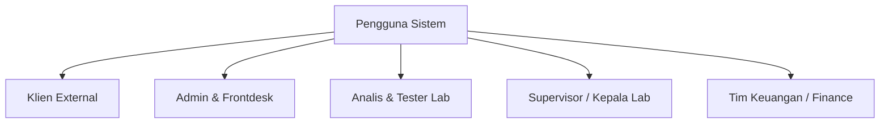
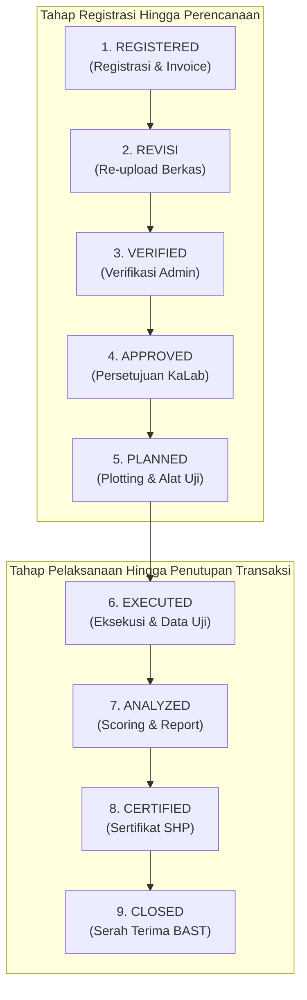
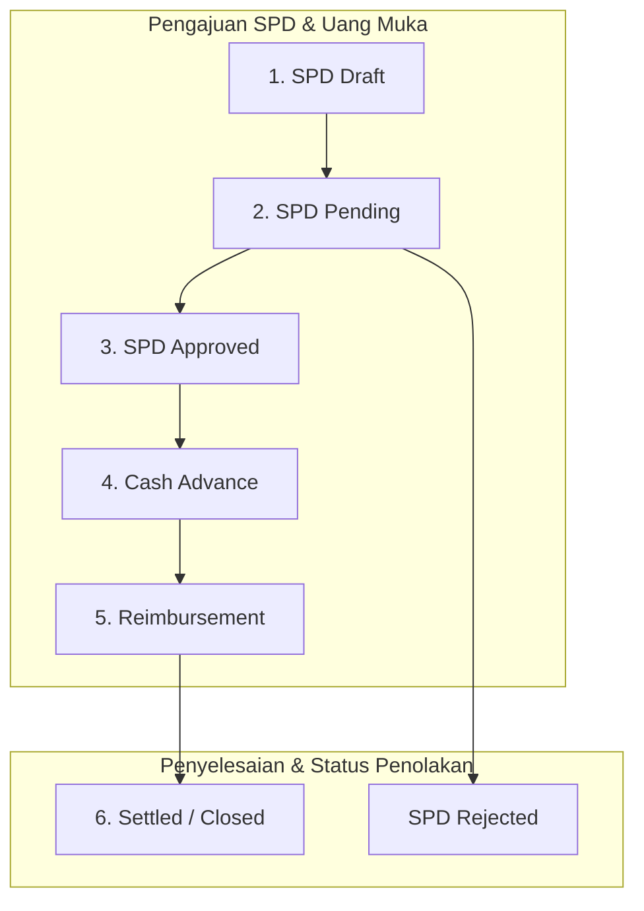
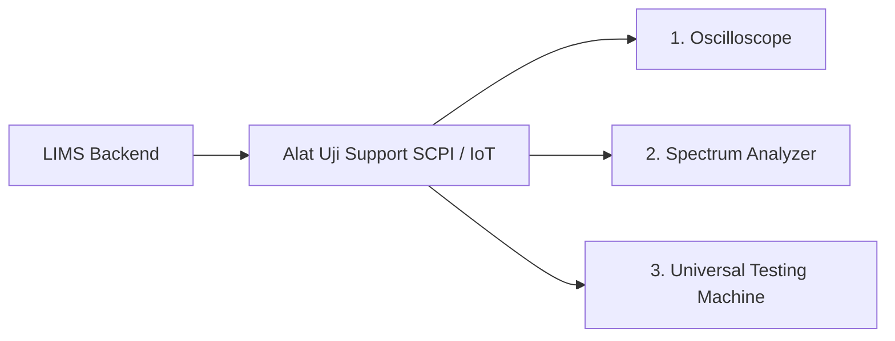

# Business Requirements Document (BRD)

## LIMS (Laboratory Information Management System)

**Dokumen Versi:** 2.3  
**Tanggal:** 03 September 2026  
**Status:** Approved for Implementation (Revised)  
**Klasifikasi:** Rahasia / Internal Laboratorium

---

## Daftar Isi

- [1. Ringkasan Eksekutif & Visi Proyek](#1-ringkasan-eksekutif--visi-proyek)
- [2. Tujuan Proyek & Indikator Keberhasilan (KPI)](#2-tujuan-proyek--indikator-keberhasilan-kpi)
- [3. Analisis Pemangku Kepentingan & Matriks Peran (RBAC)](#3-analisis-pemangku-kepentingan--matriks-peran-rbac)
- [4. Arsitektur & Alur Kerja Bisnis (Daur Hidup Pengujian)](#4-arsitektur--alur-kerja-bisnis-daur-hidup-pengujian)
- [5. Persyaratan Fungsionalitas Modul (Functional Requirements)](#5-persyaratan-fungsionalitas-modul-functional-requirements)
  - [5.1 Modul Otentikasi, RBAC & Hardening Keamanan](#51-modul-otentikasi-rbac--hardening-keamanan)
  - [5.2 Modul Registrasi & Pengajuan (Submission)](#52-modul-registrasi--pengajuan-submission)
  - [5.3 Modul Perencanaan & Pelaksanaan Uji](#53-modul-perencanaan--pelaksanaan-uji)
  - [5.4 Modul Scoring Engine & AI Overlay](#54-modul-scoring-engine--ai-overlay)
  - [5.5 Modul Keuangan & Perjalanan Dinas (Finance, SPD, Cash Advance)](#55-modul-keuangan--perjalanan-dinas-finance-spd-cash-advance)
  - [5.6 Modul Manajemen Aset Peralatan Client (Moving Asset & Handover)](#56-modul-manajemen-aset-peralatan-client-moving-asset--handover)
  - [5.7 Modul Manajemen Testing Tools (Stock & Usage Tracking)](#57-modul-manajemen-testing-tools-stock--usage-tracking)
  - [5.8 Modul Kecerdasan Buatan (AI RAG, Omnichannel & PQC Anomaly)](#58-modul-kecerdasan-buatan-ai-rag-omnichannel--pqc-anomaly)
  - [5.9 Modul Integrasi Perangkat Uji & Simulator IoT](#59-modul-integrasi-perangkat-uji--simulator-iot)
- [6. Spesifikasi Integrasi Perangkat Uji (SCPI / IoT Supported Tools)](#6-spesifikasi-integrasi-perangkat-uji-scpi--iot-supported-tools)
- [7. Persyaratan Non-Fungsional (Non-Functional Requirements)](#7-persyaratan-non-fungsional-non-functional-requirements)
- [8. Manajemen Risiko & Kontingensi Operasional](#8-manajemen-risiko--kontingensi-operasional)

---

## 1. Ringkasan Eksekutif & Visi Proyek

LIMS (_Laboratory Information Management System_) adalah platform digital terintegrasi yang dirancang untuk mengotomatisasi, mendigitalkan, dan meningkatkan akurasi seluruh rantai operasional laboratorium pengujian.

### 🎯 Latar Belakang & Masalah Bisnis

1. **Proses Pengujian Manual & Resiko Paper-based**: Pencatatan parameter uji fisik di kertas rentan terhadap kesalahan ketik (_human error_), pemalsuan data, dan lambatnya pembuatan Sertifikat Hasil Pengujian (SHP).
2. **Integrasi Data Aset & Keuangan**: Manajemen aset milik klien (_Moving Asset_), inventaris alat uji (_Testing Tools_), serta pertanggungjawaban dana dinas (SPD, _Cash Advance_, _Reimbursement_) belum terhubung secara _real-time_ dengan eksekusi teknis pengujian.
3. **Kebutuhan Audit Trail**: Laboratorium pengujian memerlukan jaminan integritas data yang tidak dapat dimanipulasi (_unalterable log_) dan bukti foto fisik di setiap tahapan pengujian.

---

## 2. Tujuan Proyek & Indikator Keberhasilan (KPI)

| Indikator Keberhasilan (KPI)      | Target Kuantitatif / Kualitatif                                                    |
| :-------------------------------- | :--------------------------------------------------------------------------------- |
| **Integrasi Data Perangkat Uji**  | Testing tools yang support integrasi akan dilakukan integrasi dengan LIMS.         |
| **Pencegahan Data Anomali (PQC)** | Deteksi anomali real-time menggunakan AI _Isolation Forest_ sebelum data disimpan. |
| **Kepatuhan Audit Trail**         | 100% data uji terhubung dengan foto fisik MinIO dan time stamp.                    |

---

## 3. Analisis Pemangku Kepentingan & Matriks Peran (RBAC)

Sistem LIMS menerapkan _Role-Based Access Control_ (RBAC) berbasis JSON Web Tokens (JWT):

### Matriks Hak Akses Peran (RBAC)

| Peran (Role)                | Hak Akses Utama                                                                                                         |
| :-------------------------- | :---------------------------------------------------------------------------------------------------------------------- |
| **Admin & Frontdesk**       | Verifikasi registrasi, penerimaan aset klien, pembuatan invoice.                                                        |
| **Analis & Tester**         | Input skor uji fisik, reservasi _testing tools_, eksekusi SCPI/OCR.                                                     |
| **Supervisor / Kepala Lab** | Menentukan testing scenario, Penunjukan team tester, Plotting jadwal, approve SPD, override anomali AI, pengesahan SHP. |
| **Keuangan (Finance)**      | Validasi pembayaran, pencairan _Cash Advance_, settlement _Reimbursement_.                                              |

---

## 4. Arsitektur & Alur Kerja Bisnis (Daur Hidup Pengujian)

LIMS diakses melalui dua tipe klien utama: **Web Application (Desktop/Admin)** dan **Mobile Application**. Semua permintaan diroutingkan melalui NGINX Load Balancer.

### Diagram Arsitektur Sistem & Alur Akses

### Alur Daur Hidup Pengujian

Sistem LIMS dikendalikan oleh instansi proses **Camunda BPM Community Edition** secara asinkron dengan alur terstruktur (maksimal 5 kotak/proses per baris):

---

## 5. Persyaratan Fungsionalitas Modul (Functional Requirements)

### 5.1 Modul Otentikasi, RBAC & Hardening Keamanan

- **FR-AUTH-01 (Single-Session Mode)**: Sistem mendukung mode sesi tunggal per akun (`SINGLE_SESSION_MODE`). Percobaan login kedua dari akun yang sama akan **ditolak**.
- **FR-AUTH-02 (Client Fingerprinting Binding)**: Mengikat token JWT dengan `IP_Address` dan `User_Agent`. Penggunaan token pada perangkat/IP berbeda otomatis membatalkan sesi (`401 Unauthorized`).
- **FR-AUTH-03 (Brute-Force Lockout)**: Pengecekan dan penguncian akun akibat percobaan login gagal (misal 5 kali gagal) tergantung pada konfigurasi sistem.
- **FR-AUTH-04 (Password Policy)**: Kata sandi wajib minimal 9 karakter (mengandung Uppercase, Lowercase, dan Simbol).

### 5.2 Modul Registrasi & Pengajuan (Submission)

- **FR-SUB-01 (Nomor Registrasi Unik)**: Menerbitkan nomor registrasi otomatis dengan format `YYYY-000XX`.
- **FR-SUB-02 (Pendaftaran Aset Klien)**: Mencatat identitas barang uji milik klien secara otomatis ke tabel `lims.testing_equipments`.
- **FR-SUB-03 (Auto-Billing Invoice)**: Otomatis menerbitkan tagihan invoice berdasarkan tarif paket pengujian yang dipilih.

### 5.3 Modul Perencanaan & Pelaksanaan Uji

- **FR-EXEC-01 (Dynamic Testing Worksheet)**: Form worksheet tergenerasi dinamis sesuai paket pengujian (Tipe > Metodologi > Aspek > Sub-Aspek).
- **FR-EXEC-02 (Multi-Channel Data Entry)**: Menerima input data dari manual form baik dengan input skor manual maupun dengan dropdown, OCR, maupun integrasi langsung alat uji SCPI/IoT.

### 5.4 Modul Scoring Engine & AI Overlay

- **FR-SCORE-01 (Kalkulasi Bobot Aspek)**: Menghitung persentase bobot kumulatif aspek:
  $$\text{Score}_{\text{Aspect}} = \frac{\sum (\text{Score}_{\text{SubAspect}} \times \text{Weight}_{\text{SubAspect}})}{\sum \text{Weight}_{\text{SubAspect}}}$$
- **FR-SCORE-02 (Global Threshold Match)**: Membandingkan skor akhir gabungan (`final_score`) dengan parameter global (`SCORE_THRESHOLD_PASS` = 75, `SCORE_THRESHOLD_NOTE` = 60).

### 5.5 Modul Keuangan & Perjalanan Dinas (Finance, SPD, Cash Advance)

- **FR-FIN-01 (Alur SPD & Keuangan)**: Diagram alur keuangan:

- **FR-FIN-02 (Cash Advance & Reimbursement)**: Pencairan uang muka operasional dan klaim biaya aktual pasca-dinas dengan kewajiban melampirkan struk/nota digital ke MinIO.

### 5.6 Modul Manajemen Aset Peralatan Client (Moving Asset & Handover)

- **FR-AST-01 (Moving Asset Tracking)**: Mencatat riwayat perpindahan fisik barang uji antar lab atau ke lapangan (`lims.asset_activity_logs`).
- **FR-AST-02 (QR Code Labeling & Scan)**: Generasi QR Code otomatis untuk ditempelkan pada fisik aset dan dapat dipindai via kamera web/mobile.
- **FR-AST-03 (Handover BAST)**: Mencetak Berita Acara Serah Terima barang saat dikembalikan ke klien.

### Diagram Modul Pelacakan Aset

### 5.7 Modul Manajemen Testing Tools (Stock & Usage Tracking)

- **FR-TOOL-01 (Stock vs Usage Classification)**:
  - **STOCK**: Alat habis pakai (kuantitas berkurang, contoh: reagen, APD).
  - **USAGE**: Alat pinjam durasi (berbasis jam/tanggal, contoh: Oscilloscope).
- **FR-TOOL-02 (Availability Matrix & Booking)**: Mencegah konflik jadwal penggunaan alat uji oleh tim tester yang berbeda di waktu yang sama.
- **FR-TOOL-03 (Monthly Partitioning)**: Tabel transaksi alat `testing_tool_transactions` di-partisi secara bulanan di PostgreSQL.

### 5.8 Modul Kecerdasan Buatan (AI RAG, Omnichannel & PQC Anomaly)

- **FR-AI-01 (Omnichannel RAG Chatbot)**: Asisten virtual cerdas yang dapat diakses dari Web App, Mobile APK, dan Telegram Bot.
- **FR-AI-02 (Vector Ingestion Pipeline)**: Pemotongan teks PDF SOP (`AI_CHUNK_SIZE` = 1000, `AI_CHUNK_OVERLAP` = 200) dan ekstraksi vektor 768-dimensi (`nomic-embed-text`) ke PostgreSQL `pgvector`.
- **FR-AI-03 (PQC Anomaly Detection)**: Deteksi anomali statistik multivariate real-time menggunakan algoritma **Isolation Forest** (ONNX Runtime Go Native).
- **FR-AI-04 (Supervisor Override)**: Blokir otomatis input skor anomali, dengan opsi _bypass/override_ khusus oleh akun berkualifikasi `SUPERVISOR_SCORE` atau `ADMIN`.

### 5.9 Modul Integrasi Perangkat Uji & Simulator IoT

- **Definisi Protokol Integrasi Perangkat**:
  - **Webhook**: Metode pengiriman data secara otomatis via protokol HTTP/HTTPS POST dari perantara/gateway ke server LIMS saat pengujian selesai.
  - **SCPI (Standard Commands for Programmable Instruments)**: Protokol perintah standar berbasis teks (IEEE 488.2) yang digunakan untuk mengontrol dan membaca parameter instrumen pengujian elektronik (seperti Oscilloscope dan Spectrum Analyzer) melalui jaringan LAN (TCP Port 5025) atau USBTMC.
- **FR-IOT-01 (Integrasi Perangkat)**: LIMS menerima data payload dari simulator/perangkat fisik yang mendukung integrasi protokol SCPI atau IoT/Webhook.
- **FR-IOT-02 (Node-RED Integration)**: Middleware Node-RED mendengarkan serial RS232/Modbus/MQTT dan merutekan payload ke LIMS.

---

## 6. Spesifikasi Integrasi Perangkat Uji (SCPI / IoT Supported Tools)

LIMS akan **mendukung integrasi langsung untuk Alat Uji yang mendukung protokol SCPI / IoT**, yaitu:

### 📋 Tabel Spesifikasi Alat Uji Terintegrasi

| Nama Alat Uji                          | Spesifikasi & Standard                | Metode Akuisisi Data                                     |     |
| :------------------------------------- | :------------------------------------ | :------------------------------------------------------- | :-- |
| **Oscilloscope (Siglent SDS2354X HD)** | 350MHz, 4-CH, 12-bit, SCPI Port 5025  | SCPI Direct TCP (`:MEAS:ITEM?`) + HTTP PNG Screen Grab   |
| **Spectrum Analyzer**                  | 9 kHz – 26.5 GHz, CISPR EMI           | SCPI Direct TCP (`:CALC:MARK:X?`) + Trace CSV Data       |
| **Universal Testing Machine (UTM)**    | 5 kN, Akurasi Grade 0.5, Stroke 900mm | SCPI Direct / PC Software Auto-Export CSV + RS232 Serial |

---

## 7. Persyaratan Non-Fungsional (Non-Functional Requirements)

### 🛡️ 7.1 Keamanan & Privasi (Security)

- **Enkripsi Data**: Enkripsi password menggunakan `bcrypt` dan enkripsi rahasia database menggunakan `AES-CFB`.
- **Token Handling**: JWT Cookie HttpOnly dengan perlindungan tambahan `Client Fingerprinting` (IP & User-Agent).
- **CORS Protection**: Kebijakan whitelist terikat, pemblokiran `null origin` dari file lokal.

### 💾 7.2 Integritas Data (Data Integrity)

- **BIGINT 64-bit ID**: Penggunaan identifier 64-bit pada PostgreSQL untuk kompatibilitas data relasional jangka panjang.
- **Audit Trail & MinIO Object Storage**: Bukti foto fisik dan perubahan data tersimpan di MinIO (_Immutable Storage_).

---

## 8. Manajemen Risiko & Kontingensi Operasional

| Risiko Operasional                  | Tingkat Risiko | Dampak                                       | Strategi Mitigasi / Kontingensi                                                                |
| :---------------------------------- | :------------: | :------------------------------------------- | :--------------------------------------------------------------------------------------------- |
| **Koneksi LAN Perangkat Terputus**  |     Sedang     | Pengujian terhenti / data IoT gagal ditarik. | Fallback otomatis ke **Mode OCR Kamera Mobile App** (Foto Layar LCD).                          |
| **False Positive AI PQC (Anomali)** |     Rendah     | Form terblokir saat input data valid.        | Fitur **Supervisor Override** dengan verifikasi kredensial `SUPERVISOR_SCORE`.                 |
| **Hijack Token JWT**                |     Tinggi     | Akses ilegal ke akun pengguna.               | Sistem **Client Fingerprinting Binding** membatalkan sesi seketika jika IP/User-Agent berubah. |

---

> [!NOTE]
> **Persetujuan Dokumen Requirements (Sign-off):**  
> Dokumen BRD LIMS v2.3 ini disusun sebagai acuan utama pengembangan dan integrasi perangkat uji terintegrasi (Oscilloscope, Spectrum Analyzer, UTM) pada sistem LIMS.
