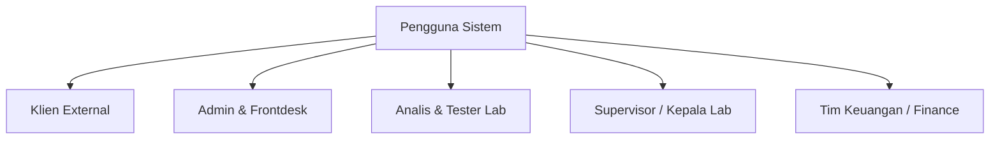
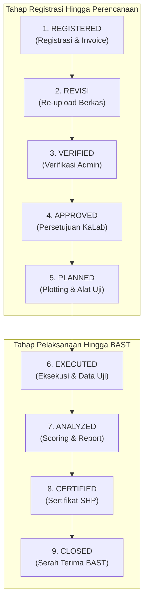
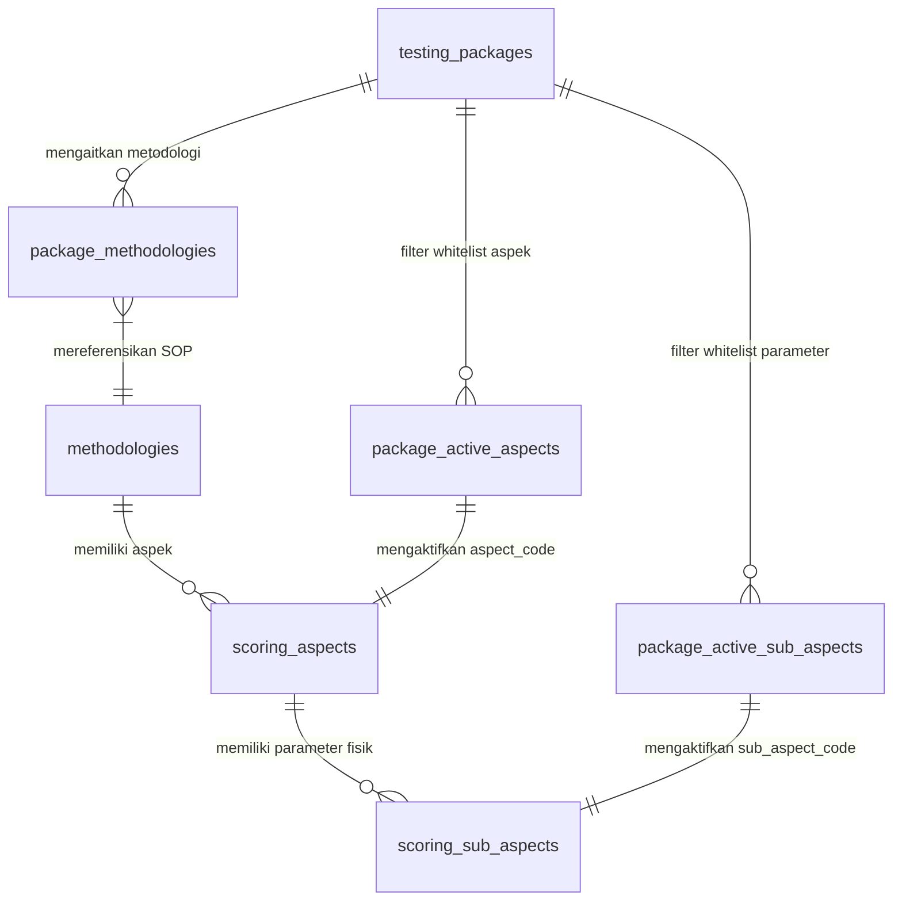
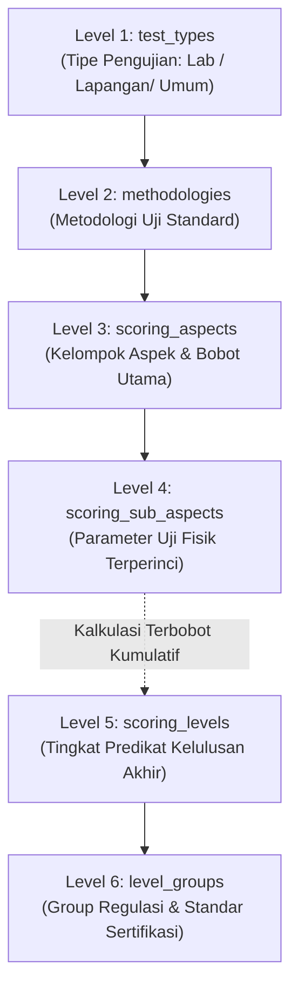
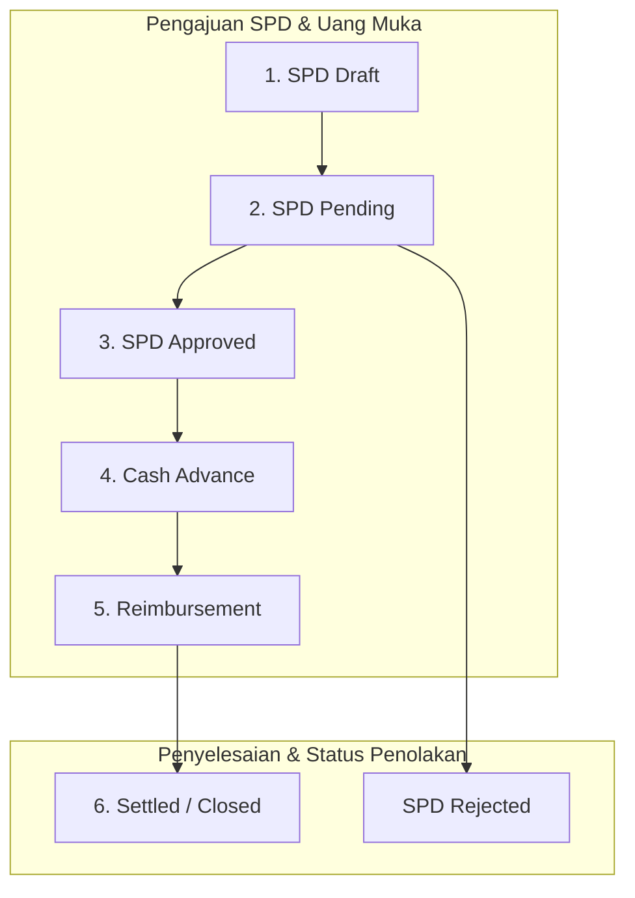
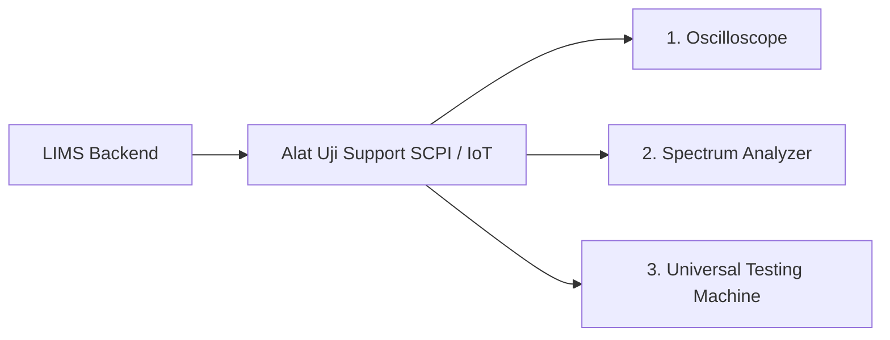

# Business Requirements Document (BRD)

## LIMS (Laboratory Information Management System)

**Dokumen Versi:** 2.4  
**Tanggal:** 06 September 2026  
**Status:** Approved for Implementation (Revised)  
**Klasifikasi:** Rahasia / Internal Laboratorium

---

## Daftar Isi

- [1. Ringkasan Eksekutif & Visi Proyek](#1-ringkasan-eksekutif--visi-proyek)
- [2. Tujuan Proyek & Indikator Keberhasilan (KPI)](#2-tujuan-proyek--indikator-keberhasilan-kpi)
- [3. Analisis Pemangku Kepentingan & Matriks Peran (RBAC)](#3-analisis-pemangku-kepentingan--matriks-peran-rbac)
- [4. Arsitektur & Alur Kerja Bisnis (Daur Hidup Pengujian)](#4-arsitektur--alur-kerja-bisnis-daur-hidup-pengujian)
- [5. Persyaratan Fungsionalitas Modul (Functional Requirements)](#5-persyaratan-fungsionalitas-modul-functional-requirements)
  - [5.1 Modul Otentikasi, RBAC & Hardening Keamanan](#51-modul-otentikasi-rbac--hardening-keamanan)
  - [5.2 Modul Registrasi & Pengajuan (Submission)](#52-modul-registrasi--pengajuan-submission)
  - [5.3 Modul Konfigurasi Paket Layanan (Testing Packages Architecture)](#53-modul-konfigurasi-paket-layanan-testing-packages-architecture)
    - [5.3.A. Arsitektur Relasi & Whitelisting Data Paket](#53a-arsitektur-relasi--whitelisting-data-paket)
    - [5.3.B. Persyaratan Fungsional Konfigurasi Paket (Testing Package FRs)](#53b-persyaratan-fungsional-konfigurasi-paket-testing-package-frs)
  - [5.4 Modul Perencanaan & Pelaksanaan Uji (Planning & Multi-Channel Execution)](#54-modul-perencanaan--pelaksanaan-uji-planning--multi-channel-execution)
  - [5.5 Modul Scoring Engine & Validasi Terstruktur](#55-modul-scoring-engine--validasi-terstruktur)
  - [5.6 Modul Keuangan & Perjalanan Dinas (Finance, SPD, Cash Advance)](#56-modul-keuangan--perjalanan-dinas-finance-spd-cash-advance)
  - [5.7 Modul Manajemen Aset Peralatan Client (Moving Asset & Handover)](#57-modul-manajemen-aset-peralatan-client-moving-asset--handover)
  - [5.8 Modul Manajemen Testing Tools (Stock & Usage Tracking)](#58-modul-manajemen-testing-tools-stock--usage-tracking)
  - [5.9 Modul Kecerdasan Buatan (AI RAG, AI Overlay & PQC Anomaly)](#59-modul-kecerdasan-buatan-ai-rag-ai-overlay--pqc-anomaly)
  - [5.10 Modul Integrasi Perangkat Uji & Simulator IoT](#510-modul-integrasi-perangkat-uji--simulator-iot)
- [6. Spesifikasi Integrasi Perangkat Uji (SCPI / IoT Supported Tools)](#6-spesifikasi-integrasi-perangkat-uji-scpi--iot-supported-tools)
- [7. Persyaratan Non-Fungsional (Non-Functional Requirements)](#7-persyaratan-non-fungsional-non-functional-requirements)

---

## 1. Ringkasan Eksekutif & Visi Proyek

LIMS (_Laboratory Information Management System_) adalah platform digital terintegrasi yang dirancang untuk mengotomatisasi, mendigitalkan, dan meningkatkan akurasi seluruh rantai operasional laboratorium pengujian.

### 🎯 Latar Belakang & Masalah Bisnis

1. **Proses Pengujian Manual & Resiko Paper-based**: Pencatatan parameter uji fisik di kertas rentan terhadap kesalahan ketik (_human error_), pemalsuan data, dan lambatnya pembuatan Sertifikat Hasil Pengujian (SHP).
2. **Integrasi Data Aset & Keuangan**: Manajemen aset milik klien (_Moving Asset_), inventaris alat uji (_Testing Tools_), serta pertanggungjawaban dana dinas (SPD, _Cash Advance_, _Reimbursement_) belum terhubung secara _real-time_ dengan eksekusi teknis pengujian.
3. **Kebutuhan Audit Trail**: Laboratorium pengujian memerlukan jaminan integritas data yang tidak dapat dimanipulasi (_unalterable log_) dan bukti foto fisik di setiap tahapan pengujian.

---

## 2. Tujuan Proyek & Indikator Keberhasilan (KPI)

| Indikator Keberhasilan (KPI)      | Target Kuantitatif / Kualitatif                                                    |
| :-------------------------------- | :--------------------------------------------------------------------------------- |
| **Integrasi Data Perangkat Uji**  | Testing tools yang support integrasi akan dilakukan integrasi dengan LIMS.         |
| **Pencegahan Data Anomali (PQC)** | Deteksi anomali real-time menggunakan AI _Isolation Forest_ sebelum data disimpan. |
| **Kepatuhan Audit Trail**         | 100% data uji terhubung dengan foto fisik MinIO dan time stamp.                    |

---

## 3. Analisis Pemangku Kepentingan & Matriks Peran (RBAC)

Sistem LIMS menerapkan _Role-Based Access Control_ (RBAC) berbasis JSON Web Tokens (JWT):

### Matriks Hak Akses Peran (RBAC)

| Peran (Role)                | Hak Akses Utama                                                                                                         |
| :-------------------------- | :---------------------------------------------------------------------------------------------------------------------- |
| **Admin & Frontdesk**       | Verifikasi registrasi, penerimaan aset klien, pembuatan invoice.                                                        |
| **Analis & Tester**         | Input skor uji fisik, reservasi _testing tools_, eksekusi SCPI/OCR.                                                     |
| **Supervisor / Kepala Lab** | Menentukan testing scenario, Penunjukan team tester, Plotting jadwal, approve SPD, override anomali AI, pengesahan SHP. |
| **Keuangan (Finance)**      | Validasi pembayaran, pencairan _Cash Advance_, settlement _Reimbursement_.                                              |

---

## 4. Arsitektur & Alur Kerja Bisnis

LIMS diakses melalui dua tipe klien utama: **Web Application (Desktop/Admin)** dan **Mobile Application**. Semua permintaan diroutingkan melalui NGINX Load Balancer.

### Diagram Arsitektur Sistem & Alur Akses

### Alur Kerja Pengujian

Sistem LIMS dikendalikan oleh modul proses **Camunda BPM Community Edition** secara asinkron dengan alur terstruktur:

---

## 5. Persyaratan Fungsionalitas Modul (Functional Requirements)

### 5.1 Modul Otentikasi, RBAC & Hardening Keamanan

- **FR-AUTH-01 (Single-Session Mode)**: Sistem mendukung mode sesi tunggal per akun (`SINGLE_SESSION_MODE`). Percobaan login kedua dari akun yang sama akan **ditolak**.
- **FR-AUTH-02 (Client Fingerprinting Binding)**: Mengikat token JWT dengan `IP_Address` dan `User_Agent`. Penggunaan token pada perangkat/IP berbeda otomatis membatalkan sesi (`401 Unauthorized`).
- **FR-AUTH-03 (Brute-Force Lockout)**: Pengecekan dan penguncian akun akibat percobaan login gagal (misal 5 kali gagal) tergantung pada konfigurasi sistem.
- **FR-AUTH-04 (Password Policy)**: Kata sandi wajib minimal 9 karakter (mengandung Uppercase, Lowercase, dan Simbol).

### 5.2 Modul Registrasi & Pengajuan (Submission)

- **FR-SUB-01 (Nomor Registrasi Unik)**: Menerbitkan nomor registrasi otomatis dengan format `YYYY-000XX`.
- **FR-SUB-02 (Pendaftaran Aset Klien)**: Mencatat identitas barang uji milik klien secara otomatis ke tabel `lims.testing_equipments` (Merk, Model, Varian, Nomor Seri, dan Spesifikasi Teknis).
- **FR-SUB-03 (Auto-Billing Invoice)**: Otomatis menerbitkan tagihan invoice (status `UNPAID`) berdasarkan tarif resmi paket pengujian yang dipilih pemohon saat pendaftaran.
- **FR-SUB-04 (Pemilihan Paket & Cakupan Layanan)**: Pemilihan paket pengujian dari katalog `testing_packages`.

### 5.3 Modul Konfigurasi Paket Layanan (Testing Packages Architecture)

Modul ini memberikan fleksibilitas komersial dan operasional bagi laboratorium untuk menyusun berbagai varian paket pengujian (misalnya: *Paket Lengkap Sertifikasi SNI*, *Paket Uji Singkat/Pra-Evaluasi*, *Paket Verifikasi Lapangan*) tanpa mengubah master data metodologi atau standar acuan teknis induk.

#### 5.3.A. Arsitektur Relasi & Whitelisting Data Paket

1. **`lims.testing_packages` (Direktori Master Paket)**:
   - Menyimpan atribut komersial paket: `package_code` (kode unik, misal `ALK-BRONZE`), `name` (nama paket), `base_price` (tarif resmi rupiah), `methodology_code` (methodologi tes misal AKLAP, ALKOM, MANAG), dan `description`.
2. **`lims.package_methodologies` (Tabel Metodologi Tes)**:
   - Menghubungkan paket dengan satu atau lebih metodologi acuan (`methodologies`).
3. **`lims.package_active_aspects` (Whitelist Aspek Aktif)**:
   - Menentukan aspek penilaian mana saja (`scoring_aspects`) yang diaktifkan dalam paket tersebut.
4. **`lims.package_active_sub_aspects` (Whitelist Sub-Aspek / Parameter Uji Aktif)**:
   - Menentukan parameter fisik spesifik (`scoring_sub_aspects`) yang wajib diuji oleh tim teknis.

#### 5.3.B. Persyaratan Fungsional Konfigurasi Paket (Testing Package FRs)

- **FR-PKG-01 (Katalog Layanan & Tarif Dinamis)**: Manajemen katalog paket pengujian mencakup penentuan tarif resmi yang langsung terhubung ke modul penerbitan invoice (*auto-billing*).
- **FR-PKG-02 (Multi-Methodology Assignment)**: Sistem mendukung penggabungan beberapa metodologi uji sekaligus ke dalam satu paket layanan (misal: memadukan Metodologi Laboratorium `LAB` dan Metodologi Lapangan `FLD` dan Umum `MANAGE`).
- **FR-PKG-03 (Granular Whitelist Filtering)**:
  - *Aspect Whitelisting*: Sistem memfilter aspek penilaian secara selektif per paket layanan.
  - *Parameter Whitelisting*: Sistem membatasi parameter uji fisik yang relevan untuk paket yang bersangkutan, sehingga mencegah beban uji berlebih pada pengujian bertarif ekonomis/singkat.
- **FR-PKG-04 (Dynamic Worksheet Generation)**: Saat permohonan pengujian disetujui (*Approved*), sistem mengompilasi form worksheet pengujian dinamis secara instan berdasarkan konfigurasi whitelist paket yang dipilih klien.

### 5.4 Modul Perencanaan & Pelaksanaan Uji (Planning & Multi-Channel Execution)

- **FR-EXEC-01 (Penjadwalan & Plotting Tim)**: Penunjukan tim penguji (*Tester Assignment*) per aspek uji dan penetapan tanggal serta lokasi pengujian (Laboratorium / Lapangan).
- **FR-EXEC-02 (Multi-Channel Data Entry)**: Form worksheet pengujian menerima input data melalui 4 kanal:
  1. *Input Manual Nilai Fisik & Dropdown List*.
  2. *AI OCR Scanner* (Pembacaan nilai numerik dari foto display alat via kamera/file).
  3. *Barcode / QR Scanner* (Pembacaan label identitas sampel/aset).
  4. *Direct SCPI / IoT Webhook* (Tarik data otomatis via LAN).

### 5.5 Modul Scoring Engine & Validasi Terstruktur

Sistem penilaian LIMS mengadopsi mesin kalkulasi terstruktur hierarkis enam level yang dilengkapi pemisahan tegas antara pembacaan fisik alat dan evaluasi dropdown serta validasi dua arah otomatis.

#### A. Arsitektur 6-Level Scoring Engine

1. **Level 1 (`test_types`)**: Klasifikasi tertinggi pengujian (*Laboratorium*, *Lapangan*, atau *Umum*). Tabel: `lims.test_types`.
2. **Level 2 (`methodologies`)**: Standar acuan pengujian teknis yang terikat pada tipe pengujian (`test_type_code`).
3. **Level 3 (`scoring_aspects`)**: Kelompok aspek penilaian utama (misal: *Konstruksi & Perlengkapan*, *Unjuk Kerja Teknis*, *Keselamatan Operasional*) yang memiliki bobot aspek persentase dan batas kelulusan (*Aspect Threshold*).
4. **Level 4 (`scoring_sub_aspects`)**: Parameter pengujian fisik terperinci yang diuji dan diukur (memiliki standar spesifikasi, operator pembanding, satuan, dan bobot internal).
5. **Level 5 (`scoring_levels`)**: Tingkatan predikat kelulusan akhir (*Lulus Memenuhi Standar*, *Lulus Bersyarat*, *Tidak Lulus*) berdasarkan rentang skor akhir gabungan (`min_score` s.d `max_score`).
6. **Level 6 (`level_groups`)**: Grup klasifikasi standar kelulusan (misal: Standar SNI, Regulasi Kominfo, atau Alat Komunikaso, atau General).

#### B. Pemisahan Nilai Fisik (`actual_value`) dan Skor Dropdown List (`score`)

Untuk menjamin integritas data teknis dan menghindari kesalahan fatal kalkulasi matematis (contoh: nilai fisik suhu `150.00 °C` tidak boleh langsung dihitung sebagai skor 150%), sistem menerapkan pemisahan kolom database:
- **`actual_value` (`NUMERIC(15,4)`)**: Murni mencatat angka riil hasil pembacaan instrumen fisik pengujian (misal: `150.00` dengan satuan `°C`, atau `220.50` dengan satuan `V`).
- **`score` (`FLOAT8`)**: Menyimpan nilai skor evaluasi dropdown kelayakan parameter dalam skala `0.00` hingga `100.00` (misal: skor `30.00` untuk kondisi suhu kritis tidak memenuhi standar).
- **Kolom `% Hasil`**: Pada antarmuka pengguna dirender sebagai kolom terkunci (*read-only / disabled*) yang merefleksikan nilai skor rubrik terhitung.

#### C. Batas Numerik Terstruktur (`test_result_low` & `test_result_high`)

Pencocokan kriteria dropdown tmenggunakan batas numerik matematis terstruktur pada tabel `lims.scoring_sub_aspect_items`:

| Tipe Aturan Evaluasi | `test_result_low` | `test_result_high` | Logika Evaluasi Sistem | Kasus Penggunaan Riil |
| :--- | :---: | :---: | :--- | :--- |
| **Rentang (Range)** | Nilai Min (misal: `80.0`) | Nilai Max (misal: `120.0`) | $\text{low} \le \text{Nilai Uji} \le \text{high}$ | Pengujian tegangan operasional normal (80 - 120 V). |
| **Batas Bawah ($\ge$)** | Nilai Ambang (misal: `141.0`) | Nilai Maksimum (misal: `500.0`) | $\text{low} \le \text{Nilai Uji} \le \text{high}$ | Suhu kritis tidak memenuhi standar ($> 140$ °C). |
| **Batas Atas ($\le$)** | Nilai Minimum (misal: `0.0`) | Nilai Ambang (misal: `50.0`) | $\text{low} \le \text{Nilai Uji} \le \text{high}$ | Nilai riak arus (*ripple voltage*) maksimal 50 mV. |
| **Strict Equal ($=$)** | Nilai Acuan (misal: `75.0`) | Nilai Acuan (misal: `75.0`) | $\text{Nilai Uji} = \text{low}$ | Pilihan opsi diskrit/kualitatif (misal kode status 75). |

#### D. Validasi Dua Arah & Penguncian Otomatis (Bi-directional Auto-Lock)

- **Skenario 1 (Input Nilai Fisik Terlebih Dahulu)**:
  Saat analis menginput nilai fisik pada form, sistem secara otomatis mengevaluasi rentang numerik di atas, memilih dropdown rubrik yang sesuai, mengisi skor parameter, dan **mengunci dropdown (*disabled*)**. Hal ini mencegah ketidaksinkronan data antara angka instrumen dan penilaian tester.
- **Skenario 2 (Pilihan Dropdown Manual Terlebih Dahulu)**:
  Jika analis memilih opsi dropdown secara manual lalu menginput nilai fisik yang bertentangan dengan rentang kriteria yang dipilih, sistem memunculkan indikator validasi visual (kotak merah) dan **memblokir proses simpan (*Save Barrier*)** dengan peringatan interaktif.

#### E. Audit Trail Bukti Fisik Foto Scan (`photo_path`)

- Setiap parameter uji fisik dilengkapi fitur upload berkas dan tangkapan kamera langsung (*snapshot*) untuk melampirkan foto display instrumen pengujian.
- Berkas disimpan secara aman di MinIO (*Object Storage*).

#### F. Formula Matematis Penilaian & Multi-Gating

1. **Skor Rata-Rata Aspek ($\text{Score}_{\text{Aspect}}$)**:
   $$\text{Score}_{\text{Aspect}} = \frac{\sum_{i=1}^{n} (\text{Score}_{\text{SubAspect}, i} \times \text{Weight}_{\text{SubAspect}, i})}{\sum_{i=1}^{n} \text{Weight}_{\text{SubAspect}, i}}$$

2. **Skor Akhir Gabungan ($\text{Score}_{\text{Final}}$)**:
   $$\text{Score}_{\text{Final}} = \sum_{j=1}^{m} (\text{Score}_{\text{Aspect}, j} \times \text{Weight}_{\text{Aspect}, j})$$

3. **Aturan Kelulusan Berlapis (*Multi-Gating Evaluation*)**:
   - **Gerbang Aspek (*Strict Aspect Gating*)**: Setiap aspek memiliki batas kelulusan teknis mandiri (`threshold` pada `scoring_aspects`, default: 60). Jika terdapat satu saja aspek yang memiliki skor di bawah threshold-nya, maka status akhir otomatis ditetapkan **TIDAK LULUS**, meskipun skor akhir gabungan di atas 75.
   - **Gerbang Sub-Aspek (*Sub-Aspect Parameter Compliance Gating*)**: Selain nilai rata-rata aspek $\ge \text{threshold}$, seluruh sub-aspek aktif di dalam aspek tersebut wajib memenuhi standar acuan teknis minimumnya (merujuk ke `scoring_sub_aspects.standard_value`, misal $\ge 65.00$). Kegagalan pada satu saja sub-aspek (status *"Tidak Memenuhi"*) secara otomatis menggugurkan kelulusan aspek tersebut (**Aspek GAGAL**), yang selanjutnya menggugurkan kelulusan pengujian secara menyeluruh.

#### G. Contoh Perhitungan Skor 1 Aspek dengan Beberapa Sub-Aspek (Berdasarkan Data Riil Database)

Berikut adalah penjelasan dan simulasi matematis perhitungan nilai pada **1 Aspek Penilaian tunggal** menggunakan data riil yang tersimpan pada tabel `lims.scoring_aspects`, `lims.scoring_sub_aspects`, `lims.scoring_sub_aspect_items`, dan `lims.testing_aspect_scores`:

##### 1. Definisi Konfigurasi Aspek dari Database (`lims.scoring_aspects`)
- **Kode Aspek (`code`)**: `KEPEN`
- **Nama Aspek (`name`)**: **Kemampuan Penerima**
- **Metodologi Uji (`methodology_code`)**: `AKLAP`
- **Batas Kelulusan Minimum Aspek (`threshold`)**: **60.00**
- **Total Bobot Aspek (`weight`)**: **130%**
- **Daftar 6 Sub-Aspek Riil (`lims.scoring_sub_aspects`)**:
  1. `KESEN`: Kemampuan - Penerima - Sensitifitas (Bobot $W_1 = 25\%$)
  2. `KELCH`: Kemampuan - Sensitivitas squelch (Bobot $W_2 = 25\%$)
  3. `KEDAI`: Kemampuan - Penerima - Daya out put audio (Bobot $W_3 = 20\%$)
  4. `KERUS`: Kemampuan - Pemakaian arus penerima (Bobot $W_4 = 20\%$)
  5. `KESUA`: Kemampuan - Kekerasan suara (Bobot $W_5 = 20\%$)
  6. `KESEL`: Kemampuan - Penerima - Selektifitas (Bobot $W_6 = 20\%$)
  - *Total Bobot Sub-Aspek*: $25\% + 25\% + 20\% + 20\% + 20\% + 20\% = 130\%$.

##### 2. Data Pengukuran Riil (Contoh Aplikasi ID: 212)

Pada pengujian riil (terekam pada tabel `lims.testing_results` untuk `application_id = 212`), analis menginput nilai uji fisik (`actual_value`) yang langsung menjadi nilai evaluasi parameter (`score` / $S_i$):

| No | Kode Sub-Aspek | Nama Parameter Sub-Aspek | Bobot ($W_i$) | Standar Acuan Database | Nilai Uji / Skor ($S_i$) | Evaluasi Kepatuhan | Kontribusi Terbobot ($S_i \times W_i\%$) |
| :-: | :--- | :--- | :-: | :---: | :-: | :---: | :---: |
| 1 | `KESEN` | Kemampuan - Penerima - Sensitifitas | **25%** | $\ge 65$ | **$90.00$** | Memenuhi Standar | $90.00 \times 25\% = \mathbf{22.50}$ |
| 2 | `KELCH` | Kemampuan - Sensitivitas squelch | **25%** | $\ge 65$ | **$100.00$** | Memenuhi Standar *(Opsi: "Dapat diatur")* | $100.00 \times 25\% = \mathbf{25.00}$ |
| 3 | `KEDAI` | Kemampuan - Penerima - Daya out put audio | **20%** | $\ge 65$ | **$89.00$** | Memenuhi Standar | $89.00 \times 20\% = \mathbf{17.80}$ |
| 4 | `KERUS` | Kemampuan - Pemakaian arus penerima | **20%** | $\ge 65$ | **$50.00$** | Di Bawah Standar Acuan | $50.00 \times 20\% = \mathbf{10.00}$ |
| 5 | `KESUA` | Kemampuan - Kekerasan suara | **20%** | $\ge 65$ | **$90.00$** | Memenuhi Standar | $90.00 \times 20\% = \mathbf{18.00}$ |
| 6 | `KESEL` | Kemampuan - Penerima - Selektifitas | **20%** | $\ge 65$ | **$90.00$** | Memenuhi Standar | $90.00 \times 20\% = \mathbf{18.00}$ |
| **Total** | | | **130%** | | | | **111.30** |

> [!NOTE]
> **Karakteristik Parameter Fisik vs Dropdown List**:
> 1. **Tanpa Dropdown (`scoring_sub_aspect_items`)**: Pada parameter kuantitatif seperti `KESEN`, `KEDAI`, `KERUS`, `KESUA`, dan `KESEL`, analis langsung menginput nilai angka hasil uji ke form (tanpa dropdown list), sehingga nilai fisik aktual (`actual_value`) langsung menjadi skor parameter ($S_i$).
> 2. **Dengan Dropdown List**: Hanya parameter diskrit/kualitatif (seperti `KELCH`) yang memiliki opsi di tabel `scoring_sub_aspect_items` (misal: ID 45 *"Dapat diatur"* dengan skor 100, ID 46 *"Tidak dapat diatur"* dengan skor 50).

##### 3. Langkah Perhitungan Matematis Nilai Aspek

Nilai aspek dihitung menggunakan formula rata-rata terbobot terhadap total persentase bobot aktif:

$$\text{Score}_{\text{KEPEN}} = \frac{\sum_{i=1}^{6} (S_i \times W_i\%)}{\sum_{i=1}^{6} W_i\%}$$

Substitusi nilai angka:

$$\begin{aligned}
\text{Score}_{\text{KEPEN}} &= \frac{(90 \times 25\%) + (100 \times 25\%) + (89 \times 20\%) + (50 \times 20\%) + (90 \times 20\%) + (90 \times 20\%)}{25\% + 25\% + 20\% + 20\% + 20\% + 20\%} \\
&= \frac{22.50 + 25.00 + 17.80 + 10.00 + 18.00 + 18.00}{130\%} \\
&= \frac{111.30}{1.30} = \mathbf{85.61538461538461}
\end{aligned}$$

> **Verifikasi Data Database**:  
> Nilai hasil kalkulasi matematis di atas terbukti **100% presisi** dengan data aktual yang tersimpan di database pada tabel `lims.testing_aspect_scores`:  
> `SELECT score FROM lims.testing_aspect_scores WHERE application_id = 212 AND aspect_code = 'KEPEN';` $\implies$ **`85.61538461538461`**.

##### 4. Evaluasi Ambang Batas Kelulusan Aspek & Prasyarat Sub-Aspek (Aspect & Sub-Aspect Gating)

Pada sistem LIMS, kelulusan suatu Aspek teknis menganut prinsip **Prasyarat Validasi Berlapis (*Dual-Layer Aspect Validation*)**:
1. **Prasyarat 1 (Ambang Batas Nilai Rata-Rata Aspek)**:
   - Nilai rata-rata terbobot aspek wajib mencapai threshold minimum: $\text{Score}_{\text{Aspect}} \ge \text{Threshold}_{\text{Aspect}}$ (pada Aspek `KEPEN`, threshold adalah **60.00** merujuk ke kolom `lims.scoring_aspects.threshold`).
2. **Prasyarat 2 (Kepatuhan Seluruh Sub-Aspek / Parameter Compliance)**:
   - Seluruh sub-aspek aktif di dalam aspek tersebut wajib memenuhi standar acuan minimumnya masing-masing: merujuk ke kolom `lims.scoring_sub_aspects.standard_value = 65.00` dengan `standard_operator = '>='` (Nilai Sub-Aspek $\ge 65.00$).

**Analisis Hasil Evaluasi pada Contoh Aplikasi ID 212**:
- **Evaluasi Prasyarat 1**: Skor rata-rata terbobot Aspek `KEPEN` adalah **85.62** ($\ge 60.00$) $\implies$ Memenuhi ambang batas agregat aspek.
- **Evaluasi Prasyarat 2**: Dari 6 parameter sub-aspek yang diuji, terdapat 1 parameter yaitu **`KERUS`** (*Kemampuan - Pemakaian arus penerima*) dengan nilai uji **$50.00$**.
  - Merujuk ke standar acuan database (`scoring_sub_aspects.standard_value = 65.00` dengan operator $\ge$), karena $50.00 < 65.00$, maka parameter `KERUS` berstatus **"Tidak Memenuhi"** (gagal standar spesifikasi teknis).
- **Keputusan Kelulusan Aspek `KEPEN`**:
  Karena terdapat salah satu sub-aspek yang tidak memenuhi standar acuan minimum (`KERUS` = $50.00 < 65.00$), maka Aspek Kemampuan Penerima (`KEPEN`) dinyatakan **TIDAK LULUS (FAILED)** ❌, meskipun nilai rata-rata terbobotnya mencapai 85.62!
- **Dampak ke Kelulusan Sertifikasi Akhir (*Strict Aspect Gating*)**:
  Kegagalan pada Aspek `KEPEN` ini secara otomatis menggugurkan seluruh pengujian, sehingga status akhir permohonan sertifikasi ditetapkan **TIDAK LULUS**, memastikan perangkat dengan parameter arus yang tidak aman/menyimpang tidak dapat diloloskan hanya karena nilai sub-aspek lainnya tinggi.

### 5.6 Modul Keuangan & Perjalanan Dinas (Finance, SPD, Cash Advance)

- **FR-FIN-01 (Alur SPD & Keuangan)**: Diagram alur keuangan:

- **FR-FIN-02 (Cash Advance & Reimbursement)**: Pencairan uang muka operasional dan klaim biaya aktual pasca-dinas dengan kewajiban melampirkan struk/nota digital ke MinIO.

### 5.7 Modul Manajemen Aset Peralatan Client (Moving Asset & Handover)

- **FR-AST-01 (Moving Asset Tracking)**: Mencatat riwayat perpindahan fisik barang uji antar lab atau ke lapangan (`lims.asset_activity_logs`).
- **FR-AST-02 (QR Code Labeling & Scan)**: Generasi QR Code otomatis untuk ditempelkan pada fisik aset dan dapat dipindai via kamera web/mobile.
- **FR-AST-03 (Handover BAST)**: Mencetak Berita Acara Serah Terima barang saat dikembalikan ke klien.

### Diagram Modul Pelacakan Aset

### 5.8 Modul Manajemen Testing Tools (Stock & Usage Tracking)

- **FR-TOOL-01 (Stock vs Usage Classification)**:
  - **STOCK**: Alat habis pakai (kuantitas berkurang, contoh: reagen, APD).
  - **USAGE**: Alat pinjam durasi (berbasis jam/tanggal, contoh: Oscilloscope).
- **FR-TOOL-02 (Availability Matrix & Booking)**: Mencegah konflik jadwal penggunaan alat uji oleh tim tester yang berbeda di waktu yang sama.

### 5.9 Modul Kecerdasan Buatan (AI RAG, AI Overlay & PQC Anomaly)

- **FR-AI-01 (Omnichannel RAG Chatbot)**: Asisten virtual cerdas yang dapat diakses dari Web App, Mobile APK, dan Telegram Bot untuk layanan informasi teknis dan SOP laboratorium.
- **FR-AI-02 (Lapisan Analisis AI Cerdas / AI Overlay Engine)**:
  - AI memantau seluruh hasil uji dan secara otomatis mengidentifikasi parameter yang tidak memenuhi standar acuan teknis.
  - **Generasi Draf Laporan Kelayakan Otomatis**:
    - *Bagian A*: Ringkasan Eksekutif Analis (*Executive Summary*).
    - *Bagian B*: Analisis Kekuatan Teknis (daftar parameter yang memenuhi standar) digenerasi **100% secara deterministik dan presisi oleh backend Go**.
    - *Bagian C*: Analisis Deviasi Teknis & Dampak Operasional Lapangan (dianalisis oleh AI berdasarkan konteks SOP).
    - *Bagian D*: Rekomendasi Tindak Lanjut & Perbaikan Spesifik.
- **FR-AI-03 (PQC Anomaly Detection)**: Deteksi anomali statistik multivariate real-time menggunakan algoritma **Isolation Forest** (ONNX Runtime Go Native).
- **FR-AI-04 (Supervisor Override)**: Blokir otomatis input skor anomali, dengan opsi _bypass/override_ khusus oleh akun dengan Role `SUPERVISOR_SCORE` atau `ADMIN`.

### 5.10 Modul Integrasi Perangkat Uji & Simulator IoT

- **Definisi Protokol Integrasi Perangkat**:
  - **Webhook**: Metode pengiriman data secara otomatis via protokol HTTP/HTTPS POST dari perantara/gateway ke server LIMS saat pengujian selesai.
  - **SCPI (Standard Commands for Programmable Instruments)**: Protokol perintah standar berbasis teks (IEEE 488.2) yang digunakan untuk mengontrol dan membaca parameter instrumen pengujian elektronik (seperti Oscilloscope dan Spectrum Analyzer) melalui jaringan LAN (TCP Port 5025) atau USBTMC.
- **FR-IOT-01 (Integrasi Perangkat)**: LIMS menerima data payload dari simulator/perangkat fisik yang mendukung integrasi protokol SCPI atau IoT/Webhook.

---

## 6. Spesifikasi Integrasi Perangkat Uji (SCPI / IoT Supported Tools)

LIMS akan **mendukung integrasi langsung untuk Alat Uji yang mendukung protokol SCPI / IoT**, yaitu:

### 📋 Tabel Spesifikasi Alat Uji Terintegrasi

| Nama Alat Uji                          | Spesifikasi & Standard                | Metode Akuisisi Data                                     |     |
| :------------------------------------- | :------------------------------------ | :------------------------------------------------------- | :-- |
| **Oscilloscope (Siglent SDS2354X HD)** | 350MHz, 4-CH, 12-bit, SCPI Port 5025  | SCPI Direct TCP (`:MEAS:ITEM?`) + HTTP PNG Screen Grab   |
| **Spectrum Analyzer**                  | 9 kHz – 26.5 GHz, CISPR EMI           | SCPI Direct TCP (`:CALC:MARK:X?`) + Trace CSV Data       |
| **Universal Testing Machine (UTM)**    | 5 kN, Akurasi Grade 0.5, Stroke 900mm | SCPI Direct / PC Software Auto-Export CSV + RS232 Serial |

---

## 7. Persyaratan Non-Fungsional (Non-Functional Requirements)

### 🛡️ 7.1 Keamanan & Privasi (Security)

- **Enkripsi Data**: Enkripsi password menggunakan `bcrypt` dan enkripsi rahasia database menggunakan `AES-CFB`.
- **Token Handling**: JWT Cookie HttpOnly dengan perlindungan tambahan `Client Fingerprinting` (IP & User-Agent).
- **CORS Protection**: Kebijakan whitelist terikat, pemblokiran `null origin` dari file lokal.

---

> [!NOTE]
> **Persetujuan Dokumen Requirements (Sign-off):**  
> Dokumen BRD LIMS v2.3 ini disusun sebagai acuan utama pengembangan dan integrasi perangkat uji terintegrasi (Oscilloscope, Spectrum Analyzer, UTM) pada sistem LIMS.
