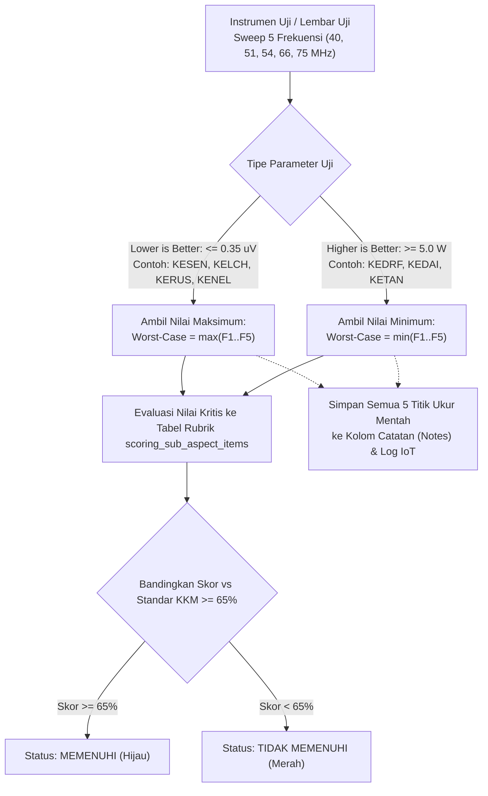

# DOKUMEN SPESIFIKASI & PETUNJUK PENGUJIAN RADIO CARIMA
## Konfigurasi Parameter, Rumus Perhitungan, dan Alur Pengujian pada Sistem LIMS

---

## 1. PENDAHULUAN & RUANG LINGKUP
Dokumen ini merupakan panduan operasional pengujian dinas dan konfigurasi sistem LIMS (*Laboratory Information Management System*) untuk pengujian perangkat **Radio Komunikasi Carima**.

Pengujian dibagi menjadi dua kelompok utama:
1. **Butir 15. Kemampuan**:
   - a. Penerimaan (*Receive Characteristics*)
   - b. Pemancaran (*Transmitter Characteristics*)
   - c. Jarak Capai (*Operational Range & Coverage*)
2. **Butir 16. Kelancaran Kerja**:
   - Ketahanan fisik, mekanik, lingkungan (*Environmental & Ruggedness Tests*), serta ketahanan beban transmisi.

---

## 2. PEMETAAN PARAMETER KE SISTEM LIMS

Hierarki data di LIMS:
$$\text{Metodologi Uji} \longrightarrow \text{Aspek Scoring} \longrightarrow \text{Sub-Aspek Scoring} \longrightarrow \text{Item Rubrik Penilaian}$$

### 2.1. Aspek Penerimaan (`KEPEN`) — Metodologi: `AKLAP` / `ALKOM`
*Standar Kelulusan Skor: $\ge 65\%$*

| No | Kode Sub-Aspek | Parameter Uji | Satuan | Standar Acuan | Tipe Batas Kritis | Alat Uji yang Digunakan |
| :---: | :---: | :--- | :---: | :---: | :---: | :--- |
| 1 | `KESEN` | Sensitifitas Penerima | $\mu\text{V}$ | $\le 0.35\ \mu\text{V}$ (Normal: $0 - 0.30\ \mu\text{V}$) | **Maksimum ($\max$)** | Generator FM, Distortion Analyzer, VTVM |
| 2 | `KESEL` | Selektifitas Penerima | $\text{dB}$ | $\le 8\ \text{dB}$ | **Maksimum ($\max$)** | Generator FM, Signal Generator, Frekuensi Counter |
| 3 | `KEDAI` | Daya Output Audio | $\text{mW}$ | $\ge 160\ \text{mW}$ | **Minimum ($\min$)** | Generator FM, Distortion Analyzer, Beban Dummy Handset |
| 4 | `KELCH` | Sensitifitas Squelch | $\mu\text{V}$ | $\le 0.35\ \mu\text{V}$ (Normal: $\le 0.30\ \mu\text{V}$) | **Maksimum ($\max$)** | Signal Generator, Audio Generator, Oscilloscope |
| 5 | `KERUS` | Pemakaian Arus Penerima | $\text{mA}$ | $\le 150\ \text{mA}$ (Toleransi: $150 - 200\ \text{mA}$) | **Maksimum ($\max$)** | Ampere Meter DC, Catu Daya 12.5 V |
| 6 | `KESUA` | Kekerasan Suara Audio | $\text{dB}$ | $17 - 25\ \text{dB}$ | **Rentang (*Range*)** | Audio Meter, Radio Pemancar Referensi |

---

### 2.2. Aspek Pemancaran (`KOCAR`) — Metodologi: `AKLAP`
*Standar Kelulusan Skor: $\ge 65\%$*

| No | Kode Sub-Aspek | Parameter Uji | Satuan | Standar Acuan | Tipe Batas Kritis | Alat Uji yang Digunakan |
| :---: | :---: | :--- | :---: | :---: | :---: | :--- |
| 1 | `KEDRF` | Daya Keluar RF (*RF Output Power*) | $\text{Watt}$ | $\ge 5\ \text{W}$ (Normal: $5 - 7\ \text{W}$) | **Minimum ($\min$)** | RF Watt Meter, Dummy Load 50 $\Omega$ |
| 2 | `KENEL` | SWR untuk Semua Channel | Ratio | $\le 1.5$ (Toleransi: $\le 2.0$) | **Maksimum ($\max$)** | SWR Meter, Berbagai Macam Antena Uji |
| 3 | `KERAN` | Tipe Pancaran | Kualitatif | Telephony (FM / F3E) | Kualitatif | Oscilloscope RF, Modulation Meter |
| 4 | `KERJA` | Frekuensi Kerja | $\text{MHz}$ | $30.00 - 88.00\ \text{MHz}$ | Batas Rentang | Frekuensi Counter, Signal Generator |
| 5 | `KEJUM` | Jumlah Kanal (*Channel Capacity*) | Kanal | Sesuai formula rentang frekuensi | Nilai Nominal | Analisis Matematis & Uji Penalaan |
| 6 | `KERAK` | Jarak Antar Kanal (*Channel Spacing*) | $\text{KHz}$ | $25\ \text{KHz}$ atau $50\ \text{KHz}$ | Nilai Nominal | Signal Generator, Frekuensi Counter |
| 7 | `KENAL` | Preset Kanal | Kualitatif | Min. 4 kanal preset tersimpan | Kualitatif | Panel Operasi Carima |
| 8 | `KETER` | Pengaman Transmisi / Frekuensi | Kualitatif | Proteksi aktif & stabil | Kualitatif | Panel Uji Carima |
| 9 | `KETEL` | Ketelitian Frekuensi (*Stability*) | $\text{ppm} / \text{Hz}$ | $\Delta f \le \pm 1\ \text{KHz}$ | **Deviasi Absolut** | Frekuensi Counter Presisi |
| 10 | `KEPAN` | Pemakaian Arus Pancar | $\text{Ampere}$ | Sesuai spesifikasi manual | **Maksimum ($\max$)** | Ampere Meter DC, Catu Daya 12.5 V, Dummy 50 $\Omega$ |
| 11 | `KEAAN` | Sistem Penalaan | Kualitatif | Cepat, presisi, tanpa selip | Kualitatif | Panel Pelayanan Radio |
| 12 | `KENAG` | Karakteristik Sumber Tenaga | $\text{Volt}$ | Stabil pada $11 - 14\ \text{V}$ | Rentang Tegangan | Catu Daya DC Variabel, Watt Meter |

---

### 2.3. Aspek Jarak Capai (`KOJAR`) — Metodologi: `AKLAP`
*Standar Kelulusan Skor: $\ge 65\%$*

| No | Kode Sub-Aspek | Medan Pengujian | Jarak Acuan Minimal | Tipe Batas Kritis | Kondisi Operasi |
| :---: | :---: | :--- | :---: | :---: | :--- |
| 1 | `KETAN` | Medan Tanpa Hambatan (*Line of Sight*) | $\ge 4\ \text{km}$ | **Minimum ($\min$)** | Medan terbuka datar |
| 2 | `KETUP` | Medan Tertutup (Hutan / Gunung) | $\ge 2\ \text{km}$ | **Minimum ($\min$)** | Kanopi lebat / punggungan bukit |
| 3 | `KEANG` | Medan Pantai (Siang Hari) | $\ge 3\ \text{km}$ | **Minimum ($\min$)** | Siang hari (panas, salinitas laut) |
| 4 | `KELAM` | Medan Pantai (Malam Hari) | $\ge 4\ \text{km}$ | **Minimum ($\min$)** | Malam hari |
| 5 | `KEKOS` | Medan Perkotaan (Siang Hari) | $\ge 1\ \text{km}$ | **Minimum ($\min$)** | Halangan gedung, interferensi RF perkotaan |
| 6 | `KEKOM` | Medan Perkotaan (Malam Hari) | $\ge 2\ \text{km}$ | **Minimum ($\min$)** | Malam hari |
| 7 | `KEPUR` | Medan Gunung Kapur / Karst | $\ge 3\ \text{km}$ | **Minimum ($\min$)** | Pantulan karst/kapur |
| 8 | `KERET` | Medan Hutan Karet | $\ge 2\ \text{km}$ | **Minimum ($\min$)** | Pola kerapatan pohon karet |

---

### 2.4. Aspek Kelancaran Kerja & Lingkungan (`KEKER`) — Metodologi: `MANAG`
*Standar Kelulusan Skor: $\ge 65\%$ (Kriteria: Normal / Tahan = 100%, Malfungsi = 20%)*

| No | Kode Sub-Aspek | Jenis Uji | Parameter Teknis Uji | Alat yang Dibutuhkan |
| :---: | :---: | :--- | :--- | :--- |
| 1 | `KEBAN` | Memancar Tanpa Beban | Lepas antena 1 menit saat memancar, lalu receive 10 menit | Watt Meter, Catu Daya |
| 2 | `KEANT` | Antena Hubung Singkat | Hubungkan pin antena ke bodi 1 menit saat memancar, lalu receive 10 menit | Watt Meter, Catu Daya |
| 3 | `KEHAN` | Uji Goncangan (*Jolting*) | Amplitudo 3 cm, frekuensi 50–120 siklus/menit, 3 sumbu @20 menit (total 1 jam) | Meja Goncang (*Jolting Table*) |
| 4 | `KEGET` | Uji Getaran (*Vibration*) | Frekuensi 10–15 Hz (langkah 1 Hz), amplitudo $\ge 0.8\text{ mm}$, 3 sumbu | Meja Getar (*Vibration Table*) |
| 5 | `KETUR` | Uji Benturan (*Impact*) | Kemiringan 60° terhadap daun meja jati 5 cm, 4x pembenturan tiap sisi | Meja Kayu Jati Tebal 5 cm |
| 6 | `KEDAP` | Uji Penjatuhan (*Drop*) | Ketinggian 120 cm pada papan jati bertulang beton (26 kali jatuhan) | Landasan Uji Jatuh 120 cm |
| 7 | `KEACA` | Uji Suhu / Cuaca Ekstrim | Oven $+50^\circ\text{C}$ selama 1 jam, dilanjutkan Freezer $-20^\circ\text{C}$ selama 1 jam | Chamber Oven & Freezer |
| 8 | `KEAIR` | Uji Kedap Air (*Immersion*) | Rendam air tawar kedalaman 1 meter selama 2 jam, suhu air $26^\circ\text{C}$ | Bak Perendam 1 m |
| 9 | `KEOPE` | Ketahanan Operasi Kontinu | Operasi menyala dan berkomunikasi terus-menerus selama $1 \times 24$ jam | Catu Daya DC 12.5 V |

---

## 3. FORMULA PERHITUNGAN & CARA KERJA SISTEM LIMS

### 3.1. Formula Rasio Gelombang Tegak (SWR - Standing Wave Ratio)
Berdasarkan dokumen teknis dinas:
$$\text{SWR} = \frac{P_{\text{pancar}} + P_{\text{refleksi}}}{P_{\text{pancar}} - P_{\text{refleksi}}}$$

Secara teori saluran transmisi RF presisi menggunakan koefisien refleksi ($\Gamma$):
$$\Gamma = \sqrt{\frac{P_{\text{refleksi}}}{P_{\text{pancar}}}}, \quad \text{SWR} = \frac{1 + \Gamma}{1 - \Gamma}$$

*Contoh Perhitungan:*
- Daya Pancar Maju ($P_{\text{pancar}}$) = $5.0\text{ Watt}$
- Daya Pantul Refleksi ($P_{\text{refleksi}}$) = $0.2\text{ Watt}$
$$\text{SWR} = \frac{5.0 + 0.2}{5.0 - 0.2} = \frac{5.2}{4.8} = 1.083 \approx 1.08$$

#### Bagaimana Penanganannya di LIMS?
1. **Pembacaan Instrumen Langsung**: Pada pengujian nyata, instrumen *SWR Meter* (seperti *Bird Model 43*, *Daiwa*, *Diamond SX-400*, atau *Rohde & Schwarz Power Sensor*) **sudah otomatis menghitung** dan langsung menampilkan angka SWR pada jarum/layar digital.
2. **Input LIMS**: Penguji menginput angka hasil baca instrumen (misal `1.08`) ke kolom **Nilai Fisik** sub-aspek `KENEL`.
3. **Pencocokan Rubrik Otomatis**: LIMS mengevaluasi:
   - $1.00 - 1.50 \implies \text{Skor } 100\%$ (**Memenuhi**)
   - $1.51 - 2.00 \implies \text{Skor } 60\%$ (**Tidak Memenuhi**)
   - $> 2.00 \implies \text{Skor } 20\%$ (**Kritis / Gagal**)
4. **Dokumentasi Komponen Daya**: Penguji dapat mencatat rincian $P_{\text{pancar}}$ dan $P_{\text{refl}}$ pada kolom Catatan: `Pf=5W, Pr=0.2W -> SWR=1.08`.

---

### 3.2. Formula Jumlah Kanal & Jarak Kanal
Berdasarkan dokumen teknis:
$$\text{Jumlah Kanal} = \frac{\text{Lebar Band}}{\text{Lebar Frekuensi Antar Kanal}} + 1$$

*Contoh Kasus Radio Carima (30.00 s.d 88.00 MHz dengan spasi kanal 25 KHz):*
- Rentang frekuensi = $88.00 - 30.00 = 58.00\text{ MHz} = 58.000\text{ KHz}$.
- Jarak antar kanal = $25\text{ KHz}$.
$$\text{Jumlah Kanal} = \frac{58.000}{25} = 2.320\text{ Kanal}$$

Penguji menginput angka `2320` ke kolom Nilai Fisik `KEJUM`.

---

## 4. PENGUJIAN MULTI-FREKUENSI (5 TITIK PRESET: 40, 51, 54, 66, 75 MHz)
### Penjelasan Teknis Deteksi Nilai Kritis pada OCR & IoT LIMS

Dokumen pengujian mensyaratkan sampling pengukuran dilakukan pada 5 frekuensi preset:
$$F_1 = 40.00\text{ MHz}, \quad F_2 = 51.00\text{ MHz}, \quad F_3 = 54.00\text{ MHz}, \quad F_4 = 66.00\text{ MHz}, \quad F_5 = 75.00\text{ MHz}$$



---

### 4.1. Apakah Nilai yang Masuk ke LIMS Hanya Nilai Kritis?

**Penjelasan Alur Data:**
1. **Di Lapangan & Laboratorium:** Penguji mengukur dan mencatat ke-5 frekuensi pada lembar kerja (*log sheet*) atau instrumen otomatis (*spectrum analyzer / radio test set*).
2. **Di Sistem LIMS:** Parameter penilaian akhir membutuhkan **1 nilai representatif (*Single Evaluated Value*)** agar dapat dinilai lulus/gagal secara objektif dan dikalikan dengan bobot aspek.
3. **Nilai yang Direkam:**
   - Kolom **Nilai Fisik (*Actual Value*)**: Berisi **Nilai Terkritis (*Worst-Case Value*)**.
   - Kolom **Catatan (*Notes*)**: Menyimpan **seluruh rincian 5 titik frekuensi**:
     ```text
     F1(40M)=0.20, F2(51M)=0.24, F3(54M)=0.26, F4(66M)=0.31, F5(75M)=0.34 uV. Critical Max=0.34 uV
     ```
   - **Tabel Log Telemetri IoT (`simulator_data_logs`)**: Menyimpan rekaman transmisi mentah dari alat uji.
   - **Dokumentasi Audit**: Foto/scan lembar kerja asli terlampir di sistem LIMS.

> [!NOTE]
> **Prinsip Pengujian Kelaikan Militer & Laboratorium:**
> *"Jika pada titik frekuensi paling kritis (kondisi terburuk) saja perangkat masih memenuhi spesifikasi, maka seluruh spektrum frekuensi operasional lainnya dijamin aman dan laik operasi."*

---

### 4.2. Bagaimana LIMS Mendeteksi "Nilai Kritis" (Contoh: Kasus $\le 0.35\ \mu\text{V}$)?

Logika deteksi nilai kritis ditentukan oleh **arah batas spesifikasi (*Critical Direction*)**:

#### Kasus A: Parameter "Semakin Kecil Semakin Baik" (*Lower is Better* / Operator $\le$)
*Contoh:* **Sensitifitas Penerima (`KESEN`)** dan **Sensitifitas Squelch (`KELCH`)** dengan batas $\le 0.35\ \mu\text{V}$.
- Tegangan sinyal masukan yang lebih kecil menandakan penerima yang lebih peka (lebih bagus).
- Tegangan input yang membesar mendekati atau melampaui $0.35\ \mu\text{V}$ adalah kondisi yang **paling berisiko gagal**.
- **Logika Penentuan Nilai Kritis:**
  $$\text{Nilai Kritis} = \mathbf{\max}(F_1, F_2, F_3, F_4, F_5)$$

*Simulasi Contoh Data Sensitifitas (`KESEN`):*
| Frekuensi Preset | Sinyal Masukan RF | Evaluasi Parsial |
| :---: | :---: | :--- |
| $F_1 = 40.00\text{ MHz}$ | $0.20\ \mu\text{V}$ | Sangat Peka |
| $F_2 = 51.00\text{ MHz}$ | $0.24\ \mu\text{V}$ | Peka |
| $F_3 = 54.00\text{ MHz}$ | $0.26\ \mu\text{V}$ | Peka |
| $F_4 = 66.00\text{ MHz}$ | $0.31\ \mu\text{V}$ | Sedang (Mulai Menurun) |
| $F_5 = 75.00\text{ MHz}$ | $\mathbf{0.34\ \mu\text{V}}$ | **Paling Kritis ($\max$)** |

**Bagaimana LIMS Memprosesnya:**
1. Dari kelima angka $\{0.20, 0.24, 0.26, 0.31, 0.34\}$, sistem mengambil nilai maksimum: **$0.34\ \mu\text{V}$**.
2. Angka $0.34\ \mu\text{V}$ dicocokkan ke tabel rubrik `scoring_sub_aspect_items`:
   - $0.00 - 0.30\ \mu\text{V} \implies \text{Skor } 100\%$ (Normal)
   - $0.31 - 0.35\ \mu\text{V} \implies \text{Skor } 60\%$ (Sedang)
   - $> 0.35\ \mu\text{V} \implies \text{Skor } 20\%$ (Abnormal / Gagal)
3. Nilai $0.34$ masuk ke rentang Sedang $\implies$ **Skor 60%**.
4. Sistem membandingkan terhadap passing grade KKM $\ge 65\%$:
   $$60\% < 65\% \implies \mathbf{Tidak\ Memenuhi\ (Merah)}$$
5. Jika nilai terburuknya adalah $0.28\ \mu\text{V}$ (masuk rentang normal), maka Skor 100% $\implies$ **Memenuhi (Hijau)**.

---

#### Kasus B: Parameter "Semakin Besar Semakin Baik" (*Higher is Better* / Operator $\ge$)
*Contoh:* **Daya Keluar RF (`KEDRF`)** dengan standar $\ge 5.0\text{ Watt}$, atau **Jarak Capai (`KETAN`)** $\ge 4.0\text{ km}$.
- Daya atau jarak yang lebih besar lebih baik.
- Daya yang mengecil adalah kondisi yang **paling kritis**.
- **Logika Penentuan Nilai Kritis:**
  $$\text{Nilai Kritis} = \mathbf{\min}(F_1, F_2, F_3, F_4, F_5)$$

*Simulasi Contoh Daya RF (`KEDRF`):*
| Frekuensi Preset | Daya Pancar Terukur | Evaluasi Parsial |
| :---: | :---: | :--- |
| $F_1 = 40.00\text{ MHz}$ | $5.5\text{ Watt}$ | Memenuhi Standar |
| $F_2 = 51.00\text{ MHz}$ | $5.8\text{ Watt}$ | Memenuhi Standar |
| $F_3 = 54.00\text{ MHz}$ | $5.6\text{ Watt}$ | Memenuhi Standar |
| $F_4 = 66.00\text{ MHz}$ | $5.2\text{ Watt}$ | Memenuhi Standar |
| $F_5 = 75.00\text{ MHz}$ | $\mathbf{4.7\text{ Watt}}$ | **Paling Kritis ($\min$)** |

**Bagaimana LIMS Memprosesnya:**
1. LIMS mengambil nilai minimum: **$4.7\text{ Watt}$**.
2. Angka $4.7\text{ W}$ berada di bawah standar minimum $5.0\text{ W}$, sehingga LIMS otomatis memberikan evaluasi **Tidak Memenuhi** (karena pada frekuensi 75 MHz daya pemancar mengalami pelemahan di bawah ambang kelaikan dinas).

---

### 4.3. Implementasi Teknis pada Fitur OCR dan IoT

#### A. Pada Modul OCR (Scan File / Foto Kamera):
1. **Template Lembar Uji (Log Sheet):**
   Pada formulir lembar kerja laboratorium, terdapat tabel frekuensi yang dilengkapi kolom **"Nilai Terkritis (*Worst-Case*)"** atau **"Kesimpulan Akhir"**.
2. **Algoritma OCR Parser LIMS (`ocr_controller.go`):**
   - OCR memindai baris parameter (misal baris `KESEN` atau kata kunci `Sensitifitas`).
   - Jika ditemukan beberapa angka dalam baris/tabel:
     - Untuk parameter dengan operator spesifikasi `"<="` (seperti $\le 0.35\ \mu\text{V}$), algoritma menyaring angka dan memilih nilai terbesar ($\max$) yang masih dalam batas logika satuan $\mu\text{V}$.
     - Untuk operator `">="` (seperti $\ge 5\text{ W}$), algoritma memilih nilai terkecil ($\min$).
3. **Penyimpanan Rincian:** Seluruh teks baris pembacaan ($F_1$ s.d $F_5$) otomatis disimpan ke string `notes`.

#### B. Pada Modul IoT / Mesin Integrasi (`machine_controller.go`):
1. Instrumen uji (*Radio Communication Test Set*) mengirimkan data telemetri ke endpoint:
   `POST /api/machine-integration/results`
2. Gateway / Node-RED yang membaca instrumen mengemas payload JSON:
   ```json
   {
     "application_id": 105,
     "scoring_parameter_code": "KESEN",
     "score": 0.34,
     "machine_id": "COMM_TEST_SET_01",
     "notes": "F1(40M)=0.20, F2(51M)=0.24, F3(54M)=0.26, F4(66M)=0.31, F5(75M)=0.34. Critical Max=0.34 uV."
   }
   ```
3. LIMS menerima payload tersebut, mencatat log lengkap di tabel `simulator_data_logs`, dan mengisikan nilai $0.34$ beserta catatan rincian frekuensi ke dalam lembar pengujian secara real-time.

---

### 4.4. Tanya-Jawab Teknis Pengujian OCR untuk Tabel KESEN

#### Pertanyaan 1: Jika ingin testing OCR untuk KESEN, apakah bisa langsung meng-capture tabel tersebut?
**Jawaban: BISA, dengan 1 SYARAT WAJIB, yaitu harus menyertakan KODE PARAMETER (`KESEN`) atau NAMA PARAMETER (`Sensitifitas`).**

*Penjelasan Teknis:*
- Engine OCR LIMS (`OCRExtractTestResults` pada [`ocr_controller.go`](file:///c:/Project/Application/lims/backend/controllers/ocr_controller.go)) bekerja mencocokkan teks hasil scan dengan daftar sub-aspek yang aktif di database (`scoring_sub_aspects`).
- Jika Anda **hanya meng-capture tabel angka polos** tanpa ada kata `KESEN` atau `Sensitifitas`, maka OCR **tidak mengetahui parameter apa yang sedang diuji** (sistem tidak tahu angka tersebut milik Sensitifitas, Daya Pancar, Arus, atau SWR).
- **Format Capture yang Direkomendasikan (100% Terbaca oleh OCR):**

```text
========================================================================
PARAMETER: KESEN - SENSITIFITAS PENERIMA (Standar: <= 0.35 uV)
========================================================================
| No | Frekuensi Preset | Sinyal Masukan RF | Evaluasi Parsial         |
|----|------------------|-------------------|--------------------------|
| 1  | 40.00 MHz        | 0.20 uV           | Sangat Peka              |
| 2  | 51.00 MHz        | 0.24 uV           | Peka                     |
| 3  | 54.00 MHz        | 0.26 uV           | Peka                     |
| 4  | 66.00 MHz        | 0.31 uV           | Sedang                   |
| 5  | 75.00 MHz        | 0.34 uV           | Paling Kritis (Worst-Case)|
------------------------------------------------------------------------
KESIMPULAN AKHIR KESEN : 0.34 uV (TIDAK MEMENUHI)
========================================================================
```
> [!TIP]
> Cukup sertakan minimal 1 baris judul atau label bertuliskan `KESEN` atau `Sensitifitas` pada gambar yang Anda screenshot/capture, maka OCR LIMS langsung otomatis mengenali dan memasukkan hasilnya ke form penilaian.

---

#### Pertanyaan 2: Bagaimana LIMS bisa mendeteksi kolom ke-2 (Sinyal Masukan RF) dan bukan kolom ke-1 (Frekuensi)?

Ada 3 filter cerdas yang berjalan secara berurutan di dalam sistem:

1. **Filter Besaran Angka & Rentang Logika (*Magnitude & Range Filtering*):**
   - Angka di **Kolom 1** bernilai puluhan: `40.00`, `51.00`, `54.00`, `66.00`, `75.00` (satuan MHz).
   - Angka di **Kolom 2** bernilai desimal kecil: `0.20`, `0.24`, `0.26`, `0.31`, `0.34` (satuan $\mu\text{V}$).
   - Standar acuan `KESEN` di database LIMS adalah $\le 0.35\ \mu\text{V}$ dengan rentang fisik normal $0.00 - 1.00\ \mu\text{V}$.
   - Algoritma verifikasi kandidat nilai (`isValidScoreCandidate` pada LIMS) secara otomatis **mengeliminasi angka 40 s.d 75** karena mustahil sebuah radio militer memiliki sensitifitas 40 Volt! Sistem hanya meloloskan angka desimal yang rasional ($0.20 - 0.34$).

2. **Filter Satuan Fisik (*Unit-Aware Tokenizer*):**
   - OCR LIMS mengenali asosiasi angka dengan satuannya:
     - Token yang berakhiran/berdampingan dengan `MHz` diabaikan sebagai variabel uji frekuensi.
     - Token yang berakhiran/berdampingan dengan `uV`, `μV`, atau `microvolt` langsung diklasifikasikan sebagai nilai ukur tegangan kepekaan penerima.

3. **Segmentasi Kolom Spasial (*Spatial Bounding-Box Segmentation*):**
   - Engine PaddleOCR membaca teks dalam bentuk koordinat bounding box $(X_{\min}, Y_{\min}, X_{\max}, Y_{\max})$.
   - Posisi Kolom 1 berada di koordinat kiri ($X \approx 10\% - 35\%$).
   - Posisi Kolom 2 berada di koordinat tengah ($X \approx 36\% - 65\%$).
   - Header `"Sinyal Masukan RF"` memetakan seluruh baris di bawahnya sebagai nilai pengukuran.
   - Dari seluruh nilai Kolom 2 yang terkumpul $\{0.20, 0.24, 0.26, 0.31, 0.34\}$, fungsi batas kritis $\max()$ memilih **$0.34$** untuk diisikan ke kolom skor, dan seluruh teks baris disimpan ke kolom Catatan.

---

## 5. RANGKUMAN ALUR PENGUJIAN & VALIDASI DI LIMS

1. **Perencanaan (`/planning`)**: Jadwalkan pengujian radio Carima dan alokasikan instrumen (Signal Generator, Distortion Analyzer, Wattmeter, SWR meter, Meja Getar/Goncang).
2. **Pelaksanaan (`/testing`)**:
   - Lakukan sweep 5 frekuensi preset (40, 51, 54, 66, 75 MHz).
   - Masukkan nilai kritis ke kolom Nilai Fisik (atau gunakan OCR / IoT).
   - Sistem memvalidasi kesesuaian nilai terhadap standar kelulusan ($\ge 65\%$).
   - Ambil foto instrumen sebagai bukti audit fisik.
3. **Analisis & Sertifikasi (`/analysis` & `/reporting`)**: Rekapitulasi bobot, skor akhir paket, serta penerbitan Sertifikat Kelaikan Teknis Radio Carima.

