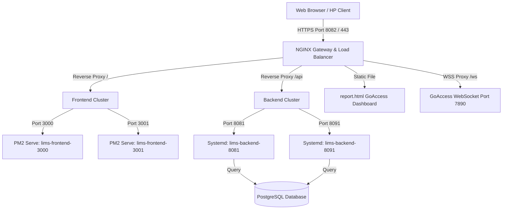

# Panduan Deployment Produksi LIMS Menggunakan NGINX, PM2, dan GoAccess

Dokumen ini menjelaskan arsitektur dan langkah-langkah detail untuk men-deploy **Laboratory Information Management System (LIMS)** ke lingkungan produksi (*Production-grade*) dengan tingkat ketersediaan tinggi (*High Availability*), pembagian beban (*Load Balancing*), enkripsi aman (SSL/TLS), serta monitoring real-time.

---

## 1. Arsitektur Produksi (Load Balancing & High Availability)

LIMS di-deploy dengan memisahkan server aplikasi web (*Frontend*) dan server backend API (*Backend*) ke dalam kluster multi-port yang di-load-balance langsung oleh NGINX. 



---

## 2. Prasyarat Sistem & Dependensi

Pastikan komponen-komponen berikut terinstal pada server produksi:
*   **Operating System**: Ubuntu Server 20.04 LTS / Debian 11 atau lebih baru (WSL2 dalam skenario lokal).
*   **Web Server & Load Balancer**: NGINX (`sudo apt install nginx`).
*   **Process Manager (Frontend)**: Node.js & PM2 (`sudo npm install -g pm2 serve`).
*   **Service Manager (Backend)**: Systemd (bawaan Linux).
*   **Log Analytics**: GoAccess (`sudo apt install goaccess`).
*   **Security & SSL**: Certbot Let's Encrypt atau SSL Certificate lokal (mkcert).

---

## 3. Deployment & Monitoring Frontend (Multi-Server PM2)

Frontend React/Vite di-compile menjadi aset statis kemudian disajikan oleh dua instance HTTP server (`serve`) yang dikelola oleh PM2 untuk mencegah *single point of failure* (SPOF).

### A. Build Aset Statis
1. Masuk ke folder root frontend:
   ```bash
   cd frontend
   ```
2. Instal semua dependensi:
   ```bash
   npm install
   ```
3. Lakukan build produksi:
   ```bash
   npm run build
   ```
   *Hasil build akan berada di direktori `dist/`.*
4. Salin folder hasil build ke direktori penyajian di server (misalnya `/var/www/lims/frontend/dist`):
   ```bash
   sudo mkdir -p /var/www/lims/frontend
   sudo cp -r dist /var/www/lims/frontend/
   sudo chown -R www-data:www-data /var/www/lims
   ```

### B. Konfigurasi Cluster PM2
PM2 menyajikan folder `dist` di port `3000` dan `3001` secara independen:
```bash
# Menjalankan Server Frontend 1 di Port 3000
pm2 start "serve -s /var/www/lims/frontend/dist -l 3000" --name "lims-frontend-3000"

# Menjalankan Server Frontend 2 di Port 3001
pm2 start "serve -s /var/www/lims/frontend/dist -l 3001" --name "lims-frontend-3001"

# Menyimpan konfigurasi agar otomatis jalan saat server reboot
pm2 save
pm2 startup
```

### C. Monitoring Frontend dengan PM2
PM2 mempermudah monitoring status dan kesehatan frontend Anda:
*   **Melihat Daftar Layanan**:
    ```bash
    pm2 list
    ```
*   **Memantau Metrik Penggunaan (CPU, Memori, Realtime)**:
    ```bash
    pm2 monit
    ```
*   **Melihat Log Real-time**:
    ```bash
    pm2 logs lims-frontend-3000
    pm2 logs lims-frontend-3001
    ```
*   **Melihat Informasi Detail Proses**:
    ```bash
    pm2 show lims-frontend-3000
    ```

---

## 4. Deployment & Monitoring Backend (Multi-Server Systemd)

Backend Go dikompilasi menjadi biner dan dijalankan sebagai dua layanan sistem (*systemd services*) terpisah pada port `8081` dan `8091`.

### A. Kompilasi Kode Go
Lakukan kompilasi silang (*Cross-Compile*) jika build dilakukan dari mesin Windows ke Linux:
```powershell
# Dari Windows PowerShell ke Linux
$env:GOOS="linux"; $env:GOARCH="amd64"; go build -ldflags="-s -w" -o main .
```
Pindahkan biner `main` ke server target di `/var/www/lims/backend/`.

### B. Konfigurasi File Lingkungan (.env)
Buat berkas `.env` terpisah untuk masing-masing port guna membedakan variabel port:

1.  **File `.env.8081`**:
    ```env
    GIN_MODE=release
    PORT=8081
    DB_HOST=127.0.0.1
    DB_PORT=5432
    DB_NAME=lims_prod_db
    DB_USER=lims_app
    DB_PASSWORD_ENCRYPTED=hhWT9CLQDmJP8EkFsQuzbn0KKy7QXhN94FE=
    DB_SCHEMA=lims
    JWT_SECRET=your_super_secret_key
    ```

2.  **File `.env.8091`**:
    ```env
    GIN_MODE=release
    PORT=8091
    DB_HOST=127.0.0.1
    DB_PORT=5432
    DB_NAME=lims_prod_db
    DB_USER=lims_app
    DB_PASSWORD_ENCRYPTED=hhWT9CLQDmJP8EkFsQuzbn0KKy7QXhN94FE=
    DB_SCHEMA=lims
    JWT_SECRET=your_super_secret_key
    ```

> [!IMPORTANT]
> **Aturan Systemd untuk file `.env`**:
> Jangan menuliskan inline comment (contoh: `PORT=8081 # port backend`) atau *shell variable expansion* (seperti `DB_HOST=${IP}`) di dalam file `.env` karena systemd akan membacanya secara literal dan memicu kegagalan startup (*panic*).

### C. Membuat Systemd Services
Buat dua berkas unit service di `/etc/systemd/system/`:

1.  **Layanan Port 8081** (`/etc/systemd/system/lims-backend-8081.service`):
    ```ini
    [Unit]
    Description=LIMS Go Backend Service (Port 8081)
    After=network.target postgresql.service

    [Service]
    Type=simple
    User=www-data
    Group=www-data
    WorkingDirectory=/var/www/lims/backend
    ExecStart=/var/www/lims/backend/main
    Restart=always
    RestartSec=5
    LimitNOFILE=65535
    EnvironmentFile=/var/www/lims/backend/.env.8081

    [Install]
    WantedBy=multi-user.target
    ```

2.  **Layanan Port 8091** (`/etc/systemd/system/lims-backend-8091.service`):
    ```ini
    [Unit]
    Description=LIMS Go Backend Service (Port 8091)
    After=network.target postgresql.service

    [Service]
    Type=simple
    User=www-data
    Group=www-data
    WorkingDirectory=/var/www/lims/backend
    ExecStart=/var/www/lims/backend/main
    Restart=always
    RestartSec=5
    LimitNOFILE=65535
    EnvironmentFile=/var/www/lims/backend/.env.8091

    [Install]
    WantedBy=multi-user.target
    ```

### D. Mengaktifkan dan Monitoring Backend
Jalankan perintah berikut untuk memuat ulang dan mengaktifkan service:
```bash
sudo systemctl daemon-reload
sudo systemctl enable --now lims-backend-8081.service lims-backend-8091.service
```

Untuk memantau log backend Go dari systemd, gunakan **`journalctl`**:
```bash
# Monitoring log real-time port 8081
sudo journalctl -u lims-backend-8081.service -f -n 100

# Monitoring log real-time port 8091
sudo journalctl -u lims-backend-8091.service -f -n 100
```

---

## 5. Konfigurasi NGINX (Load Balancing, SSL & Real-IP)

NGINX dikonfigurasi sebagai gerbang masuk utama yang mendistribusikan trafik secara merata ke cluster frontend dan backend.

### A. Konfigurasi Utama (`/etc/nginx/nginx.conf`)
Buka file `/etc/nginx/nginx.conf` dan tambahkan pemetaan IP Client asli serta format log kustom di dalam blok `http { ... }`:

```nginx
http {
    # ... konfigurasi dasar ...

    # Memetakan IP asli: jika X-Forwarded-For kosong, fallback ke $remote_addr
    map $http_x_forwarded_for $real_client_ip {
        ""      $remote_addr;
        default $http_x_forwarded_for;
    }

    # Format log monitoring detail untuk upstream load balancer
    log_format upstream_monitoring '$remote_addr - ClientIP: $real_client_ip - [$time_local] '
                                   '"$request" $status $body_bytes_sent '
                                   'to_server=$upstream_addr status=$upstream_status '
                                   'resp_time=$upstream_response_time '
                                   'agent="$http_user_agent"';

    access_log /var/log/nginx/access.log;
    error_log /var/log/nginx/error.log;

    include /etc/nginx/conf.d/*.conf;
    include /etc/nginx/sites-enabled/*;
}
```

### B. Konfigurasi Blok Virtual Host LIMS (`/etc/nginx/conf.d/lims.conf`)
Terapkan file konfigurasi NGINX berikut untuk menyambungkan semua cluster:

```nginx
# --- LOAD BALANCER BACKEND CLUSTER ---
upstream lims_backend_cluster {
    # Hapus ip_hash; untuk memaksa Round-Robin sehingga beban merata per request
    server 127.0.0.1:8081 max_fails=3 fail_timeout=10s;
    server 127.0.0.1:8091 max_fails=3 fail_timeout=10s;
}

# --- LOAD BALANCER FRONTEND CLUSTER ---
upstream lims_frontend_cluster {
    server 127.0.0.1:3000 max_fails=3 fail_timeout=10s;
    server 127.0.0.1:3001 max_fails=3 fail_timeout=10s;
}

# Redirect HTTP (8088) ke HTTPS (8082)
server {
    listen 8088;
    server_name lims.local localhost;
    return 301 https://$host$request_uri;
}

# Blok HTTPS Utama
server {
    listen 8082 ssl;
    server_name lims.local localhost;

    # --- SERTIFIKAT SSL ---
    ssl_certificate /etc/nginx/ssl/lims.local+2.pem;
    ssl_certificate_key /etc/nginx/ssl/lims.local+2-key.pem;
    ssl_protocols TLSv1.2 TLSv1.3;
    ssl_prefer_server_ciphers on;
    ssl_ciphers HIGH:!aNULL:!MD5;

    # --- PENANGANAN REAL IP DARI REVERSE PROXY ---
    set_real_ip_from 127.0.0.1;
    real_ip_header X-Forwarded-For;
    real_ip_recursive on;

    # Security Headers
    add_header X-Frame-Options "SAMEORIGIN" always;
    add_header X-XSS-Protection "1; mode=block" always;
    add_header X-Content-Type-Options "nosniff" always;
    add_header Referrer-Policy "no-referrer-when-downgrade" always;
    add_header Content-Security-Policy "default-src 'self' http: https: data: blob: 'unsafe-inline' 'unsafe-eval';" always;

    client_max_body_size 50M;

    # Melayani Aset Statis / report.html GoAccess secara langsung
    root /var/www/lims/frontend/dist;
    index index.html;

    # Proxy ke Cluster PM2 Frontend
    location / {
        proxy_pass http://lims_frontend_cluster;
        proxy_http_version 1.1;
        proxy_set_header Upgrade $http_upgrade;
        proxy_set_header Connection 'upgrade';
        proxy_set_header Host $host;
        proxy_cache_bypass $http_upgrade;
    }

    # GoAccess static dashboard
    location = /report.html {
        root /var/www/lims/frontend/dist;
    }

    # Proxy WebSocket untuk GoAccess Real-Time
    location /ws {
        proxy_pass http://127.0.0.1:7890;
        proxy_http_version 1.1;
        proxy_set_header Upgrade $http_upgrade;
        proxy_set_header Connection "Upgrade";
    }

    # Proxy API ke Go Backend Cluster
    location /api {
        proxy_pass http://lims_backend_cluster;
        proxy_http_version 1.1;
        proxy_set_header Upgrade $http_upgrade;
        proxy_set_header Connection 'upgrade';
        proxy_set_header Host $host;
        proxy_cache_bypass $http_upgrade;
        
        # Meneruskan IP Client Asli untuk Audit Log Backend
        proxy_set_header X-Real-IP $remote_addr;
        proxy_set_header X-Forwarded-For $proxy_add_x_forwarded_for;
        proxy_set_header X-Forwarded-Proto $scheme;

        # Timeout settings
        proxy_connect_timeout 90s;
        proxy_send_timeout 90s;
        proxy_read_timeout 90s;
    }

    # Proxy Halaman Simulator ke Go Backend Cluster
    location /simulator {
        proxy_pass http://lims_backend_cluster;
        proxy_http_version 1.1;
        proxy_set_header Upgrade $http_upgrade;
        proxy_set_header Connection 'upgrade';
        proxy_set_header Host $host;
        proxy_cache_bypass $http_upgrade;
    }

    # Proxy untuk file unggahan
    location /uploads {
        proxy_pass http://lims_backend_cluster/uploads;
        expires 30d;
        add_header Cache-Control "public, no-transform";
    }

    # Output Log file dengan log_format khusus
    access_log /var/log/nginx/lims_access.log upstream_monitoring;
    error_log /var/log/nginx/lims_error.log;
}

# Blok HTTPS Alternatif untuk Telegram Webhook (Port 8443)
server {
    listen 8443 ssl;
    server_name 212.85.24.33;

    # Menggunakan sertifikat khusus IP (Common Name = 212.85.24.33)
    ssl_certificate /etc/nginx/ssl/telegram.crt;
    ssl_certificate_key /etc/nginx/ssl/telegram.key;
    ssl_protocols TLSv1.2 TLSv1.3;
    ssl_prefer_server_ciphers on;
    ssl_ciphers HIGH:!aNULL:!MD5;

    location /api {
        proxy_pass http://lims_backend_cluster;
        proxy_http_version 1.1;
        proxy_set_header Upgrade $http_upgrade;
        proxy_set_header Connection 'upgrade';
        proxy_set_header Host $host;
        proxy_set_header X-Real-IP $remote_addr;
        proxy_set_header X-Forwarded-For $proxy_add_x_forwarded_for;
        proxy_set_header X-Forwarded-Proto $scheme;
    }
}
```

Terapkan dan restart NGINX:
```bash
sudo nginx -t && sudo systemctl reload nginx
```

---

## 6. Rotasi Log Harian (Logrotate)

Di server produksi, file log dapat dengan cepat menghabiskan memori jika tidak dikelola dengan benar. Kami mengonfigurasi `logrotate` harian agar file log di-rename menggunakan ekstensi tanggal (`_YYYYMMDD.log`).

Edit file `/etc/logrotate.d/nginx`:
```bash
sudo nano /etc/logrotate.d/nginx
```

Masukkan konfigurasi produksi berikut:
```nginx
/var/log/nginx/lims_access.log
/var/log/nginx/lims_error.log {
	daily
	missingok
	rotate 14
	compress
	delaycompress
	notifempty
	create 0640 www-data adm
	sharedscripts
	dateext
	dateformat _%Y%m%d
	extension .log
	dateyesterday
	prerotate
		if [ -d /etc/logrotate.d/httpd-prerotate ]; then \
			run-parts /etc/logrotate.d/httpd-prerotate; \
		fi \
	endscript
	postrotate
		invoke-rc.d nginx rotate >/dev/null 2>&1
	endscript
}

/var/log/nginx/access.log
/var/log/nginx/error.log {
	daily
	missingok
	rotate 14
	compress
	delaycompress
	notifempty
	create 0640 www-data adm
	sharedscripts
	prerotate
		if [ -d /etc/logrotate.d/httpd-prerotate ]; then \
			run-parts /etc/logrotate.d/httpd-prerotate; \
		fi \
	endscript
	postrotate
		invoke-rc.d nginx rotate >/dev/null 2>&1
	endscript
}
```

Uji validasi konfigurasi rotasi secara langsung:
```bash
sudo logrotate -df /etc/logrotate.d/nginx
```

---

## 7. Real-Time Analytics dengan GoAccess

GoAccess memproses file `lims_access.log` secara real-time dan menyajikannya dalam dasbor HTML interaktif di `https://lims.local/report.html`.

### A. Script Inisialisasi GoAccess
Buat script inisialisasi di server target Anda (misal `scratch/run_goaccess.sh`):

```bash
#!/bin/bash

# Hentikan instansi GoAccess yang berjalan sebelumnya
sudo killall goaccess 2>/dev/null || true

# Jalankan GoAccess baru di latar belakang
# Format log (--log-format) harus disesuaikan persis dengan 'upstream_monitoring' di NGINX
sudo goaccess /var/log/nginx/lims_access.log \
  --log-format='%h - ClientIP: %^ - [%d:%t %^] "%r" %s %b to_server=%v status=%^ resp_time=%^ agent="%u"' \
  --date-format='%d/%b/%Y' \
  --time-format='%H:%M:%S' \
  --ws-url=wss://lims.local/ws \
  -o /var/www/lims/frontend/dist/report.html \
  --real-time-html &

echo "GoAccess Berhasil Dijalankan di Latar Belakang!"
```

Jalankan script tersebut:
```bash
chmod +x scratch/run_goaccess.sh
./scratch/run_goaccess.sh
```

---

## 8. Pemantauan & Verifikasi Operasional (Production Checklist)

Gunakan daftar perintah berikut di server produksi Anda untuk melakukan verifikasi kesehatan sistem secara berkala:

| Target Pemantauan | Perintah Pemeriksaan | Indikator Berhasil |
| :--- | :--- | :--- |
| **Status Port Aktif** | `sudo ss -tulpn` | Port 8082, 8088, 3000, 3001, 8081, 8091, 7890 dalam status `LISTEN`. |
| **Status PM2 (Frontend)** | `pm2 list` | `lims-frontend-3000` & `3001` berstatus `online`. |
| **Status Backend** | `systemctl status lims-backend-8081` | Service berstatus `active (running)`. |
| **Pembagian Beban (Nginx)** | `tail -f /var/log/nginx/lims_access.log` | Nilai `to_server` bergantian secara acak/seimbang antara `127.0.0.1:8081` dan `127.0.0.1:8091`. |
| **Log Analitik Real-time** | Kunjungi `https://lims.local/report.html` | Grafik dasbor ter-update secara berkala tanpa putus koneksi WebSocket. |
