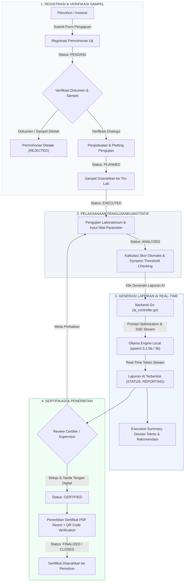
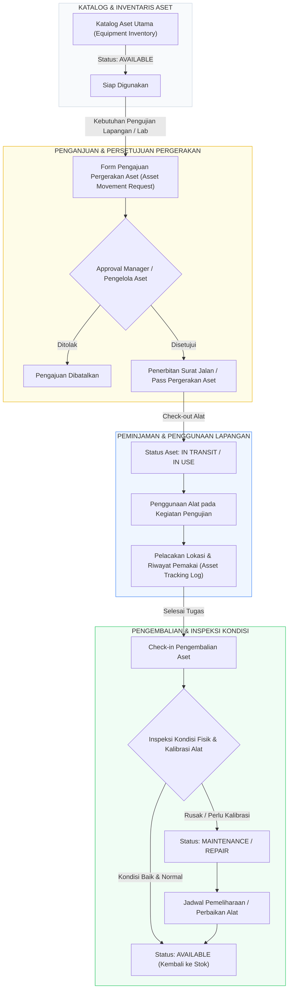
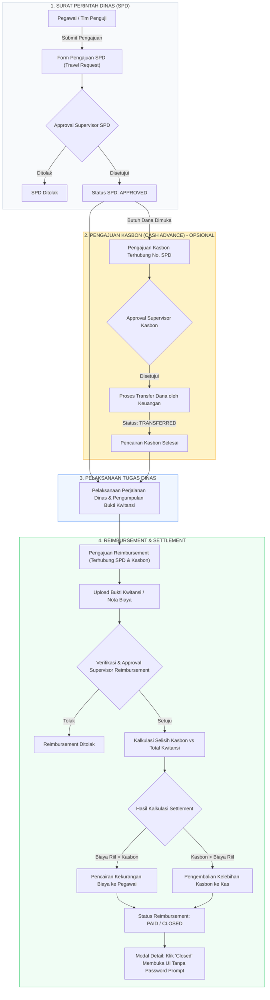

# 🔄 Visualisasi Alur Proses Bisnis LIMS (Laboratory Information Management System)

Dokumen ini menyajikan visualisasi diagram alur (*flowchart*) terstruktur untuk 3 modul utama sistem LIMS, mencakup alur pengujian dengan integrasi AI, manajemen pergerakan aset (*asset movement*), serta alur operasional keuangan dari Surat Perintah Dinas (SPD) hingga *Reimbursement*.

---

## 1. 🧪 Alur Pengujian & Penerbitan Sertifikat (End-to-End dengan AI)

Diagram berikut menggambarkan alur hidup (*lifecycle*) permohonan pengujian mulai dari registrasi awal, pengujian laboratorium, sintesis laporan berbasis **AI (Ollama Local SSE Streaming)**, persetujuan sertifikator, hingga penerbitan sertifikat resmi.

### 📋 Penjelasan Tahapan:
1. **Registrasi (`PENDING` $\rightarrow$ `PLANNED`)**: Pemohon mendaftarkan pengujian instrumen/peralatan. Admin meneliti sampel dan dokumen administrasi.
2. **Pengujian (`EXECUTED` $\rightarrow$ `ANALYZED`)**: Pengujian fisik/teknis dilakukan di lab. Sistem menghitung skor per aspek dan mengecek threshold kelulusan dinamis.
3. **Generasi AI (`REPORTING`)**: Modul AI lokal (Ollama `qwen2.5`) menyintesis narasi *Executive Summary*, analisis parameter deviasi/gagal, dan tindakan perbaikan spesifik secara *real-time streaming*.
4. **Penerbitan (`CERTIFIED` $\rightarrow$ `FINALIZED` / `CLOSED`)**: Supervisor menelaah dan menyetujui laporan. Sertifikat digital PDF dengan stempel QR Code diterbitkan.

---

## 2. 📦 Alur Movement Asset Testing (Manajemen Pergerakan Alat Uji)

Diagram ini mengontrol siklus peminjaman, pelacakan lokasi (*tracking*), dan pengembalian aset alat uji yang digunakan untuk pengujian lapangan maupun antar-laboratorium.

### 📋 Penjelasan Tahapan:
1. **Pengajuan**: Petugas mengajukan peminjaman aset alat uji dengan mencantumkan tujuan pengujian dan durasi pemakaian.
2. **Approval & Suratan**: Pengelola aset menyetujui dan menerbitkan manifes pergerakan barang.
3. **Peminjaman (`IN USE`)**: Lokasi dan pengguna aktif tercatat pada log riwayat aset.
4. **Inspeksi Pengembalian**: Setelah dikembalikan, alat diinspeksi. Jika normal, status kembali ke `AVAILABLE`; jika ada penyimpangan/kerusakan, dialihkan ke `MAINTENANCE`.

---

## 3. 💰 Alur Operational Financial (SPD $\rightarrow$ Kasbon $\rightarrow$ Reimbursement)

Diagram ini menggambarkan integrasi alur administrasi perjalanan dinas (SPD), pencairan dana dimuka (*Cash Advance / Kasbon*), hingga klaim biaya (*Reimbursement*) dan pelunasan (*Settlement*).

### 📋 Penjelasan Tahapan:
1. **SPD (`Travel Request`)**: Pengajuan dinas diajukan dan disetujui supervisor.
2. **Kasbon (`Cash Advance`)**: Jika membutuhkan dana operasional awal, kasbon diajukan terhubung ke nomor SPD dan dicairkan oleh bagian keuangan.
3. **Pelaksanaan**: Tim melakukan kegiatan pengujian dan mengumpulkan bukti transaksi/kwitansi resmi.
4. **Reimbursement & Settlement (`Reimbursement`)**: Pengajuan klaim dibuat dengan melampirkan kwitansi. Sistem memperhitungkan selisih antara kasbon dimuka dan biaya nyata. Setelah disetujui, pembayaran dilunasi dan status menjadi `PAID` / `CLOSED` (di mana tombol "Closed" pada modal UI menutup tampilan secara bersih).
