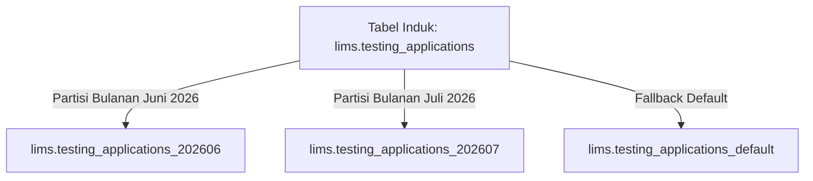
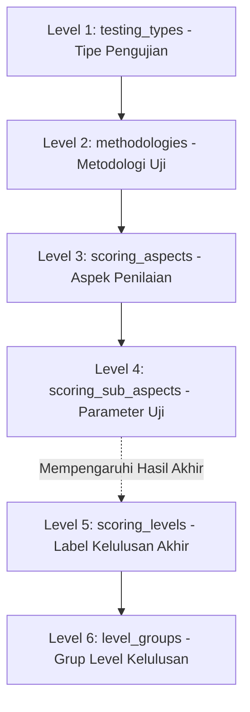
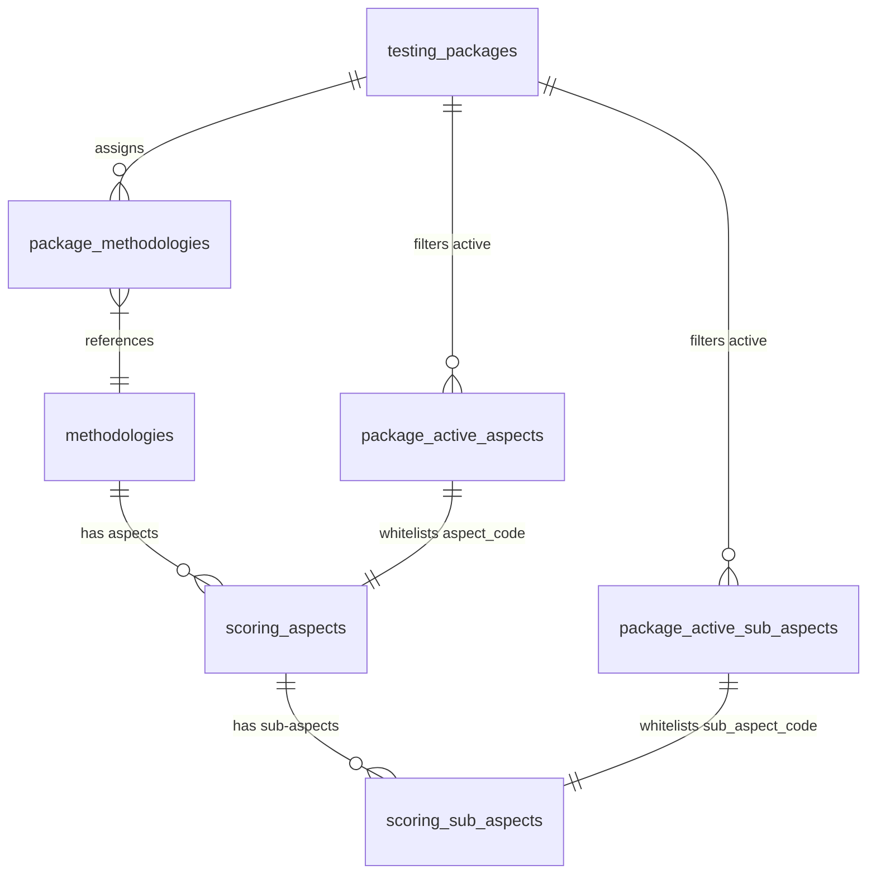

# LIMS System Documentation (Laboratory Information Management System)

Dokumen ini menyajikan prasyarat perangkat lunak, arsitektur teknis lengkap, alur akses pengguna, struktur direktori, mekanisme partisi data, pemetaan modul dengan API serta basis data, konfigurasi paket dinamis, sistem penilaian (*scoring*) LIMS, dan panduan deployment produksi Nginx terlengkap.

---


## Daftar Isi
- [Executive Summary](#executive-summary)
- [Project Objectives](#project-objectives)
- [Stakeholders & User Roles](#stakeholders--user-roles)
- [Non-Functional Requirements](#non-functional-requirements)
- [Ringkasan Modul & Sub-Modul LIMS](#ringkasan-modul--sub-modul-lims)
- [1. Prasyarat Perangkat Lunak (Software Prerequisites)](#1-prasyarat-perangkat-lunak-software-prerequisites)
- [2. Arsitektur Sistem & Alur Akses Pengguna (System Architecture & Access Flow)](#2-arsitektur-sistem--alur-akses-pengguna-system-architecture--access-flow)
  - [Diagram Arsitektur Sistem & Alur Akses](#diagram-arsitektur-sistem--alur-akses)
  - [Alur Akses Detil Pengguna](#alur-akses-detil-pengguna)
- [3. Struktur Direktori Proyek (Project Directory Structure)](#3-struktur-direktori-proyek-project-directory-structure)
  - [A. Struktur Direktori Backend (Go)](#a-struktur-direktori-backend-go)
  - [B. Struktur Direktori Frontend (React)](#b-struktur-direktori-frontend-react)
- [4. Alur Kerja & Fragmentasi Data (Workflow & Data Partitioning)](#4-alur-kerja--fragmentasi-data-workflow--data-partitioning)
  - [A. Tahapan Alur Kerja Detil LIMS](#a-tahapan-alur-kerja-detil-lims)
  - [B. Fragmentasi & Partisi Database (Database Partitioning)](#b-fragmentasi--partisi-database-database-partitioning)
- [5. Modul Aplikasi, API, dan Basis Data (Application Modules, APIs, & Database Schema)](#5-modul-aplikasi-api-dan-basis-data-application-modules-apis--database-schema)
  - [1. Modul Otentikasi & RBAC (Auth & Access Control)](#1-modul-otentikasi--rbac-auth--access-control)
  - [2. Modul Registrasi & Pengajuan (Submission)](#2-modul-registrasi--pengajuan-submission)
  - [3. Modul Perencanaan & Pelaksanaan Uji](#3-modul-perencanaan--pelaksanaan-uji)
  - [4. Modul Analisa Data & Scoring (Scoring Engine)](#4-modul-analisa-data--scoring-scoring-engine)
  - [5. Modul Keuangan & Perjalanan (Finance & Travel)](#5-modul-keuangan--perjalanan-finance--travel)
  - [6. Modul Manajemen Aset Peralatan Client (Asset Tracking)](#6-modul-manajemen-aset-peralatan-client-asset-tracking)
  - [7. Modul Manajemen Testing Tools (Testing Tools Tracking)](#7-modul-manajemen-testing-tools-testing-tools-tracking)
  - [8. Modul AI & Otomatisasi IoT](#8-modul-ai--otomatisasi-iot)
  - [9. Modul Monitoring](#9-modul-monitoring)
  - [10. Modul Reporting](#10-modul-reporting)
  - [11. Modul Pemeliharaan Sistem](#11-modul-pemeliharaan-system)
- [6. Arsitektur & Konfigurasi Paket Layanan (Testing Packages)](#6-arsitektur--konfigurasi-paket-layanan-testing-packages)
- [7. Tabel Basis Data (Database Tables Directory)](#7-tabel-basis-data-database-tables-directory)
- [8. Panduan Deployment Produksi LIMS (Multi-Direktori Backend & Frontend)](#8-panduan-deployment-produksi-lims-multi-direktori-backend--frontend)
  - [A. Arsitektur Produksi (Multi-Direktori vs Multi-VM)](#a-arsitektur-produksi-multi-direktori-vs-multi-vm)
  - [B. Prasyarat Sistem & Manajemen Pengguna Linux](#b-prasyarat-sistem--manajemen-pengguna-linux)
  - [C. Port Mapping & Manajemen Konflik Port](#c-port-mapping--manajemen-konflik-port)
  - [D. Deployment & Konfigurasi Frontend (PM2)](#d-deployment--konfigurasi-frontend-pm2)
  - [E. Deployment & Konfigurasi Backend (Multi-Direktori)](#e-deployment--konfigurasi-backend-multi-direktori)
  - [F. Konfigurasi NGINX](#f-konfigurasi-nginx)
  - [G. Rotasi Log Harian (Logrotate) & Penjadwalan 01:00 Dini Hari](#g-rotasi-log-harian-logrotate--penjadwalan-0100-dini-hari)
  - [H. Real-Time Analytics dengan GoAccess](#h-real-time-analytics-dengan-goaccess)
  - [I. Pemantauan & Pemeliharaan (Checklist)](#i-pemantauan--pemeliharaan-checklist)
  - [J. Pelatihan Model AI (PQC) & Penjadwalan Otomatis (Crontab)](#j-pelatihan-model-ai-pqc--penjadwalan-otomatis-crontab)
  - [K. Administrasi & Pemeliharaan Modul Pendukung (PostgreSQL, MinIO, Camunda)](#k-administrasi--pemeliharaan-modul-pendukung-postgresql-minio-camunda)
  - [L. Akses LIMS dari Internet (Ngrok Dev & Produksi Asli)](#l-akses-lims-dari-internet-ngrok-dev-amp-produksi-asli)
  - [M. Ringkasan Lokasi Berkas Log LIMS](#m-ringkasan-lokasi-berkas-log-lims)
  - [N. Ringkasan Perintah Manajemen Modul LIMS (Start, Stop, Status)](#n-ringkasan-perintah-manajemen-modul-lims-start-stop-status)
  - [O. Strategi Manajemen Versi Aplikasi Android LIMS](#o-strategi-manajemen-versi-aplikasi-android-lims)
  - [P. Panduan Pembuatan APK Android (Berbagai Skema Jaringan & Target)](#p-panduan-pembuatan-apk-android-berbagai-skema-jaringan-amp-target)

---

## Executive Summary
LIMS (*Laboratory Information Management System*) merupakan sistem terintegrasi yang dirancang untuk mendigitalkan dan mengotomatisasi seluruh siklus operasional pengujian laboratorium, mulai dari pendaftaran klien, pelacakan aset, penjadwalan uji, hingga penagihan dan pelaporan (SHP).


## Project Objectives
- Mendigitalkan alur kerja pengujian secara menyeluruh (*paperless*) untuk mempercepat SLA layanan kepada klien.
- Mengintegrasikan manajemen aset, ketersediaan alat uji, sistem keuangan, dan data hasil uji ke dalam satu platform terpusat.
- Meningkatkan akurasi analisis dan evaluasi melalui integrasi kecerdasan buatan (RAG & LLM) serta pengambilan data otomatis dari IoT/Simulator.


## Stakeholders & User Roles
Sistem ini melayani berbagai pemangku kepentingan dengan kontrol akses berbasis peran (RBAC), antara lain:
- **Klien / Mitra**: Pihak eksternal yang mengajukan pendaftaran uji dan menerima laporan hasil akhir.
- **Admin & Frontdesk**: Staf operasional yang menangani verifikasi registrasi, penagihan awal, dan serah terima aset fisik.
- **Analis & Tester**: Tim teknis lapangan/lab yang mengeksekusi pengujian dan memasukkan parameter ukur.
- **Manajemen / Kepala Lab**: Pihak manajerial yang memvalidasi persetujuan SPD, uang muka, dan mengesahkan SHP.
- **Keuangan (Finance)**: Staf yang mengelola pencairan dana operasional, penerimaan pembayaran, dan *settlement reimbursement*.


## Non-Functional Requirements
- **Data Integrity**: Standardisasi ID 64-bit untuk memastikan kompatibilitas dengan dataset relasional skala besar (menggunakan PostgreSQL `BIGINT`).
- **Security**: Kontrol akses sistem secara berlapis menggunakan *Role-Based Access Control* (RBAC) dan otentikasi aman berbasis JWT (*JSON Web Tokens*).
- **Performance**: Partisi basis data (*Database Partitioning*) otomatis untuk tabel log aplikasi dan hasil uji guna memastikan waktu eksekusi kueri di bawah satu detik (*sub-second query times*).
- **Interoperability**: Integrasi mulus dengan perangkat keras (Simulator Hardware) melalui perantara protokol *RESTful API*, *HTTP Request*, maupun *MQTT*.

---


## Ringkasan Modul & Sub-Modul LIMS

Berikut adalah ringkasan (*summary table*) dari seluruh modul dan sub-modul yang beroperasi di dalam ekosistem LIMS beserta fungsi utamanya:

| Modul | Fitur | Fungsi & Kapabilitas | Backend (Golang) | Frontend (React) |
| :--- | :--- | :--- | :--- | :--- |
| **1. Otentikasi & RBAC** | Manajemen Pengguna & Sesi | Menangani login, pendaftaran token JWT, dan validasi sesi aktif. | `controllers/auth_controller.go`, `middleware/auth.go`, `lims.user_sessions` | `AppContext.jsx`, `Header.jsx` |
| | Kontrol Akses Berbasis Peran | Membatasi dan merender menu sidebar secara dinamis sesuai jabatan (*role*) pengguna. | `middleware/role_check.go`, `lims.roles`, `lims.menus`, `lims.role_menus` | `Sidebar.jsx`, `MainContent.jsx` |
| **2. Registrasi & Pengajuan** | Manajemen Klien (Mitra) | Mengelola data perusahaan/mitra yang mendaftarkan pengujian. | `controllers/application_controller.go`, `lims.partners` | `Submission.jsx` |
| | Pendaftaran Aplikasi Uji | Pendataan dokumen persyaratan, pengajuan uji, serta pendaftaran awal aset klien. | `controllers/application_controller.go`, `services/camunda_service.go`, `services/minio_service.go`, `lims.testing_applications` | `Submission.jsx` |
| **3. Perencanaan & Pelaksanaan** | *Plotting* Jadwal & Tim | Menjadwalkan pengujian lapangan/lab dan menugaskan tim tester tersertifikasi. | `controllers/application_controller.go`, `lims.testing_plans`, `lims.tester_applications`, `lims.master_testers` | `PlanningForm.jsx` |
| | Perekaman Hasil Uji | Form input untuk merekam nilai fisik lapangan berdasarkan hierarki parameter pengujian. | `controllers/application_controller.go`, `lims.testing_results` | `AppDetail.jsx` (Form Input) |
| **4. Analisa Data & Scoring** | Kalkulasi *Scoring Engine* | Menghitung persentase bobot aspek secara hierarkis (Tipe Uji ➔ Metodologi ➔ Grup ➔ Aspek ➔ Sub-Aspek). | `services/scoring_service.go`, `lims.testing_results`, `lims.testing_aspect_scores`, `lims.testing_applications` | `AppDetail.jsx` (View Score) |
| | Penentuan Kelulusan | Membandingkan nilai akhir dengan ambang batas (*threshold*) global untuk label kelulusan. | `services/scoring_service.go`, `lims.global_parameters` | `AppDetail.jsx` |
| **5. Keuangan & Perjalanan** | Penagihan (*Billing/Invoice*) | Pembuatan tagihan otomatis saat registrasi. | `controllers/billing_controller.go`, `lims.invoices` | `Submission.jsx` |
| | Pembayaran Invoice | Validasi dan pencatatan pembayaran invoice dari klien. | `controllers/billing_controller.go`, `lims.payments` | `Submission.jsx` |
| | Surat Perjalanan Dinas (SPD) | Pengajuan perjalanan petugas lapangan beserta rincian anggarannya. | `controllers/travel_controller.go` (implicit), `lims.travel_requests`, `lims.travel_request_counters` | Travel request UI |
| | *Cash Advance & Reimbursement* | Proses permohonan uang muka dan klaim biaya aktual (*upload* nota/struk digital). | `controllers/travel_controller.go` (implicit), `services/minio_service.go`, `lims.cash_advances`, `lims.reimbursements`, `lims.travel_request_counters` | Reimbursement UI |
| **6. Manajemen Aset Peralatan Client** | Pelacakan Aset Klien (*Moving*) | Pemantauan lokasi barang klien (*Moving Asset*) di dalam atau luar laboratorium. | `controllers/asset_controller.go`, `lims.testing_equipments`, `lims.master_asset_statuses` | `AssetManagementPage.jsx` |
| | Serah Terima Aset (*Handover*) | Pembuatan dan pencetakan Berita Acara Serah Terima barang kembali kepada klien. | `controllers/asset_controller.go`, `lims.asset_handovers` | `AssetManagementPage.jsx` |
| | Movement Logs | Mencatat log perpindahan lokasi (*moving*) alat uji secara *real-time*. | `POST /api/assets/movement`, `lims.asset_activity_logs` | `AssetManagementPage.jsx` |
| | Activity History (Logs) | Audit trail lengkap pencatatan riwayat log aktivitas aset tertentu. | `GET /api/asset-logs`, `lims.asset_activity_logs` | `AssetManagementPage.jsx` |
| | Asset Labeling | Pembuatan label QR Code otomatis untuk memudahkan identifikasi fisik. | `lims.testing_equipments` | `AssetManagementPage.jsx` (`qrcode.react`) |
| | Scan Integration | Pemindaian barcode/QR via kamera (web/mobile) untuk akses cepat ke data aset. | `GET /api/assets`, `lims.testing_equipments` | `AssetManagementPage.jsx` (`html5-qrcode`) |
| **7. Manajemen Testing Tools** | Inventaris & Reservasi Alat | Pemantauan stok alat, jadwal kalibrasi, serta sistem pemesanan (*booking*) alat uji. | `controllers/tool_controller.go`, `lims.testing_tools`, `lims.testing_tool_reservations`, `lims.testing_tool_availabilities` | `ToolAvailabilityPage.jsx` |
| | Monitor Pemakaian Alat | Melacak riwayat *check-in/check-out* serta intensitas penggunaan setiap alat saat pengujian. | `controllers/tool_controller.go`, `lims.testing_tool_transactions` | `ToolAvailabilityPage.jsx` |
| **8. AI & Otomatisasi IoT** | *Chatbot RAG Assistant* | Agen virtual cerdas untuk tanya-jawab referensi manual/SOP lab secara *omnichannel*. | `controllers/sop_controller.go`, `controllers/ai_controller.go`, `services/rag_service.go`, `database/rag_schema.go`, `chat_sch.documents`, `chat_sch.document_chunks` | `AsistenLab.jsx` |
| | ↳ Document Ingestion (Pengolahan Dokumen) | Unggah & ekstraksi teks PDF SOP halaman-per-halaman, pemecahan teks (*chunking* sliding window) dan penyimpanan metadata. | `controllers/sop_controller.go`, `services/rag_service.go` (`IngestPDF`), `chat_sch.documents` | `AsistenLab.jsx` (upload UI) |
| | ↳ Embedding & Vector Storage (Representasi Vektor) | Konversi potongan teks menjadi vektor 768-dimensi (`nomic-embed-text`) dan penyimpanan ke PostgreSQL `pgvector`. | `services/rag_service.go` (`GetEmbedding`), `chat_sch.document_chunks` | — |
| | ↳ Retrieval & Prompt Engineering (Pencarian & Sintesis) | Pencarian kemiripan semantik (*cosine similarity*) terhadap vektor chunks dan perakitan *prompt* konteks untuk LLM. | `services/rag_service.go`, `chat_sch.document_chunks` | `AsistenLab.jsx` |
| | ↳ Generation (Pembuatan Jawaban) | Generasi jawaban natural berbasis konteks SOP oleh LLM lokal (Ollama) atau cloud (Groq), lengkap dengan sumber nama file & nomor halaman. | `controllers/ai_controller.go`, Ollama / Groq API | `AsistenLab.jsx` |
| | Rekomendasi Laporan (LLM) | Penghasil draf otomatis analisis kesimpulan dan rekomendasi perbaikan dari AI. | `controllers/ai_controller.go`, `lims.testing_applications` (`analysis_conclusion`) | `AppDetail.jsx` |
| | Predictive Quality Control (PQC) | Deteksi anomali statistik multivariate (*Isolation Forest*) secara *real-time* saat operator menginput skor. | Go native inference (`onnxruntime_go`), Python `train.py`, `lims.ai_model_registry`, `lims.ai_anomaly_logs` | UI form eksekusi (modal warning/supervisor override) |
| | ↳ Retraining | Pelatihan ulang model PQC secara terjadwal menggunakan data historis terbaru untuk menjaga akurasi deteksi anomali. | Python `train.py`, `lims.ai_model_registry` | UI Maintenance Page |
| | ↳ Deteksi Anomali Statistik (Outlier) | Identifikasi skor parameter yang menyimpang secara statistik dari distribusi normal data historis menggunakan model *Isolation Forest*. | Go native inference (`onnxruntime_go`), `lims.testing_pqc_ai_anomalies` | UI form eksekusi (modal warning) |
| | ↳ Validasi Batas Toleransi | Pengecekan otomatis apakah nilai skor yang diinput masih berada dalam rentang toleransi batas minimum–maksimum parameter pengujian. | `services/scoring_service.go`, `lims.scoring_sub_aspects` | `AppDetail.jsx` (Form Input) |
| | ↳ Mekanisme Blokir & Override | Pemblokiran otomatis input skor anomali disertai notifikasi peringatan, dengan opsi *supervisor override* berbasis otorisasi peran. | `controllers/ai_controller.go`, `lims.ai_anomaly_logs` | UI form eksekusi (modal supervisor override) |
| | Integrasi Simulator IoT | Penerimaan data log otomatis secara *real-time* langsung dari perangkat uji fisik/eksternal. | `controllers/machine_controller.go` (webhook), `lims.simulator_data_logs` | `hardware_simulator.html` (statis/test) |
| **9. Monitoring** | *Dashboard* & *Tracking* | Pemantauan progres tahapan pengujian (aplikasi) dan SLA layanan harian. | NGINX Load Balancer, GoAccess WebSocket (`port 7890`) | `WelcomePage.jsx`, `report.html` (GoAccess static) |
| **10. Reporting** | Sertifikat Hasil Pengujian (SHP) | Penghasil (*generator*) laporan kelulusan dan laporan teknis akhir untuk dicetak/didistribusikan. | `utils/print.js` (printing helper) | `AppDetail.jsx` (trigger print SHP) |
| | Laporan Summary Testing | Ringkasan statistik seluruh hasil pengujian per periode/status. | `controllers/report_controller.go`, `lims.testing_applications` | Report Page |
| | Laporan Detil Testing | Rincian lengkap parameter, skor, dan hasil uji per aplikasi. | `controllers/report_controller.go`, `lims.testing_results`, `lims.testing_aspect_scores` | Report Page |
| | Laporan Daftar Aset | Inventarisasi seluruh aset klien beserta status dan lokasinya. | `controllers/report_controller.go`, `lims.testing_equipments` | Report Page |
| | Laporan Serah Terima | Berita acara serah terima aset kepada klien setelah pengujian selesai. | `controllers/report_controller.go`, `lims.asset_handovers` | Report Page |
| | Laporan Tagihan | Daftar seluruh invoice dan status pembayarannya per periode. | `controllers/report_controller.go`, `lims.invoices` | Report Page |
| | Laporan Pembayaran | Rekap transaksi pembayaran invoice yang telah diterima. | `controllers/report_controller.go`, `lims.payments` | Report Page |
| | Laporan SPD | Rekapitulasi Surat Perjalanan Dinas beserta status persetujuannya. | `controllers/report_controller.go`, `lims.travel_requests` | Report Page |
| | Laporan Cash Advance | Rincian pengajuan dan pencairan uang muka operasional dinas. | `controllers/report_controller.go`, `lims.cash_advances` | Report Page |
| | Laporan Reimbursement | Rekap klaim penggantian biaya aktual beserta bukti struk/nota. | `controllers/report_controller.go`, `lims.reimbursements` | Report Page |
| **11. Pemeliharaan Sistem** | Manajemen Partisi Database | Penjadwalan *partitioning* tabel otomatis untuk menjaga performa data historis. | `models/schema_manager.go` | UI Maintenance Page |
| | Analisa *Bloat & Vacuum* | Fitur untuk mengidentifikasi fragmentasi data (*dead tuples*) dan melakukan *vacuuming* mandiri. | `models/schema_manager.go` | UI Maintenance Page |
| | Analisa Struktur & Partisi | Pemeriksaan kondisi struktur tabel dan status partisi aktif di database untuk verifikasi integritas. | `models/schema_manager.go` | UI Maintenance Page |
| | Backup & Restore Database | Pengamanan dan pemulihan data aplikasi secara *native* langsung dari UI. | `models/schema_manager.go` | UI Maintenance Page |

---


## 1. Prasyarat Perangkat Lunak (Software Prerequisites)

Sebelum melakukan deployment LIMS, sistem server harus terpasang perangkat lunak berikut:

| Komponen | Perangkat Lunak | Versi Minimal | Keterangan |
| :--- | :--- | :---: | :--- |
| **Sistem Operasi** | Linux (Ubuntu Server / Debian) atau WSL2 | Ubuntu 20.04 LTS | Lingkungan dasar deployment |
| **Bahasa Pemrograman** | Go (Golang) | 1.21+ (Rekomendasi 1.23) | Runtime backend |
| **Runtime JS & PM2** | Node.js & npm | Node 18+ & npm 9+ | Menjalankan build frontend & PM2 manager |
| **Basis Data** | PostgreSQL dengan `pgvector` | Postgres 14+ | Penyimpanan utama & AI embedding |
| **Workflow Engine** | Camunda BPM Community Edition | Platform 7.x | Otomatisasi alur pendaftaran |
| **Object Storage** | MinIO Server | Latest Stable | Penyimpanan berkas digital |
| **Web Server** | NGINX | 1.18+ | Reverse proxy & load balancing |
| **OCR Engine** | Python & PaddleOCR | Python 3.8+ | Pengenal dokumen/hasil uji |
| **AI LLM Runner** | Ollama | Latest Stable | Runner model AI lokal (jika tidak via Groq Cloud) |

---


## 2. Arsitektur Sistem & Alur Akses Pengguna (System Architecture & Access Flow)

LIMS diakses melalui dua tipe klien utama: **Web Application (Desktop/Admin)** dan **Mobile Application (Android APK via Capacitor)**. Semua permintaan dirutekan melalui NGINX Load Balancer.


### Diagram Arsitektur Sistem & Alur Akses


### Alur Akses Detil Pengguna
1. **Akses via Web (Desktop) - Bebas Port**:
   - Pengguna mengakses menggunakan domain standar tanpa port: `https://lims.local` (HTTPS Port 443) atau `http://lims.local` (HTTP Port 80).
   - NGINX bertindak sebagai gerbang tunggal yang mendengarkan Port 80/443, mengeliminasi kebutuhan pengguna mengetik port di browser.
   - NGINX merutekan permintaan frontend ke port internal `3000` & `3001` (PM2) dan permintaan API `/api` ke port internal `8081` & `8091` (Go Backend).
2. **Akses via Mobile App (Android APK)**:
   - **Mode Produksi**: Aplikasi Android memanggil API LIMS secara langsung melalui URL DNS Publik resmi (Port 443) dengan sertifikat SSL terpercaya (misal Let's Encrypt).
   - **Mode Pengembangan (Development Only)**: URL API diarahkan menggunakan bantuan terowongan aman **Ngrok** (`https://*.ngrok-free.dev`) untuk menjembatani server lokal dengan perangkat ponsel uji secara instan.
3. **Penyajian Laporan & Analitik (GoAccess)**:
   - Akses `/report.html` untuk memantau log lalu lintas secara real-time. NGINX menyajikan berkas HTML ini secara statis dan membuka koneksi WebSocket di `/ws` ke server GoAccess (port `7890`).

---


## 3. Struktur Direktori Proyek (Project Directory Structure)

Proyek LIMS terbagi menjadi dua bagian besar: `backend` (Go) dan `frontend` (React + Vite + Capacitor).


### A. Struktur Direktori Backend (Go)
```
backend/
├── controllers/          # Logika pengendali HTTP REST API
│   ├── ai_controller.go           # Penanganan RAG & AI report generator
│   ├── application_controller.go  # Alur utama transaksi pengujian
│   ├── auth_controller.go         # Otentikasi sesi & pengambilan menu
│   ├── billing_controller.go      # Manajemen invoice & pembayaran
│   ├── asset_controller.go        # Pelacakan pergerakan aset & handover
│   └── tool_controller.go         # Pemakaian alat uji & reservasi
├── database/             # Inisialisasi pool koneksi database
│   └── db.go                      # Konfigurasi GORM ke Postgres & Chatbot DB
├── middleware/           # Interseptor HTTP Request
│   ├── auth.go                    # Validasi otentikasi JWT Token
│   ├── rate_limit.go              # Pembatasan laju request per menit
│   └── role_check.go              # Pemeriksaan hak akses menu peran
├── models/               # Definisi skema tabel GORM & logic data
│   ├── models.go                  # Struct utama (User, Application, dll.)
│   └── schema_manager.go          # Manajemen partisi tabel dinamis
├── routes/               # Pemetaan endpoint URI ke controller
│   └── routes.go                  # Konfigurasi rute Gin Router
└── services/             # Integrasi layanan pihak ketiga
    ├── camunda_service.go         # Pengiriman sinyal ke Camunda BPM
    ├── minio_service.go           # Operasi berkas ke Object Storage MinIO
    ├── scoring_service.go         # Algoritma perhitungan skor aspek uji
    └── email_service.go           # Pengiriman email notifikasi otomatis
```


### B. Struktur Direktori Frontend (React)
```
frontend/
├── src/
│   ├── constants/        # Konfigurasi global & pemetaan rute
│   │   └── routes.jsx             # Rute workflow & pemetaan label tombol aksi
│   ├── context/          # State management React
│   │   └── AppContext.jsx         # Penyimpanan sesi login & config global
│   ├── models/           # Penghubung HTTP request
│   │   └── api.js                 # Handler request fetch & deteksi mobile
│   ├── utils/            # Helper utilitas
│   │   └── print.js               # Templating cetak SHP & Bukti Registrasi
│   └── views/
│       ├── components/   # Komponen UI Reusable
│       │   ├── Sidebar.jsx        # Sidebar dinamis berbasis role
│       │   ├── Header.jsx         # Header bar & inbox notifikasi
│       │   └── AppDetail.jsx      # Modal detail pendaftaran & kelulusan
│       ├── layout/       # Rangka layout halaman utama
│       │   └── MainContent.jsx    # Router internal per rute menu
│       └── pages/        # Halaman antarmuka utama
│           ├── WelcomePage.jsx    # Dashboard menu (grid shopee-style)
│           ├── Submission.jsx     # Kelola pendaftaran & invoice
│           ├── PlanningForm.jsx   # Form penjadwalan & plotting tester
│           ├── ToolAvailabilityPage.jsx # Pemantauan ketersediaan alat uji
│           └── AsistenLab.jsx     # Interface chat asisten RAG AI
```

---


## 4. Alur Kerja & Fragmentasi Data (Workflow & Data Partitioning)


### A. Tahapan Alur Kerja Detil LIMS
Setiap pengajuan pengujian terikat pada daur hidup (*workflow*) yang dikendalikan oleh instansi proses Camunda BPM. Berikut detail aktivitas pada masing-masing status:


1. **`REGISTERED` (Registrasi & Pengajuan)**:
   - Pemohon menginput data peralatan, data pemohon, dan mengunggah dokumen administrasi ke MinIO.
   - Sistem secara otomatis mengenerasi Nomor Registrasi unik (format: `YYYY-000XX`) dan data Invoice (status `UNPAID`) jika pemohon memilih paket pengujian.
2. **`VERIFIED` (Verifikasi Administratif)**:
   - Petugas memeriksa kesesuaian berkas. Jika ada kekurangan dokumen, status diubah menjadi **`REVISI`** agar pemohon mengunggah ulang. Jika lengkap, status naik menjadi `VERIFIED`.
3. **`APPROVED` (Persetujuan Pimpinan)**:
   - Kepala Lab memvalidasi pengajuan. Jika disetujui, workflow melangkah ke perencanaan teknis.
4. **`PLANNED` (Perencanaan Pengujian)**:
   - Petugas memetakan parameter pengujian dinamis (menurut paket/metodologi), penjadwalkan tanggal uji lab/lapangan, dan menunjuk tim penguji (`tester_applications`).
5. **`EXECUTED` (Pelaksanaan Pengujian)**:
   - Tim penguji mengisi hasil pengujian fisik parameter uji (skor `0-100`) ke dalam tabel `testing_results`. Data juga dapat masuk secara otomatis dari log IoT/Simulator.
6. **`ANALYZED` (Pengolahan & Analisa Data)**:
   - Sistem menghitung persentase bobot aspek secara otomatis untuk memperoleh skor akhir.
   - Analis dapat memicu AI untuk menghasilkan rekomendasi dan draf kesimpulan evaluasi.
7. **`CERTIFIED` / `FINALIZED` (Pelaporan & Rekomendasi)**:
   - Penerbitan Sertifikat Hasil Pengujian (SHP) dengan nomor seri sertifikat otomatis (`certificate_num`) dan masa berlaku (`expiry_date`), serta pencetakan Laporan Teknis.
8. **`CLOSED` (Arsip Pengujian)**:
   - Daur hidup transaksi selesai, data aplikasi dikunci untuk kepentingan audit.

---


### B. Fragmentasi & Partisi Database (Database Partitioning)
Untuk mencegah penurunan performa kueri akibat volume transaksi yang besar dari waktu ke waktu, tabel `testing_applications` dan `testing_results` di-partisi secara bulanan di PostgreSQL.



- **Mekanisme Partisi Dinamis**:
  - Partisi dibuat otomatis berdasarkan kolom tanggal pembuatan data (`created_at`).
  - Parameter `DATA_RETENTION_MONTHS` di berkas `.env` (default: `3`) menentukan rentang bulan aktif yang dimuat sistem untuk mempercepat pembacaan data.
  - Skema partisi diatur langsung di tingkat database menggunakan fitur PostgreSQL Native Partitioning:
    ```sql
    CREATE TABLE lims.testing_applications (
        id BIGINT NOT NULL,
        created_at TIMESTAMP NOT NULL,
        ...
    ) PARTITION BY RANGE (created_at);
    ```
  - Untuk setiap bulan baru, database membuat tabel partisi turunan seperti `lims.testing_applications_YYYYMM` secara dinamis.

---


## 5. Modul Aplikasi, API, dan Basis Data (Application Modules, APIs, & Database Schema)

Berikut adalah detail teknis dari masing-masing modul utama yang digunakan di LIMS. Secara umum, berbagai modul bergantung pada tabel `lims.global_parameters` untuk mengambil konfigurasi dinamis yang memengaruhi alur kerja, di antaranya:
- **Modul Registrasi & Sistem**: Menggunakan parameter global (misal: `APP_VERSION`, kode integrasi eksternal) untuk identitas aplikasi.
- **Modul Penilaian & Scoring Engine**: Membaca parameter `SCORE_THRESHOLD_PASS` dan `SCORE_THRESHOLD_NOTE` sebagai ambang batas absolut penentuan kelulusan akhir pengujian.
- **Modul Database & Arsip**: Menggunakan konfigurasi seperti `DATA_RETENTION_MONTHS` untuk menentukan kapan data dipartisi atau diarsipkan.
- **Modul AI & Chatbot**: Membaca kredensial rahasia (API Keys) atau pengaturan LLM model dari tabel parameter global.


### 1. Modul Otentikasi & RBAC (Auth & Access Control)
* **Deskripsi**: Penanganan otentikasi login pengguna, pencatatan sesi aktif, serta pembuatan struktur menu sampingan dinamis.
* **API Endpoints**:
  - `POST /api/login` - Otentikasi kredensial pengguna & pembuatan JWT Token.
  - `GET /api/menus` - Mengambil menu sidebar aktif sesuai `role_id` pengguna.
  - `POST /api/logout` - Menghapus sesi aktif dari database.
* **Tabel Terkait**: `lims.users`, `lims.roles`, `lims.menus`, `lims.role_menus`, `lims.user_sessions`.


### 2. Modul Registrasi & Pengajuan (Submission)
* **Deskripsi**: Manajemen dokumen persyaratan digital dan pendataan awal registrasi pengajuan pengujian. **Di tahap registrasi ini, sistem juga melakukan pendaftaran Modul Aset (`testing_equipments`), di mana barang fisik klien yang akan diuji didata secara spesifik. Selain itu, begitu registrasi disubmit, LIMS secara otomatis membuat tagihan awal (Invoice Billing) untuk pemohon.**
* **API Endpoints**:
  - `GET /api/applications` - Mengambil daftar aplikasi dalam periode aktif.
  - `POST /api/applications` - Membuat data pengajuan baru (memicu Camunda BPM secara asinkron, merekam aset, dan membuat *invoice*).
  - `PUT /api/applications/:id` - Mengubah data pengisian pengajuan.
* **Tabel Terkait**: `lims.testing_applications`, `lims.testing_equipments`, `lims.partners`, `lims.invoices`.


### 3. Modul Perencanaan & Pelaksanaan Uji
* **Deskripsi**: Penjadwalan tanggal uji lapangan/lab, penugasan tim penguji, dan perekaman nilai hasil pengujian parameter. **Kalkulasi nilai dan penentuan kelulusan pada tahap pelaksanaan sepenuhnya dikendalikan oleh *Hierarki Scoring Engine* LIMS (yang terdiri dari Tipe Pengujian > Metodologi > Grup Level > Aspek > Sub-Aspek > Level Kelulusan).**
* **API Endpoints**:
  - `POST /api/applications/:id/plan` - Menyimpan plot jadwal dan tester.
  - `PUT /api/applications/:id/execute` - Menyimpan nilai aktual hasil uji per sub-aspek.
* **Tabel Terkait**: `lims.testing_plans`, `lims.tester_applications`, `lims.master_testers`, `lims.testing_results`.


### 4. Modul Analisa Data & Scoring (Scoring Engine)
Mesin penilaian LIMS beroperasi melalui hierarki terstruktur enam level yang terintegrasi secara kumulatif, didukung oleh overlay analisis AI cerdas.


#### A. Hierarki 6 Level Scoring Engine



1. **Level 1: `testing_types` (Tipe Pengujian)**:
   - Klasifikasi tertinggi dari pengujian (seperti *Uji Laboratorium*, *Uji Lapangan*, atau *Uji Umum*).
2. **Level 2: `methodologies` (Metodologi Uji)**:
   - Prosedur pengujian spesifik yang terikat pada tipe pengujian (via `test_type_code`).
3. **Level 3: `scoring_aspects` (Aspek Penilaian)**:
   - Kelompok Aspek penilaian utama (misal: *Aspek Manusia*, *Aspek Alat*, *Aspek Lingkungan*) yang berada di bawah metodologi uji dengan bobot persentase tertentu.
4. **Level 4: `scoring_sub_aspects` (Sub-Aspek / Parameter Uji)**:
   - Parameter pengujian fisik terperinci yang dinilai di lapangan/laboratorium yang memiliki bobot parameter internal dalam masing-masing aspeknya.
5. **Level 5: `scoring_levels` (Level Penilaian Kelulusan)**:
   - Rubrik atau kategori label hasil akhir pengujian (seperti *Lulus Tinggi*, *Lulus Sedang*, *Tidak Lulus*). Level ini berada di bawah payung grup level (`level_groups`), dan sistem akan mengklasifikasikan pengujian berdasarkan rentang nilai kelulusan (`min_score` - `max_score`) di tabel ini.
6. **Level 6: `level_groups` (Klasifikasi Grup Kelulusan)**:
   - Tabel ini menampung payung rubrik klasifikasi kelulusan (misalnya: Grup Kelulusan "Sertifikasi Standard SNI" vs "Kalibrasi Dasar"). Metodologi menunjuk ke tabel ini melalui kolom `level_group_code`.


#### B. Informasi Tambahan: Lapisan Analisis AI (AI Overlay Engine)
AI bertindak sebagai **lapisan analisis cerdas (overlay)** yang memantau performa kelima level penilaian di atas secara real-time:
- Jika terdapat parameter uji (`scoring_sub_aspects`) yang gagal memenuhi nilai batas standar atau mengalami deviasi signifikan:
  1. AI mengidentifikasi parameter gagal tersebut secara kuantitatif.
  2. AI melakukan kueri pencarian semantik (Vector Search) menggunakan ekstensi `pgvector` ke tabel `lims.document_chunks` untuk menemukan SOP pemecahan masalah (*troubleshooting*) dan panduan teknis yang relevan dari dokumen panduan lab yang diunggah.
  3. AI merumuskan penjelasan analisis naratif yang komprehensif serta rekomendasi teknis perbaikan. Output ini disimpan di kolom `analysis_conclusion` pada tabel `lims.testing_applications` dan dicetak langsung pada sertifikat Laporan Teknis SHP.

---


#### C. Tabel Basis Data yang Digunakan dalam Penilaian
Perhitungan skor LIMS melintasi beberapa tabel utama berikut:
1. **`lims.testing_results`**: Menyimpan nilai mentah aktual (`actual_value`) dan skor terhitung (`score`) per parameter uji / sub-aspek (Level 4).
2. **`lims.testing_aspect_scores`**: Menyimpan rata-rata terhitung aspek (`score`) hasil kalkulasi kumulatif sub-aspek (Level 3).
3. **`lims.testing_applications`**: Menyimpan skor akhir gabungan (`final_score`) dan status keputusan kelayakan (`final_status`) (Level 1, 2, dan 5).
4. **`lims.global_parameters`**: Menyimpan ambang batas nilai kelulusan sistem (`SCORE_THRESHOLD_PASS` & `SCORE_THRESHOLD_NOTE`).

---


#### D. Rumus Perhitungan Penilaian

1. **Nilai Aspek (\(Score_{Aspect}\))**:
   Diambil dari data tabel `lims.testing_results` yang disaring berdasarkan parameter aktif di bawah aspek terkait:
   \[
   Score_{Aspect} = \frac{\sum_{i=1}^{n} (Score_{SubAspect, i} \times Weight_{SubAspect, i})}{\sum_{i=1}^{n} Weight_{SubAspect, i}}
   \]
   *Catatan*: Jika suatu sub-aspek dinonaktifkan (`is_disabled = true` / disembunyikan lewat konfigurasi paket), maka nilai serta bobotnya dikeluarkan dari rumus perhitungan di atas. Hasil perhitungan ini disimpan di `lims.testing_aspect_scores`.

2. **Nilai Akhir Gabungan (\(Score_{Final}\))**:
   Nilai akhir gabungan merupakan kalkulasi terbobot dari seluruh aspek penilaian aktif di `lims.testing_aspect_scores`:
   \[
   Score_{Final} = \sum_{j=1}^{m} (Score_{Aspect, j} \times Weight_{Aspect, j})
   \]
   Hasil akhir ini disimpan di kolom `final_score` pada tabel `lims.testing_applications`.

3. **Status Keputusan Hasil Uji**:
   Sistem mencocokkan `final_score` dengan threshold kelulusan di `lims.global_parameters`:
   - **`SCORE_THRESHOLD_PASS`** (Default: 75) - Ambang batas kelulusan standar.
   - **`SCORE_THRESHOLD_NOTE`** (Default: 60) - Ambang batas minimal kelayakan bersyarat.

   Klasifikasi akhir disimpan di kolom `final_status` pada tabel `lims.testing_applications`:
   - **TIDAK LULUS** : Jika nilai akhir gabungan berada di bawah batas minimum (\(< 75\)).

---


### 5. Modul Keuangan & Perjalanan (Finance & Travel)
* **Deskripsi**: Modul sentral untuk manajemen kegiatan non-teknis tim penguji yang difokuskan pada penagihan, penganggaran, administrasi finansial lapangan (*cashless & paperless*), serta pencatatan bukti pembayaran. Modul ini terintegrasi erat dengan infrastruktur MinIO untuk penyimpanan bukti struk/nota digital.
* **Detail Proses Keuangan & Perjalanan**:
  1. **Penagihan & Pembayaran**: Pembuatan invoice otomatis berdasarkan tarif paket yang dipilih pemohon saat registrasi. Sistem mencatat pembayaran invoice dan memvalidasinya.
  2. **Pengajuan SPD (Surat Perjalanan Dinas)**: Petugas/Tester mengajukan rencana perjalanan terkait suatu pelaksanaan uji lapangan (*Testing Plan*), yang akan divalidasi oleh atasan.
  3. **Pengajuan Cash Advance (Uang Muka)**: Berdasarkan SPD yang disetujui, petugas mengajukan pencairan uang muka (untuk tiket, akomodasi, biaya operasional). Bagian Keuangan melakukan verifikasi dan transfer pencairan.
  4. **Klaim Reimbursement**: Pasca perjalanan, petugas melaporkan seluruh pengeluaran riil (*actual expense*) dan wajib mengunggah nota/struk bukti transaksi. Jika total pengeluaran lebih kecil dari uang muka, sistem akan mencatat kewajiban pengembalian selisih dana (*settlement*).
* **API Endpoints**:
  - `GET /api/invoices` - Mengambil daftar tagihan invoice.
  - `POST /api/payments` - Mencatat entri pembayaran baru.
  - `GET /api/travel-requests` & `POST /api/travel-requests` - Pengajuan SPD.
  - `PUT /api/travel-requests/:id/approve` - Validasi persetujuan SPD.
  - `GET /api/reimbursements` & `POST /api/reimbursements` - Pengajuan dan unggah bukti Reimbursement.
  - Serta endpoint terkait persetujuan *Cash Advance*.
* **Tabel Terkait**: `lims.invoices`, `lims.payments`, `lims.travel_requests`, `lims.cash_advances`, `lims.reimbursements`, `lims.travel_request_counters`, `lims.cash_advance_counters`.

#### DFD Modul Keuangan & Perjalanan (Finance & Travel)


---


### 6. Modul Manajemen Aset Peralatan Client (Asset Tracking)
* **Deskripsi**: Modul ini melacak seluruh siklus fisik alat klien (*testing_equipments*) sejak diserahkan ke fasilitas uji hingga dikembalikan. Prosesnya mencakup pencatatan pergerakan barang secara dinamis (*Moving Asset*) antar laboratorium atau ke lokasi uji lapangan, serta pembuatan Berita Acara Serah Terima (Handover) yang sah kepada klien setelah pengujian selesai.
* **Alur Moving Asset**: Setiap kali aset berpindah titik lokasi atau berpindah penanggung jawab (misal dari Gudang ke Tim Tester), sistem mewajibkan pencatatan *movement* yang menjejaki *timeline* keberadaan aset guna mencegah kehilangan alat.
* **Fitur Asset Tracking & Inventory**:
  - **Unique Identification**: Melacak aset secara akurat menggunakan Nomor Seri / *Serial Numbers* (dengan dukungan integrasi pemindai QR/Barcode).
  - **Movement Logs**: Merekam perubahan lokasi dan status historis aset (seperti *NEW*, *USED*, *MAINTENANCE*, dll).
  - **Disposal Management**: Menangani proses penarikan atau pemusnahan (*decommissioning*) aset yang sudah rusak/tidak layak pakai.
  - **Activity History (Logs)**: Audit trail lengkap yang mencatat siapa, kapan, dan apa yang terjadi pada suatu asset.
  - **Asset Labeling**: Pembuatan label QR Code otomatis untuk memudahkan identifikasi fisik.
  - **Scan Integration**: Mendukung pemindaian barcode/QR via kamera (web/mobile) untuk akses cepat ke data asset.
* **Arsitektur Teknis**:
  - **A. Backend (Golang)**:
    - **Controller**: `BackEnd/controllers/asset_controller.go`
    - **Models**: `BackEnd/models/models.go`
    - **Routes**: Terdaftar di `BackEnd/routes/routes.go` dengan prefix `/api/`.
    - **API Endpoints**:
      | Method | Endpoint | Fungsi |
      | :--- | :--- | :--- |
      | GET | `/api/assets` | Mengambil semua daftar asset dan detailnya. |
      | POST | `/api/asset-activity` | Mencatat aktivitas baru (MOVE, DISPO, CEKIN). |
      | GET | `/api/asset-logs` | Mengambil riwayat log aktivitas asset tertentu. |
      | GET | `/api/asset-statuses` | Mengambil daftar status asset yang tersedia. |
      | POST | `/api/assets/movement` | Mencatat log perpindahan lokasi (*moving*) alat uji secara *real-time*. |
      | POST | `/api/assets/handover` | Menyimpan bukti berita acara serah terima alat ke mitra (*Handover*). |
  - **B. Frontend (React)**:
    - **Page**: `FrontEnd/src/views/pages/AssetManagementPage.jsx`
    - **Scanner**: Menggunakan library `html5-qrcode` untuk integrasi kamera.
    - **Labeling**: Menggunakan `qrcode.react` untuk merender QR Code.
* **Tabel Terkait**: `lims.asset_activity_logs`, `lims.asset_handovers` (disposal), `lims.master_asset_statuses`, `lims.testing_equipments`.


#### DFD Modul Pelacakan Aset (Asset Tracking)


**Penjelasan Alur DFD:**
1. **Registrasi & Labeling**:
   - Aset didaftarkan melalui form pendaftaran peralatan pada tahap registrasi.
   - User mencetak label QR Code melalui menu *Asset Tracking*.
   - Label ditempelkan secara fisik pada peralatan.
2. **Pemindahan Asset (Move)**:
   - User membuka menu *Asset Tracking*.
   - User dapat memindai QR Code aset, memasukkan `asset_id` secara manual, atau mencari dari populasi data tabel aset yang ingin dipindahkan.
   - Klik tombol **Move**, lalu pilih lokasi tujuan dan status baru.
   - Sistem akan memperbarui lokasi aset di tabel utama (`testing_equipments`) dan otomatis membuat entri log pergerakan baru (`asset_activity_logs`).
3. **Audit Trail (Riwayat)**:
   - User mengklik tombol **Logs** pada baris aset.
   - Sistem akan menampilkan tabel riwayat yang berisi urutan kronologis seluruh pergerakan dan perubahan status aset tersebut.


### 7. Modul Manajemen Testing Tools (Testing Tools Tracking)
* **Deskripsi**: Sistem Testing Tools dirancang untuk mengelola inventaris alat pengujian, melacak ketersediaan berdasarkan waktu (reservasi), serta mencatat riwayat transaksi stok secara akurat menggunakan arsitektur database terpartisi.
* **Konsep Dasar Alat (Testing Tools)**: Terdapat dua tipe alat dalam sistem:
  - **STOCK (Alat Habis Pakai / Kuantitas)**: Alat yang berkurang jumlahnya saat digunakan (contoh: Cairan kimia, Baju APD sekali pakai, Amunisi). Pengguna menginput jumlah kuantitas yang dibutuhkan.
  - **USAGE (Alat Pinjam / Durasi)**: Alat yang dipinjam untuk durasi waktu tertentu dan dikembalikan (contoh: Osiloskop, Kamera Thermal, Kendaraan Operasional). Pelacakan dilakukan berbasis jadwal jam.
* **Fitur Resource & Tool Reservation**:
  - **Inventory Management**: Mengelola pemeliharaan stok alat-alat pengujian (seperti mesin simulator, sensor, dll).
  - **Availability Matrix**: Melacak matriks ketersediaan alat uji secara spesifik berdasarkan tanggal dan jam (waktu penggunaan).
  - **Reservation System**: Sistem pemesanan otomatis (*automated booking*) yang mencegah terjadinya bentrok atau konflik pemakaian alat oleh tim uji yang berbeda pada waktu bersamaan.
* **Arsitektur Database & Partisi**:
  - Untuk menjaga performa sistem seiring bertambahnya data transaksi, tabel riwayat transaksi alat menggunakan sistem **Monthly Partitioning** (Partisi Bulanan) pada PostgreSQL.
  - **Tabel Induk**: `testing_tool_transactions`
  - **Tabel Partisi**: `testing_tool_transactions_YYYYMM` (Contoh: `testing_tool_transactions_202604`)
  - **Mekanisme Query**:
    - Penambahan stok otomatis menulis ke tabel partisi bulan berjalan.
    - Laporan transaksi diarahkan langsung ke tabel partisi yang sesuai berdasarkan tanggal yang dipilih untuk optimasi kecepatan query.
    - **Aturan**: Pencarian laporan dibatasi maksimal dalam rentang 1 bulan yang sama (tidak boleh lintas bulan) untuk memastikan efisiensi pembacaan tabel partisi.
* **API Endpoints**:
  - `GET /api/testing-tools` - Mengambil daftar semua alat lab beserta informasi stok dan status.
  - `GET /api/testing-tools/availability` - Memeriksa status ketersediaan alat pada tanggal tertentu.
  - `POST /api/testing-tools/reserve` - Membuat pesanan reservasi penggunaan alat lab.
  - `GET /api/testing-tools/:id/usage-history` - Mengambil riwayat lengkap pemakaian alat lab oleh penguji.
* **Tabel Terkait**: 
  - `lims.testing_tools` - Menyimpan data master alat, tipe (STOCK/USAGE), total stok, stok rusak, dan status.
  - `lims.testing_tool_reservations` - Menyimpan jadwal booking/reservasi alat oleh tim.
  - `lims.testing_tool_availabilities` - Matriks ketersediaan harian alat uji.
  - `lims.testing_tool_transactions` - Tabel induk (terpartisi) untuk mencatat riwayat log check-out/check-in dan transaksi stok.


#### DFD Modul Pemantauan Alat (Testing Tools)


### 8. Modul AI & Otomatisasi IoT
* **Deskripsi**: Rangkaian fitur kecerdasan buatan dan integrasi IoT/Simulator untuk mengotomatisasi penilaian pengujian, deteksi anomali, penyusunan draf laporan, dan tanya-jawab SOP secara omnichannel.

#### A. Chatbot RAG Assistant (Lab Assistant)
* **Deskripsi**: Asisten cerdas untuk panduan pengujian menggunakan model Retrieval-Augmented Generation (RAG). **Chatbot (Agen AI) ini dirancang secara *omnichannel*, sehingga pengguna dan analis dapat berinteraksi mengakses asisten ini dari berbagai channel: Aplikasi Web LIMS, Aplikasi Mobile Android, WhatsApp Bot, maupun Bot Telegram.**
* **Estimasi Kebutuhan Sumber Daya (Offline/On-Premise)**:
  - **Hardware**: Processor setara AMD Ryzen 5 / Intel i5, RAM minimal 16 GB, dan GPU Nvidia RTX 3060 dengan 12GB VRAM (untuk menjalankan model lokal seperti `llama3.2:3b` atau `qwen2.5:3b` dengan waktu respons instan).
  - **Software & Engine**: PostgreSQL + ekstensi `pgvector`, LangChain Go / Native Go Vector, dan Ollama (untuk model lokal & *embedding*) atau Groq API SDK (online).
* **Arsitektur Ingestion Pipeline (RAG)**:
  - **Schema Database**: Inisialisasi melalui `database/rag_schema.go` (membuat tabel `documents` & `document_chunks` menggunakan tipe data `vector`). Disediakan juga script SQL manual di `database/rag_schema.sql`.
  - **RAG Services (`services/rag_service.go`)**: 
    - `GetEmbedding`: Membuat vektor numerik menggunakan model `nomic-embed-text` dari Ollama secara dinamis (berdasarkan variabel `AI_EMBEDDING_API_URL`).
    - `SplitText`: Pemotong teks (*chunker*) dengan ukuran ~1000 karakter dan *overlap* ~200 karakter.
    - `IngestPDF`: Mengekstrak teks dari PDF menggunakan utilitas Linux `pdftotext`, lalu mengonversinya menjadi *embeddings* secara asinkron (*background goroutine*).

  

  **Penjelasan Alur RAG:**
  - **Document Ingestion (Pengolahan Dokumen)**: SOP dan dokumen PDF diunggah ke LIMS, lalu sistem memotong dokumen menjadi beberapa bagian teks kecil (*chunks*).
  - **Embedding & Vector Storage (Representasi Vektor)**: Potongan teks dikonversi menjadi representasi vektor numerik (*embeddings*) dan disimpan di database PostgreSQL menggunakan ekstensi `pgvector` (memanfaatkan database yang sudah ada untuk menghemat biaya).
  - **Retrieval & Prompt Engineering (Pencarian & Sintesis)**: Saat *user* bertanya, sistem mencari potongan teks SOP yang paling mirip secara semantik (*cosine similarity*). Potongan SOP tersebut dijadikan "konteks" dan digabungkan ke dalam instruksi (*prompt*) untuk LLM.
  - **Generation (Pembuatan Jawaban)**: LLM lokal (seperti `llama3.2:3b` via Ollama) menyusun jawaban natural berdasarkan konteks SOP tersebut, lengkap dengan lampiran sumber nama file dan nomor halaman SOP sebagai verifikasi.
* **API Endpoints**:
  - `POST /api/chatbot/query` - Mengirimkan pertanyaan pengguna dan mencari relasi teks PDF menggunakan `pgvector`.
  - `POST /api/sop/upload` - Mengunggah (upload) dokumen PDF SOP untuk diproses Ingestion Pipeline.
  - `GET /api/sop` - Menampilkan daftar referensi SOP yang telah terdaftar di database.
  - `DELETE /api/sop/:id` - Menghapus dokumen SOP (sistem akan otomatis menghapus seluruh *chunks* vektor terkait secara *cascading*).
* **Tabel Terkait**: `chat_sch.chat_histories`, `lims.documents`, `lims.document_chunks`.

  #### Sequence Diagram Query Chatbot
  

  **Penjelasan Alur Sequence Diagram:**
  
  **Tahap 1: Pengunggahan File PDF (Upload SOP)**
  - Proses dimulai ketika pengguna mengunggah dokumen panduan lab (PDF) melalui antarmuka web LIMS.
  - **HTTP Request**: Berkas dikirim melalui metode HTTP POST ke endpoint `/api/sop/upload` dengan enkapsulasi format `multipart/form-data` di bawah kata kunci form `document`.
  - **Validasi & Penamaan Unik (`sop_controller.go`)**: Backend memverifikasi tipe berkas harus berakhiran `.pdf`. Kemudian mengubah nama file secara unik menggunakan struktur *nanosecond timestamp* (misal: `1780721019655_nama_asli.pdf`) dan menyimpannya di `./public/uploads/sop`.
  - **Penyimpanan Metadata**: Metadata dasar berkas dicatat ke dalam tabel database `documents` dengan status awal `"processing"`.
  - **Pemicu Latar Belakang (Goroutine)**: Backend memicu fungsi penyerapan teks di latar belakang: `go services.IngestPDF(filePath, doc.ID)`. Backend langsung mengembalikan HTTP 201 ke frontend agar antarmuka web tetap interaktif.

  **Tahap 2: Ekstraksi, Pemecahan Teks (Chunking), & Vektorisasi**
  Proses ini berjalan sepenuhnya secara asinkron di dalam fungsi `IngestPDF` (`rag_service.go`):
  - **Deteksi Halaman**: Sistem menjalankan perintah sistem `pdfinfo` untuk mengambil jumlah halaman yang ada di dalam PDF.
  - **Ekstraksi Halaman**: Teks mentah dari tiap halaman diambil menggunakan utilitas sistem `pdftotext` dengan parameter `-layout` guna mempertahankan tata letak kolom asli dokumen.
  - **Pembersihan & Pemotongan (Chunking)**: Teks dibersihkan dari karakter kosong yang tidak standar. Sistem membaca ukuran potongan secara dinamis dari tabel parameter global database: `AI_CHUNK_SIZE` (Default: 1000 karakter) dan `AI_CHUNK_OVERLAP` (Default: 200 karakter). Teks dipotong menggunakan algoritma *sliding window* untuk menjembatani keterputusan arti.
  - **Pembuatan Vektor (Embedding)**: Setiap potongan teks dikirim ke endpoint `/api/embeddings` milik server Ollama. Model `nomic-embed-text` digunakan untuk mengonversi teks mentah menjadi koordinat vektor numerik 768-dimensi.
  - **Penyimpanan PostgreSQL**: Potongan teks dan array float32 vektor disimpan ke tabel `document_chunks` di PostgreSQL dengan tipe data khusus `vector` (ekstensi `pgvector`). Status dokumen diubah menjadi `"completed"`.

  **Tahap 3: Pencocokan Pertanyaan User (Vector Similarity Search)**
  - **HTTP Request Query**: Frontend mengirim pesan teks dalam format JSON ke endpoint `/api/chat` (`chat_controller.go`).
  - **Embedding Kueri**: Teks pertanyaan user diubah menjadi bentuk vektor 768-dimensi.
  - **Pencarian Kemiripan Vektor (Similarity Search)**: Backend melakukan kueri pencarian kemiripan kosinus (*Cosine Distance*) menggunakan operator `<=>` terhadap tabel `document_chunks`. Sistem mengambil maksimal 4 potongan terdekat (`AI_SEARCH_LIMIT`, default: 4).
  - **Penyaringan Jarak (Threshold)**: Hasil dengan *distance* di atas batas parameter `AI_SIMILARITY_THRESHOLD` (default: 0.65) akan diabaikan.

  **Tahap 4: Sintesis Jawaban oleh LLM & Rendering di UI**
  - **Penyusunan Prompt Terstruktur**: Potongan teks relevan digabungkan ke dalam instruksi ketat kepada LLM. *System Prompt* menugaskan AI untuk menjawab HANYA berdasarkan konteks dokumen referensi SOP.
  - **Kirim Ke LLM**: Payload dikirim via HTTP request ke API LLM (lokal via Ollama `qwen2.5:1.5b` atau cloud via API Groq / Gemini) untuk diproses menjadi sintesis jawaban.
  - **HTTP Response**: Backend mengembalikan objek JSON berisi `answer` dan `sources` (daftar nama file asal beserta nomor halamannya).
  - **Rendering di UI (`AsistenLab.jsx`)**: Teks jawaban ditampilkan sebagai pesan chat, dan daftar sumber dirender sebagai tautan referensi di bawah pesan, memungkinkan analis laboratorium untuk memverifikasi lembar SOP fisik yang sah secara langsung.


#### B. Rekomendasi Laporan AI (Report Generator)
* **Deskripsi Report Generator**: Generator draf kesimpulan kelulusan dan saran teknis dari deviasi parameter uji menggunakan LLM.
* **API Endpoints (Report Generator)**:
  - `POST /api/applications/:id/generate-report` - Memicu LLM untuk membuat draf analisis evaluasi alat.
* **Tabel Terkait**: `lims.testing_applications` (`analysis_conclusion` column).


#### C. Predictive Quality Control (PQC)
Sistem LIMS mengintegrasikan modul Kecerdasan Buatan (AI-ML) untuk melakukan Predictive Quality Control (PQC) secara *real-time* pada saat operator menyimpan hasil pengujian parameter produk.

**Fungsi Utama Modul AI PQC:**
1. **Deteksi Anomali Statistik (Outlier)**: Mendeteksi apakah kombinasi nilai skor yang diinput oleh operator tidak wajar secara *multivariate* dibandingkan data historis normal.
2. **Validasi Batas Toleransi**: Menerapkan pengecekan batas rentang kelayakan individual berdasarkan statistik historis parameter.
3. **Mekanisme Blokir & Override**: Memblokir penyimpanan data anomali secara otomatis dan mewajibkan otorisasi supervisor jika ingin meloloskan penyimpanan.

**Arsitektur Hybrid ONNX:**
Sistem ini telah dimigrasikan dari arsitektur *microservice* Python (FastAPI HTTP port 8086) ke arsitektur Hybrid ONNX. Model dilatih secara offline menggunakan Python, diekspor ke format ONNX (`.onnx`), lalu dimuat dan dieksekusi secara *native* langsung di dalam Go Backend menggunakan *shared library* C++ ONNX Runtime. Hal ini menghilangkan ketergantungan runtime Python (FastAPI) di server produksi.

**Arsitektur Sistem & Aliran Data (DFD)**
Modul AI PQC berjalan dalam siklus hibrida yang memisahkan proses pelatihan model (offline) dan inferensi deteksi (online/real-time). Peta aliran data beserta pustaka (library) pendukungnya dapat dilihat pada diagram berikut:


**Komponen Arsitektur:**
- **Python (Offline Retraining)**: Script `train.py` berjalan terjadwal via *cron job* untuk melatih algoritma Isolation Forest menggunakan pustaka `scikit-learn`, lalu mengekspornya ke format ONNX (`.onnx`) menggunakan `skl2onnx`, serta menyusun berkas metadata JSON (`_meta.json`) berisi statistik median dan standar deviasi.
- **Go Backend (Native Inference)**: Menggunakan driver `github.com/yalue/onnxruntime_go` (`v1.16.0`) untuk memuat *shared library* dinamis C++ ONNX Runtime saat *startup*:
  - Windows (Development): `backend/lib/onnxruntime.dll`
  - Linux/Ubuntu (Production): `backend/lib/libonnxruntime.so`
- **Keamanan Fail-Safe (Soft-Bypass)**: Jika file model ONNX atau berkas metadata JSON tidak ditemukan/terjadi gangguan, sistem Go Backend akan melakukan *soft-bypass* — secara otomatis menganggap data pengujian normal (`is_anomaly = false`) dan tidak menampilkan modal peringatan. Transaksi penyimpanan data tetap berjalan lancar demi menjaga kelangsungan operasional laboratorium.


##### Detail Algoritma AI-ML

**3.1. Isolation Forest (Model Utama)**
- LIMS menggunakan Isolation Forest sebagai model deteksi anomali utama dengan parameter kontaminasi `0.05` dan jumlah pohon `100`.
- **Prinsip**: Mendeteksi pencilan statistik (*unsupervised outlier detection*) dengan mengisolasi titik data menggunakan pohon keputusan acak. Data anomali membutuhkan jumlah pembagian (*path length*) jauh lebih sedikit untuk terisolasi dibandingkan data normal.
- **Skor Deviasi Raw**: Output model berupa nilai negatif (`raw_score`) dalam rentang `[-1.0, 0.0]`. Nilai mendekati `-1.0` menunjukkan tingkat anomali semakin tinggi.
- **Normalisasi Skor**: Go Backend menormalkan skor mentah menjadi persentase tingkat anomali `[0.0, 1.0]`:
  $$\text{anomalyScore} = \max(0.0, \min(1.0,\ 0.5 - \text{rawScore}))$$
- **Threshold Sistem**: Jika tingkat anomali $\ge 50\%$ (`0.5`), data dianggap sebagai **anomali**.

**3.2. Batas Toleransi Individual (Secondary Boundary Check)**
Karena Isolation Forest mengevaluasi pola gabungan (*multivariate*), ada kalanya sebuah parameter bernilai sangat ekstrim secara individual namun lolos. Rumus batas toleransi:
$$\text{Batas} = \text{Median} \pm (1.5 \times \text{Std})$$
- Batas atas dibatasi maksimal `100.0%` untuk mencegah rentang yang tidak realistis secara fisik.
- **Threshold Deteksi Tunggal** (`MIN_OUT_OF_RANGE = 1`): Jika terdapat minimal 1 sub-aspek yang nilainya di luar batas toleransi, sistem secara otomatis menetapkan `is_anomaly = true` dan tingkat anomali minimal `55%`.

**3.3. Pseudo-SHAP (Leave-One-Out Permutation)**
Saat data dinyatakan anomali, Go Backend menghitung kontribusi relatif setiap parameter untuk transparansi kepada operator:

1. Hitung skor anomali dasar dengan semua nilai aktual: $\text{baseScore} = \text{session.Run(aktual)}$
2. Untuk setiap sub-aspek $i$, ganti nilai aktual dengan median historis, hitung ulang skor, lalu hitung selisih:
   $$\text{contrib}_i = \max(0.0,\ \text{tempScore}_i - \text{baseScore})$$
3. Normalisasi kontribusi menjadi persentase SHAP Value:
   $$\text{SHAP}_i = \left( \frac{\text{contrib}_i}{\sum \text{contrib}} \right) \times 100\%$$

**3.4. Daftar Pustaka (Library) & Komponen Teknis**

| No | Nama Library | Lingkungan | Versi | Fungsi Utama |
| :--- | :--- | :--- | :--- | :--- |
| 1 | `github.com/yalue/onnxruntime_go` | Go (Backend) | `v1.16.0` | Memuat library C++ ONNX Runtime dan mengeksekusi model ONNX secara *native* |
| 2 | `scikit-learn` | Python (Retrain) | `1.4.1.post1` | Melatih algoritma *Isolation Forest* |
| 3 | `skl2onnx` | Python (Retrain) | `>=1.16.0` | Mengonversi model Scikit-Learn ke format ONNX |
| 4 | `onnx` | Python (Retrain) | `>=1.15.0` | Serialisasi graf model ke berkas biner `.onnx` |
| 5 | `pandas` | Python (Retrain) | `2.2.1` | Memproses data transaksi historis dari PostgreSQL |
| 6 | `numpy` | Python (Retrain) | `1.26.4` | Komputasi numerik array dan matriks data |
| 7 | `sqlalchemy` | Python (Retrain) | `2.0.28` | ORM dan toolkit SQL untuk interaksi basis data |
| 8 | `psycopg2-binary` | Python (Retrain) | `2.9.9` | Driver PostgreSQL untuk Python |
| 9 | `cryptography` | Python (Retrain) | `42.0.5` | Mendekripsi password database yang terenkripsi AES-CFB |


##### Skema & Integrasi Basis Data

**4.1. Tabel `lims.ai_model_registry`**
Mencatat riwayat model yang berhasil dilatih secara offline. Menggunakan partisi RANGE bulanan berdasarkan kolom `trained_at`.
```sql
CREATE TABLE lims.ai_model_registry (
    id SERIAL,
    model_name VARCHAR(100) NOT NULL,
    version VARCHAR(20) NOT NULL,
    accuracy_score NUMERIC(5, 4),
    f1_score NUMERIC(5, 4),
    trained_at TIMESTAMP WITH TIME ZONE DEFAULT CURRENT_TIMESTAMP NOT NULL,
    model_path VARCHAR(255) NOT NULL,
    status VARCHAR(20) DEFAULT 'ACTIVE',
    PRIMARY KEY (id, trained_at)
) PARTITION BY RANGE (trained_at);
```
> [!NOTE]
> Tabel ini hanya digunakan untuk pencatatan riwayat model (*audit trail*). Mengingat frekuensi penulisan sangat rendah (hanya saat *retraining*), indeks tambahan pada kolom `model_name` dan `status` dapat dihapus untuk mengoptimalkan kecepatan *insert*.

**4.2. Tabel `lims.ai_anomaly_logs`**
Mencatat setiap kejadian deteksi anomali beserta tindakan operator (pemblokiran atau override).

| No | Kolom | Tipe Data | Keterangan |
| :--- | :--- | :--- | :--- |
| 1 | `id` | SERIAL (PK) | ID unik log anomali |
| 2 | `application_id` | BIGINT | ID pengajuan aplikasi LIMS terkait |
| 3 | `operator_username` | VARCHAR(50) | Username operator yang menginput nilai uji |
| 4 | `parameters_data` | JSONB | Data aktual parameter uji yang diinput (format JSON) |
| 5 | `anomaly_score` | NUMERIC(5,4) | Nilai tingkat anomali yang dihasilkan oleh model |
| 6 | `shap_values` | JSONB | Persentase kontribusi anomali per sub-aspek (SHAP) |
| 7 | `status` | VARCHAR(20) | Status akhir: `BLOCKED` atau `OVERRIDDEN` |
| 8 | `override_reason` | TEXT | Alasan tertulis override serta nama supervisor |
| 9 | `created_at` | TIMESTAMP | Waktu pencatatan log |

**Tampilan UI Mekanisme Otorisasi & Override:**


**Aturan Validasi Keamanan Override:**
1. **Validasi Kredensial**: Go Backend memverifikasi `spv_username` and hash password supervisor menggunakan algoritma `bcrypt`.
2. **Wewenang Peran Supervisor Spesifik**: Validasi ini **tidak berlaku untuk semua peran supervisor**. Otorisasi override hanya diperbolehkan bagi supervisor dengan peran khusus **`SUPERVISOR_SCORE`** atau **`ADMIN`**. Peran supervisor departemen lain (seperti `SUPERVISOR_LABORATORY`, `SUPERVISOR_FIELD`, dsb.) **TIDAK diizinkan** melakukan override demi menjaga akuntabilitas penilaian hasil pengujian.
3. **Pencegahan Bypass**: Username supervisor yang dimasukkan **tidak boleh sama** dengan username operator yang sedang aktif melakukan pengujian (`spvUser !== loggedInUsername`).
4. **Catatan Wajib**: Operator diwajibkan menulis catatan justifikasi khusus pada setiap parameter uji yang bernilai *"Di luar batas"* sebelum tombol override dapat aktif di frontend.


##### Penjadwalan Retraining Otomatis (Crontab)

**Format Perintah Crontab**

Format perintah crontab (*cron job*) digunakan untuk menjalankan skrip atau perintah secara otomatis pada waktu yang telah ditentukan di sistem operasi Linux/Unix.

```
* * * * * /path/ke/perintah_atau_skrip.sh
│ │ │ │ │
│ │ │ │ └─── Hari dalam seminggu (0–6) [0 atau 7 = Minggu]
│ │ │ └───── Bulan (1–12)
│ │ └─────── Tanggal (1–31)
│ └───────── Jam (0–23)
└─────────── Menit (0–59)
```

**Nilai yang Diizinkan per Bidang:**

| Bidang | Kegunaan | Nilai |
| :--- | :--- | :--- |
| Menit | Menentukan menit jalannya perintah | 0–59 |
| Jam | Menentukan jam jalannya perintah | 0–23 (Format 24 jam) |
| Tanggal | Menentukan hari dalam bulan | 1–31 |
| Bulan | Menentukan bulan | 1–12 (atau `jan`, `feb`, dst.) |
| Hari | Menentukan hari dalam seminggu | 0–6 (0 = Minggu, 1 = Senin, dst., atau `sun`, `mon`) |

**Operator Khusus (Wildcard):**
- **`*` (Asterisk)**: Berarti "setiap". Misalnya `*` di bidang menit berarti "jalankan setiap menit".
- **`,` (Koma)**: Daftar nilai. Contoh: `1,3,5` di bidang jam = berjalan pada jam 1, 3, dan 5.
- **`-` (Tanda Hubung)**: Rentang nilai. Contoh: `1-5` di bidang hari = Senin sampai Jumat.
- **`/` (Garis Miring)**: Interval/langkah. Contoh: `*/15` di bidang menit = setiap 15 menit.

**Contoh Perintah Crontab:**
```bash
# Jalankan setiap hari Senin jam 2 dini hari
0 2 * * 1 /home/user/maintenance.sh

# Jalankan setiap 15 menit
*/15 * * * * /home/user/check_server.sh

# Jalankan dua kali sehari (jam 5 pagi dan jam 5 sore)
0 5,17 * * * /home/user/sync.sh

# Contoh konfigurasi cron job retraining model AI LIMS
0 2 * * 0 /home/nurlim/train.sh >> /home/nurlim/lims-ai-train-$(date +\%Y\%m\%d).log 2>&1
```

> [!IMPORTANT]
> Penggunaan variabel penanggalan `$(date +\%Y\%m\%d)` pada nama file log memastikan berkas log baru terbuat setiap hari (misalnya: `lims-ai-train-20260612.log`) sehingga riwayat log pelatihan hari-hari sebelumnya tidak terhapus (*overwritten*). Pastikan Anda memberikan backslash `\` pada karakter persen `%` agar dievaluasi dengan benar oleh cron daemon.

**Monitoring & Analisis Log Retraining**

Untuk memeriksa riwayat atau memantau jalannya retraining secara *real-time*, gunakan perintah pemantauan berkas log harian:
```bash
tail -f /home/nurlim/lims-ai-train-$(date +%Y%m%d).log
```


#### D. Integrasi Simulator IoT (IoT & Data Simulator)
* **Deskripsi**: Perekaman data otomatis dari mesin simulator/peralatan luar secara langsung melalui REST API. Modul ini memungkinkan skor hasil pengujian fisik dikirim secara otomatis dari alat militer atau simulator hardware ke LIMS, tanpa input manual oleh operator. Data masuk ke tabel *staging* `simulator_data_logs` sebelum dikonsumsi oleh proses Pelaksanaan Pengujian.
* **API Endpoints**:
  - `POST /api/machine-integration/results` - Menerima data payload skor pengujian dari sistem luar dengan validasi header `X-Simulator-Key`.
* **Tabel Terkait**: `lims.simulator_data_logs`, `lims.testing_results`.


##### Arsitektur Integrasi & Protokol

**Protokol yang Didukung:**
| Kondisi Peralatan | Protokol | Keterangan |
| :--- | :--- | :--- |
| Peralatan bisa kirim HTTP + custom header | **HTTP/REST (Webhook)** | Langsung ke LIMS tanpa middleware |
| Peralatan hanya kirim data mentah (Serial/RS232) | **Node-RED + HTTP** | Node-RED sebagai penerjemah & *transformer* |
| Perlu agregasi data dari banyak sensor | **Node-RED Aggregator** | Node-RED sebagai *buffer* dan agregator |
| Peralatan hanya support Modbus/OPC-UA | **Node-RED + Modbus/OPC-UA** | Node-RED punya node driver siap pakai |
| Sensor lapangan dengan koneksi putus-nyambung | **MQTT + Broker** | Protokol ringan untuk perangkat lapangan |
| Peralatan hanya support socket raw | **TCP/UDP Sockets (Raw Stream)** | Node-RED / Custom middleware sebagai Socket listener & forwarder |

**Opsi 1: Langsung ke LIMS (Tanpa Node-RED)** ✅ *(Direkomendasikan)*

Jika peralatan sudah dapat mengirim HTTP POST dengan *custom header*, tidak perlu middleware tambahan:


```bash
curl -X POST http://localhost:8081/api/machine-integration/results \
  -H "Content-Type: application/json" \
  -H "X-Simulator-Key: <SIMULATOR_KEY_dari_ENV>" \
  -d '{"application_id":38,"scoring_parameter_code":"MOB","score":75.0,"machine_id":"MESIN-BALISTIK-01","notes":"Kondisi normal."}'
```

**Opsi 2: Via Node-RED sebagai HTTP Webhook** *(Untuk Peralatan Legacy/Serial)*

```
Peralatan ──HTTP POST──► Node-RED (port 1880) ──HTTP POST──► LIMS (port 8081)
```

Konfigurasi **Function Node** di Node-RED untuk *transform* payload dan injeksi API Key:
```js
const raw = msg.payload;
msg.payload = {
    application_id: raw.app_id || raw.application_id,
    scoring_parameter_code: raw.param_code || raw.scoring_parameter_code,
    score: parseFloat(raw.value || raw.score || 0),
    machine_id: raw.device_id || raw.machine_id || "UNKNOWN",
    notes: raw.notes || raw.description || ""
};
msg.headers = {
    "Content-Type": "application/json",
    "X-Simulator-Key": global.get('LIMS_API_KEY')  // Ambil dari env Node-RED
};
return msg;
```

> [!IMPORTANT]
> **Keamanan API Key**: Simpan `X-Simulator-Key` di *Environment Variable* Node-RED, jangan di-*hardcode* langsung di dalam *flow*. Edit `~/.node-red/settings.js` dan tambahkan `LIMS_API_KEY: process.env.LIMS_API_KEY` di dalam `functionGlobalContext`.


##### Alur Data Simulator ke Scoring
```
Peralatan/Simulator ──POST──► /api/machine-integration/results
    → Validasi X-Simulator-Key
    → Simpan ke lims.simulator_data_logs (staging)
    → Pelaksanaan Pengujian membaca log (is_simulator = true)
    → Skor auto-fill ke testing_results (read-only di UI)
```

**Model `SimulatorDataLog`** (file: `models/models.go`):
```go
type SimulatorDataLog struct {
    ID                   uint      `gorm:"primaryKey" json:"id"`
    ApplicationID        uint      `json:"application_id"`
    ScoringParameterCode string    `gorm:"type:varchar(5);index" json:"scoring_parameter_code"`
    Score                float64   `json:"score"`
    MachineID            string    `gorm:"type:varchar(60)" json:"machine_id"`
    Notes                string    `gorm:"type:varchar(200)" json:"notes"`
    IsUsed               bool      `gorm:"default:false" json:"is_used"`
    CreatedAt            time.Time `json:"created_at"`
}
```

Field `is_simulator = true` pada `scoring_sub_aspects` menandai parameter yang nilainya di-*auto-fill* dari log simulator dan bersifat *read-only* di UI Pelaksanaan Pengujian.


##### Testing dengan Hardware Simulator HTML


Untuk keperluan pengujian integrasi tanpa perangkat fisik, LIMS menyediakan file `hardware_simulator.html` dapat dibuka langsung di browser:

1. Buka `hardware_simulator.html` di browser (Chrome/Edge). Tidak perlu web server — file lokal sudah cukup.
2. Ubah **ID Registrasi** (gunakan Application ID yang aktif di database), **Mesin Penguji**, dan **Skor Terukur**.
3. Klik tombol **KIRIM DATA TELEMETRI KE LIMS**.
4. Log konsol akan menampilkan respons langsung dari server, dan data akan masuk ke tabel `simulator_data_logs`.

> [!NOTE]
> **Pastikan ID & Kode Parameter valid**: Database akan menolak data dengan Application ID atau Kode Parameter yang tidak terdaftar (*Foreign Key Constraint*). Gunakan ID registrasi dan kode parameter yang benar-benar ada di database LIMS.


### 9. Modul Monitoring
* **Deskripsi**: Menyediakan visualisasi data secara real-time dan pemantauan SLA pengujian harian.
* **API Endpoints**:
  - `GET /api/dashboard/summary` - Mengambil statistik ringkasan aplikasi (jumlah registrasi, verifikasi, selesai).
* **Penyajian Log GoAccess**:
  - `/report.html` - Menyajikan berkas HTML statis lalu lintas sistem secara real-time, terhubung via WebSocket ke GoAccess server (port 7890).
* **Tabel Terkait**: `lims.user_activity_logs`.

### 10. Modul Reporting
* **Deskripsi**: Modul terpusat yang menangani pembuatan seluruh berkas laporan LIMS — mulai dari Sertifikat Hasil Pengujian (SHP), laporan teknis, laporan operasional pengujian, laporan keuangan & perjalanan, hingga laporan inventaris aset. Semua fitur laporan dikonsolidasikan dalam modul ini.
* **Daftar Fitur Laporan**:

  | No | Laporan | Deskripsi | Sumber Data |
  | :---: | :--- | :--- | :--- |
  | 1 | **Sertifikat Hasil Pengujian (SHP)** | Laporan kelulusan dan laporan teknis akhir yang dicetak/didistribusikan ke klien. | `lims.testing_applications`, `lims.testing_aspect_scores` |
  | 2 | **Laporan Summary Testing** | Ringkasan statistik seluruh hasil pengujian per periode/status. | `lims.testing_applications` |
  | 3 | **Laporan Detil Testing** | Rincian lengkap parameter, skor, dan hasil uji per aplikasi. | `lims.testing_results`, `lims.testing_aspect_scores` |
  | 4 | **Laporan Daftar Aset** | Inventarisasi seluruh aset klien beserta status dan lokasinya. | `lims.testing_equipments`, `lims.master_asset_statuses` |
  | 5 | **Laporan Serah Terima** | Berita acara serah terima aset kepada klien setelah pengujian selesai. | `lims.asset_handovers` |
  | 6 | **Laporan Tagihan** | Daftar seluruh invoice dan status pembayarannya per periode. | `lims.invoices` |
  | 7 | **Laporan Pembayaran** | Rekap transaksi pembayaran invoice yang telah diterima. | `lims.payments` |
  | 8 | **Laporan SPD** | Rekapitulasi Surat Perjalanan Dinas beserta status persetujuannya. | `lims.travel_requests`, `lims.travel_request_counters` |
  | 9 | **Laporan Cash Advance** | Rincian pengajuan dan pencairan uang muka operasional dinas. | `lims.cash_advances`, `lims.cash_advance_counters` |
  | 10 | **Laporan Reimbursement** | Rekap klaim penggantian biaya aktual beserta bukti struk/nota. | `lims.reimbursements` |

* **API Endpoints**:
  - `GET /api/applications/:id/pdf` - Mengambil data terformat untuk di-render menjadi PDF Laporan Teknis / SHP.
  - `GET /api/reports/testing-summary` - Laporan Summary Testing per periode.
  - `GET /api/reports/testing-detail/:id` - Laporan Detil Testing per aplikasi.
  - `GET /api/reports/assets` - Laporan Daftar Aset klien.
  - `GET /api/reports/handovers` - Laporan Serah Terima Aset.
  - `GET /api/reports/invoices` - Laporan Tagihan per periode.
  - `GET /api/reports/payments` - Laporan Pembayaran invoice.
  - `GET /api/reports/travel-requests` - Laporan SPD (Surat Perjalanan Dinas).
  - `GET /api/reports/cash-advances` - Laporan Cash Advance.
  - `GET /api/reports/reimbursements` - Laporan Reimbursement.
* **Arsitektur Rendering**:
  - **SHP & Laporan Teknis**: Menggunakan utilitas `utils/print.js` untuk merender template cetak secara langsung melalui dialog cetak browser (*print styles* CSS).
  - **Laporan Operasional & Keuangan**: Di-render di sisi frontend (React) menggunakan data JSON dari API, dengan opsi ekspor ke PDF atau cetak langsung via browser.
* **Tabel Terkait**: `lims.testing_applications`, `lims.testing_results`, `lims.testing_aspect_scores`, `lims.testing_equipments`, `lims.asset_handovers`, `lims.invoices`, `lims.payments`, `lims.travel_requests`, `lims.cash_advances`, `lims.reimbursements`.

### 11. Modul Pemeliharaan Sistem
* **Deskripsi**: Layanan backend terpusat untuk operasi perawatan basis data, pembagian partisi secara dinamis, identifikasi tabel bermasalah, dan pengamanan data (*backup/restore*).
* **Mekanisme & Komponen**:
  - **Manajemen Partisi**: Menggunakan `models/schema_manager.go` untuk mengeksekusi PostgreSQL Native Partitioning tabel `testing_applications` dan `testing_results`.
  - **Analisa Struktur & Partisi**: Pemeriksaan kondisi struktur tabel dan status partisi aktif di database — menampilkan daftar partisi yang sudah dibuat, rentang tanggal partisi, jumlah baris, dan ukuran masing-masing partisi — untuk verifikasi integritas dan perencanaan kapasitas.
  - **Analisa Bloat & Vacuum**: Logika di backend untuk mendeteksi *dead tuples* dan memicu instruksi `VACUUM ANALYZE` otomatis.
  - **Backup & Restore**: Endpoint internal untuk memicu utilitas `pg_dump` dan pengembalian data melalui backend LIMS secara aman.
* **Tabel Terkait**: Seluruh tabel di dalam skema `lims` dan `chat_sch`.

## 6. Arsitektur & Konfigurasi Paket Layanan (Testing Packages)

Hierarki hubungan konfigurasi paket dirancang untuk mendukung modifikasi visibilitas parameter pengujian khusus tanpa memengaruhi data master metodologi induk. 


### Diagram Hierarki Hubungan Data Master
```
testing_packages (Tabel Paket)
  └── package_methodologies (B-Tree Join) ── methodologies (Tabel Metodologi)
                                               └── scoring_aspects (Aspek Penilaian)
                                                     └── scoring_sub_aspects (Parameter Uji)
```


### Whitelist Filtering dengan Tabel Jembatan


- **`package_active_aspects`**: Memetakan `testing_packages` langsung ke `scoring_aspects`. Jika didefinisikan, aspek lain di luar daftar diabaikan saat transaksi dibuat.
- **`package_active_sub_aspects`**: Memetakan `testing_packages` ke `scoring_sub_aspects` untuk membatasi parameter uji mana saja yang aktif dan harus diisi nilainya oleh tester.

---


## 7. Tabel Basis Data (Database Tables Directory)

### Entity Relationship Diagram (ERD)


> [!NOTE]
> **Penyederhanaan ERD**: Untuk menjaga keterbacaan diagram, tabel *history* (berawalan `hist_`) dan tabel *archive* (berawalan `_arc`) tidak ditampilkan dalam ERD di atas. Selain itu, beberapa tabel yang menggunakan skema partisi (*partitioned tables*) sengaja tidak dipasang *Foreign Key (FK) constraint* karena keterbatasan PostgreSQL Native Partitioning yang tidak mendukung FK referensi langsung ke tabel induk terpartisi.

Berikut adalah informasi dari seluruh tabel yang beroperasi dalam ekosistem database LIMS (`lims_prod_db` maupun schema khusus seperti `chat_sch`), beserta keterangan pembagian partisinya:

| No | Database | Nama Tabel | Partisi (Y/N) | Archive (Y/N) | History (Y/N) | Modul | Fungsi |
| :--- | :--- | :--- | :---: | :---: | :---: | :--- | :--- |
| 1 | lims_prod_db | `lims.ai_model_registry` | N | N | N | Konfigurasi AI | Registrasi model AI yang digunakan sistem |
| 2 | lims_prod_db | `lims.asset_activity_logs` | Y | Y | N | Pelacakan Aset | Riwayat pergerakan & log pemakaian aset internal |
| 3 | lims_prod_db | `lims.asset_handovers` | Y | Y | N | Pelacakan Aset | Log pencatatan serah terima (handover) barang |
| 4 | lims_prod_db | `lims.brands` | N | N | Y | Master Data | Master merk/brand aset atau alat uji |
| 5 | lims_prod_db | `lims.cash_advance_counters` | N | N | N | Keuangan & Perjalanan | Penomoran otomatis pengajuan uang muka |
| 6 | lims_prod_db | `lims.cash_advances` | Y | Y | N | Keuangan & Perjalanan | Permintaan Uang Muka dinas dan operasional |
| 7 | lims_prod_db | `lims.cities` | N | N | Y | Master Data | Master data kota/kabupaten |
| 8 | lims_prod_db | `lims.global_parameters` | N | N | Y | Master Konfigurasi | Ambang batas skor global, kredensial AI, versi app |
| 9 | lims_prod_db | `lims.invoices` | Y | Y | N | Penagihan (Billing) | Dokumen tagihan / invoice layanan LIMS |
| 10 | lims_prod_db | `lims.level_groups` | N | N | N | Penilaian & Scoring | Pengelompokan level parameter skor |
| 11 | lims_prod_db | `lims.locations` | N | N | Y | Master Data | Master data lokasi uji |
| 12 | lims_prod_db | `lims.master_asset_statuses` | N | N | Y | Pelacakan Aset | Referensi status aset (Dipinjam, Gudang, dll) |
| 13 | lims_prod_db | `lims.master_testers` | N | N | Y | Perencanaan Uji | Katalog personel bersertifikat penguji lab |
| 14 | lims_prod_db | `lims.material_categories` | N | N | Y | Master Data | Kategori material objek pengujian |
| 15 | lims_prod_db | `lims.menus` | N | N | Y | Auth & Access Control | Master rute menu navigasi aplikasi |
| 16 | lims_prod_db | `lims.methodologies` | N | N | Y | Penilaian & Scoring | Master metodologi panduan pelaksanaan uji |
| 17 | lims_prod_db | `lims.models` | N | N | Y | Master Data | Master data model dari brand |
| 18 | lims_prod_db | `lims.ocr_score_mappings` | N | N | N | Rekomendasi AI | Pemetaan skor dari hasil pembacaan OCR AI |
| 19 | lims_prod_db | `lims.origins` | N | N | Y | Master Data | Negara/asal usul material |
| 20 | lims_prod_db | `lims.package_active_aspects` | N | N | Y | Konfigurasi Paket | Relasi aspek aktif dalam paket uji |
| 21 | lims_prod_db | `lims.package_active_sub_aspects` | N | N | Y | Konfigurasi Paket | Relasi sub-aspek aktif dalam paket uji |
| 22 | lims_prod_db | `lims.package_methodologies` | N | N | N | Konfigurasi Paket | Relasi metodologi per paket pengujian |
| 23 | lims_prod_db | `lims.partner_types` | N | N | Y | Registrasi & Pengajuan | Master tipe rekanan (Pemerintah, Swasta, dll) |
| 24 | lims_prod_db | `lims.partners` | N | N | Y | Registrasi & Pengajuan | Direktori kontak klien / mitra pengujian |
| 25 | lims_prod_db | `lims.payments` | Y | Y | N | Penagihan (Billing) | Entri transaksi pembayaran dan validasinya |
| 26 | lims_prod_db | `lims.provinces` | N | N | Y | Master Data | Master data provinsi |
| 27 | lims_prod_db | `lims.registrations_counters` | N | N | N | Registrasi & Pengajuan | Penomoran otomatis pendaftaran aplikasi uji |
| 28 | lims_prod_db | `lims.reimbursement_counters` | N | N | N | Keuangan & Perjalanan | Penomoran otomatis klaim reimbursement |
| 29 | lims_prod_db | `lims.reimbursements` | Y | Y | N | Keuangan & Perjalanan | Catatan laporan penggantian biaya dan nota struk |
| 30 | lims_prod_db | `lims.role_menus` | N | N | Y | Auth & Access Control | Tabel jembatan hak akses menu ke role |
| 31 | lims_prod_db | `lims.roles` | N | N | Y | Auth & Access Control | Data level otoritas (Admin, Analis, dsb) |
| 32 | lims_prod_db | `lims.scoring_aspects` | N | N | Y | Penilaian & Scoring | Master klasifikasi aspek penilaian standar (Level 3) |
| 33 | lims_prod_db | `lims.scoring_levels` | N | N | Y | Penilaian & Scoring | Rubrik ambang batas kelas kelulusan akhir (Level 5) |
| 34 | lims_prod_db | `lims.scoring_sub_aspect_items` | N | N | Y | Penilaian & Scoring | Daftar item pengecekan detail parameter fisik |
| 35 | lims_prod_db | `lims.scoring_sub_aspects` | N | N | Y | Penilaian & Scoring | Master parameter detail fisik yang diukur (Level 4) |
| 36 | lims_prod_db | `lims.simulator_data_logs` | Y | Y | N | Integrasi IoT | Perekaman payload data *real-time* dari alat luar |
| 37 | lims_prod_db | `lims.status_applications` | N | N | Y | Master Data | Master status tahapan aplikasi (Draft, Verified, dll) |
| 38 | lims_prod_db | `lims.test_types` | N | N | Y | Penilaian & Scoring | Level tertinggi penentuan jenis pengujian (Level 1) |
| 39 | lims_prod_db | `lims.tester_applications` | Y | Y | N | Perencanaan Uji | Tim penguji (Laboratorium / Lapangan) bertugas |
| 40 | lims_prod_db | `lims.testing_applications` | Y | Y | N | Registrasi & Pengajuan | Master transaksi pendaftaran pengujian |
| 41 | lims_prod_db | `lims.testing_applications_audit` | Y | Y | N | Registrasi & Pengajuan | Audit trail pendaftaran pengujian |
| 42 | lims_prod_db | `lims.testing_aspect_scores` | Y | Y | N | Penilaian & Scoring | Agregasi rata-rata nilai tertimbang per aspek uji |
| 43 | lims_prod_db | `lims.testing_equipments` | Y | Y | N | Registrasi & Pengajuan | Rincian data alat fisik klien yang akan diuji |
| 44 | lims_prod_db | `lims.testing_packages` | N | N | Y | Konfigurasi Paket | Master direktori paket layanan pengujian |
| 45 | lims_prod_db | `lims.testing_plans` | Y | Y | N | Perencanaan Uji | Plotting jadwal dan rencana pelaksanaan uji |
| 46 | lims_prod_db | `lims.testing_pqc_ai_anomalies` | Y | Y | N | Rekomendasi AI | Catatan log anomali kualitas data oleh AI PQC |
| 47 | lims_prod_db | `lims.testing_report_ais` | Y | Y | N | Rekomendasi AI | Log ringkasan laporan teks *generate* LLM |
| 48 | lims_prod_db | `lims.testing_results` | Y | Y | N | Pelaksanaan Uji | Hasil pengukuran parameter fisik pengujian |
| 49 | lims_prod_db | `lims.testing_tool_availabilities` | Y | Y | N | Pemantauan Alat Uji | Informasi ketersediaan harian alat uji |
| 50 | lims_prod_db | `lims.testing_tool_reservations` | Y | Y | N | Pemantauan Alat Uji | Log penjadwalan/booking alat lab oleh tester |
| 51 | lims_prod_db | `lims.testing_tool_transactions` | Y | Y | N | Pemantauan Alat Uji | Rekaman historis pemakaian alat di lapangan |
| 52 | lims_prod_db | `lims.testing_tools` | N | N | Y | Pemantauan Alat Uji | Inventaris peralatan lab dan status kalibrasinya |
| 53 | lims_prod_db | `lims.travel_request_counters` | N | N | N | Keuangan & Perjalanan | Penomoran otomatis pengajuan SPD |
| 54 | lims_prod_db | `lims.travel_requests` | Y | Y | N | Keuangan & Perjalanan | Pengajuan dan status Surat Perjalanan Dinas (SPD) |
| 55 | lims_prod_db | `lims.user_activity_logs` | Y | N | N | Auth & Access Control | Perekaman log navigasi dan aksi seluruh pengguna |
| 56 | lims_prod_db | `lims.user_sessions` | N | N | N | Auth & Access Control | Penyimpanan token JWT untuk manajemen sesi aktif |
| 57 | lims_prod_db | `lims.users` | N | N | Y | Auth & Access Control | Data utama pengguna aplikasi LIMS |
| 58 | lims_prod_db | `lims.variants` | N | N | Y | Master Data | Sub-model / varian dari objek material |
| 59 | chat_db | `chat_sch.agent_chats` | N | N | N | Chatbot RAG AI | Riwayat percakapan pengguna dengan asisten AI |
| 60 | chat_db | `chat_sch.documents` | N | N | N | Chatbot RAG AI | Metadata direktori PDF SOP teknis referensi |
| 61 | chat_db | `chat_sch.document_chunks` | N | N | N | Chatbot RAG AI | Vektor semantik (embeddings) dari potongan dokumen |
| 62 | chat_db | `chat_sch.user_social_accounts` | N | N | N | Chatbot RAG AI | Penyimpanan sesi otentikasi login chat agent |

*(Catatan: Total keseluruhan tabel fisik yang beroperasi di `lims_prod_db` adalah 106 tabel, dan di `chat_db` adalah 4 tabel. Hal ini dikarenakan setiap tabel yang ditandai dengan **History (Y)** akan memiliki tabel pendamping berawalan `hist_` (misalnya `hist_roles`), serta tabel yang ditandai **Partisi (Y)** dan **Archive (Y)** akan terus melahirkan pecahan sub-tabel secara dinamis di tingkat basis data, seperti `testing_applications_202606`, `testing_applications_202607`, dsb).*


### Mekanisme Arsip & Manajemen Partisi
Seluruh **20 tabel** yang memiliki indikator **Archive (Y)** di atas terintegrasi secara otomatis dengan fitur *Database Management* di aplikasi. Sistem pemeliharaan ini memungkinkan administrator untuk memindahkan data operasional yang berusia lebih dari batas tertentu (konfigurasi `DATA_ARCHIVE_THRESHOLD_MONTHS`, *default* 3 bulan) ke dalam partisi arsip (`_arc`) guna menjaga performa kueri basis data utama tetap optimal.


## 8. Panduan Deployment Produksi LIMS (Multi-Direktori Backend & Frontend)

Dokumen ini menjelaskan konfigurasi deployment **LIMS (Laboratory Information Management System)** di lingkungan produksi dengan arsitektur multi-direktori untuk pembagian beban kerja (*Load Balancing*) dan ketersediaan tinggi (*High Availability*).

Dalam panduan ini, semua berkas ditempatkan langsung di bawah direktori *user* (`/home/lims`):
*   **Frontend 1 (Port 3000)**: `/home/lims/lims1/frontend`
*   **Frontend 2 (Port 3001)**: `/home/lims/lims2/frontend`
*   **Backend 1 (Port 8081)**: `/home/lims/lims1/backend`
*   **Backend 2 (Port 8091)**: `/home/lims/lims2/backend`

### A. Arsitektur Produksi (Multi-Direktori vs Multi-VM)

#### Skenario 1: Multi-Direktori di 1 VM (Skenario Saat Ini)
Jika semua server berjalan di **1 VM yang sama**, direktori `/uploads` dipisahkan menjadi folder bersama (*Shared Storage*) lokal di `/home/lims/shared_uploads` dan dihubungkan via **Symbolic Link** ke masing-masing folder backend. 

#### Skenario 2: Multi-VM (2 VM Terpisah dengan Port Sama, misal 8081)
Jika Anda menggunakan **2 VM terpisah**, disk lokal kedua VM tersebut secara fisik terpisah. Anda **tidak bisa** hanya menggunakan perintah `mkdir` dan `ln -s` lokal karena file di VM 1 tidak akan terbaca di VM 2.

**Solusi untuk Skenario Multi-VM:**
1.  **NFS (Network File System) [Rekomendasi Disk Share]**:
    Membuat folder `shared_uploads` di satu storage server (atau di VM 1), lalu me-mount folder tersebut menggunakan protokol NFS ke VM 2 pada path `/home/lims/shared_uploads`. Setelah di-mount, symbolic link `ln -s` lokal akan bekerja seolah-olah folder tersebut berada di satu mesin.
2.  **Object Storage (S3 / MinIO) [Rekomendasi Cloud/Modern]**:
    Mengubah konfigurasi kode Go backend agar langsung mengunggah file ke Object Storage (seperti MinIO server atau AWS S3) via API, bukan menyimpan ke disk lokal. Dengan cara ini, VM 1 and VM 2 tidak perlu berbagi filesystem lokal sama sekali.
3.  **GoAccess `shared_reports` di Multi-VM**:
    Setiap VM akan memiliki file log NGINX lokal masing-masing. Anda **tidak perlu** membagikan folder `shared_reports` antar VM. Biarkan setiap VM melayani `report.html` lokalnya sendiri untuk melihat trafik masing-masing VM.

```mermaid
graph TD
    Client[Web Browser / HP Client] -->|HTTPS Port 8082 / 443| Nginx[NGINX Gateway & Load Balancer]
    
    Nginx -->|Reverse Proxy /| FE_Cluster[Frontend Cluster]
    FE_Cluster -->|Port 3000| FE1[PM2 Serve: lims-frontend-3000]
    FE_Cluster -->|Port 3001| FE2[PM2 Serve: lims-frontend-3001]
    
    Nginx -->|Reverse Proxy /api| BE_Cluster[Backend Cluster]
    BE_Cluster -->|Port 8081| BE1[Systemd: lims-backend-8081]
    BE_Cluster -->|Port 8091| BE2[Systemd: lims-backend-8091]
    
    Nginx -->|Sajikan Statis Langsung| SharedDir[shared_uploads Folder]
    BE1 & BE2 -.-->|Symlink ke /uploads| SharedDir
    
    Nginx -->|Static File /report.html| SharedReports[shared_reports Folder]
    Nginx -->|WSS Proxy /ws| GoAccess[GoAccess WebSocket Port 7890]
    
    BE1 & BE2 -->|Query| DB[(PostgreSQL Database)]
    BE1 & BE2 -->|Upload Lampiran (SPD, Reimbursement, dll)| MinIO[(MinIO Object Storage)]
```

### B. Prasyarat Sistem & Manajemen Pengguna Linux

Sebelum memulai deployment, Anda harus membuat pengguna (*user*) dan grup (*group*) Linux yang sesuai serta mengatur hak akses direktori agar NGINX (user `www-data`) dan layanan sistem backend/frontend dapat saling mengakses berkas.

#### Membuat User dan Group Linux
Untuk keamanan produksi, semua proses backend, frontend (PM2), dan crontab dijalankan di bawah pengguna (`user`) dan grup (`group`) **`lims`**.

Jalankan perintah berikut untuk membuat pengguna dan grup tersebut serta menetapkan password-nya:
```bash
# Membuat grup lims
sudo groupadd lims

# Membuat user lims dengan grup utama lims
sudo useradd -m -g lims -s /bin/bash lims

# Menetapkan password untuk user lims (Masukkan password baru saat diminta)
sudo passwd lims
```

#### Konfigurasi Izin Direktori (Permissions)
Berikan izin baca dan masuk (*execute*) ke dalam folder home `lims` agar NGINX (`www-data`) dapat menyajikan berkas di dalam subfolder bersama:
```bash
# Berikan hak akses masuk ke folder home lims
sudo chmod 755 /home/lims

# Buat folder bersama untuk berkas unggahan, laporan analitik, & unduhan APK
mkdir -p /home/lims/shared_uploads
mkdir -p /home/lims/shared_reports
mkdir -p /home/lims/shared_downloads
sudo chmod -R 755 /home/lims/shared_uploads
sudo chmod -R 755 /home/lims/shared_reports
sudo chmod -R 755 /home/lims/shared_downloads

# Berikan kepemilikan folder bersama ke user 'lims' dan grup 'www-data' (agar Nginx bisa membaca/menulis)
sudo chown -R lims:www-data /home/lims/shared_uploads
sudo chown -R lims:www-data /home/lims/shared_reports
sudo chown -R lims:www-data /home/lims/shared_downloads
```

### C. Port Mapping & Manajemen Konflik Port

Untuk mencegah kegagalan startup layanan akibat port yang tabrakan (*port conflict*), pastikan port-port berikut tersedia sebelum dijalankan.

#### Daftar Port Ekosistem LIMS

| Komponen | Nama Layanan | Protokol | Port Default | Status Akses |
| :--- | :--- | :---: | :---: | :--- |
| **Nginx HTTP** | HTTP Redirect | TCP | `8088` (Redirect ke HTTPS) | Publik / Eksternal |
| **Nginx HTTPS** | Gateway Utama | TCP | `8082` (atau `443` di prod asli) | Publik / Eksternal |
| **Frontend 1** | PM2 Node.js Instance 1 | TCP | `3000` | Internal (Lokal) |
| **Frontend 2** | PM2 Node.js Instance 2 | TCP | `3001` | Internal (Lokal) |
| **Backend 1** | Go Backend Instance 1 | TCP | `8081` | Internal (Lokal) |
| **Backend 2** | Go Backend Instance 2 | TCP | `8091` | Internal (Lokal) |
| **GoAccess WS** | Real-time WebSocket | TCP | `7890` | Internal / Nginx Proxy |
| **Database** | PostgreSQL | TCP | `5433` (atau `5432` standar) | Internal (Lokal) |
| **Object Storage** | MinIO API | TCP | `9000` | Internal / Nginx Proxy |
| **MinIO UI** | MinIO Console UI | TCP | `9001` | Eksternal (Opsional) |
| **Workflow Engine** | Camunda BPM Engine | TCP | `8085` | Internal / Nginx Proxy |

#### Perintah Memeriksa Penggunaan Port (Single & Multiple)
Gunakan perintah berikut untuk memverifikasi apakah ada port yang sedang digunakan:
```bash
# 1. Memeriksa Port Tunggal (misal port 8081)
sudo ss -tulpn | grep :8081
# atau menggunakan lsof
sudo lsof -i :8081

# 2. Memeriksa Banyak Port Sekaligus (Multiple Ports)
# Memeriksa seluruh ekosistem port LIMS
sudo ss -tulpn | grep -E '8088|8082|3000|3001|8081|8091|7890|5433|9000|9001|8085'
```

#### Menghentikan/Membunuh Proses pada Port yang Bermasalah (Stop/Kill Port)
Jika suatu port terkunci oleh proses lama yang menggantung (*zombie process*), Anda dapat membunuhnya dengan cara:
```bash
# 1. Mendapatkan PID (Process ID) dari port yang terkunci
sudo lsof -t -i :8081

# 2. Membunuh proses berdasarkan nomor port (Menggunakan fuser)
sudo fuser -k 8081/tcp

# 3. Membunuh proses secara paksa (Force Kill) berdasarkan lsof PID
sudo kill -9 $(sudo lsof -t -i :8081)
```

#### Menghentikan Layanan Secara Permanen (Untuk Kebutuhan Development/Pengembangan)
Jika Anda ingin mematikan semua layanan background secara permanen agar port-port tersebut kosong (misalnya selama development agar bisa menjalankan `go run .` di dalam folder `backend`), jalankan perintah berikut:

##### 1. Stop & Disable Go Backend (Systemd)
```bash
# Menghentikan service secara instan
sudo systemctl stop lims-backend-8081.service lims-backend-8091.service

# Mencegah service berjalan otomatis saat boot
sudo systemctl disable lims-backend-8081.service lims-backend-8091.service
```

##### 2. Stop & Hapus PM2 Frontend (PM2)
```bash
# Menghentikan semua aplikasi frontend di PM2
sudo -u lims pm2 stop all

# Menghapus daftar aplikasi dari memori PM2
sudo -u lims pm2 delete all

# Menyimpan konfigurasi kosong agar PM2 tidak memuat ulang aplikasi saat reboot
sudo -u lims pm2 save

# Mematikan daemon PM2 secara total
sudo -u lims pm2 kill
```

##### 3. Stop & Disable NGINX (Systemd)
```bash
# Menghentikan NGINX dan mencegahnya berjalan otomatis saat boot
sudo systemctl stop nginx
sudo systemctl disable nginx
```

### D. Deployment & Konfigurasi Frontend (PM2)

#### Alur Kompilasi & Pemindahan File
Proses instalasi dependensi (`npm install`) dan kompilasi/build (`npm run build`) dilakukan di dalam folder kode sumber lokal (source code) Anda, yaitu:
`/mnt/d/Data_NK/Project5/AI/LIM_System_Linux_OK/frontend/`

##### 1. Struktur Folder Frontend (Source Code):
*   `src/` (Komponen, state, dan logika React)
*   `public/` (Aset publik mentah)
*   `node_modules/` (Library dependensi)
*   `package.json` & `package-lock.json`
*   `vite.config.js`
*   `dist/` (**Folder hasil kompilasi statis**)

##### 2. Menjalankan Kompilasi:
```bash
# Pindah ke folder kode sumber
cd /mnt/d/Data_NK/Project5/AI/LIM_System_Linux_OK/frontend/

# Jalankan instalasi & build
npm install
npm run build
```

##### 3. Berkas yang Dicopy ke `/home/lims/`:
Karena kita menggunakan `serve` untuk menyajikan web statis, **HANYA isi folder `dist/`** yang perlu dicopy ke target deployment. Folder `src/`, `node_modules/`, dan file konfigurasi JavaScript lainnya **tidak perlu dicopy**.

```bash
# Buat folder tujuan di server
mkdir -p /home/lims/lims1/frontend/dist
mkdir -p /home/lims/lims2/frontend/dist

# Salin HANYA isi folder 'dist' ke folder tujuan
cp -r /mnt/d/Data_NK/Project5/AI/LIM_System_Linux_OK/frontend/dist/* /home/lims/lims1/frontend/dist/
cp -r /mnt/d/Data_NK/Project5/AI/LIM_System_Linux_OK/frontend/dist/* /home/lims/lims2/frontend/dist/
```

#### Jalankan Kluster dengan PM2
Gunakan perintah `pm2` di bawah user **`lims`** untuk memicu HTTP server statis dari folder `dist/` masing-masing proyek:
```bash
# Menjalankan Server Frontend 1 (Port 3000)
pm2 start "serve -s /home/lims/lims1/frontend/dist -l 3000" --name "lims-frontend-3000"

# Menjalankan Server Frontend 2 (Port 3001)
pm2 start "serve -s /home/lims/lims2/frontend/dist -l 3001" --name "lims-frontend-3001"
```

#### Daftar Perintah PM2 (Cheat Sheet Operasional)
Gunakan perintah-perintah berikut untuk mengelola layanan frontend:

*   **Melihat Status Layanan (Status)**:
    ```bash
    pm2 list
    # atau
    pm2 status
    ```
*   **Memantau Metrik secara Live (Monitoring)**:
    ```bash
    pm2 monit
    ```
*   **Melihat Log Aplikasi (Logs)**:
    ```bash
    # Log semua aplikasi
    pm2 logs
    # Log khusus layanan tertentu
    pm2 logs lims-frontend-3000
    ```
*   **Menghentikan Layanan (Stop)**:
    ```bash
    # Menghentikan satu layanan
    pm2 stop lims-frontend-3000
    # Menghentikan semua layanan
    pm2 stop all
    ```
*   **Menyalakan/Merestart Layanan (Restart)**:
    ```bash
    # Restart satu layanan
    pm2 restart lims-frontend-3000
    # Restart semua layanan
    pm2 restart all
    ```

### E. Deployment & Konfigurasi Backend (Multi-Direktori)

#### Alur Kompilasi & Pemindahan File
Proses kompilasi Go backend dilakukan di folder kode sumber:
`/mnt/d/Data_NK/Project5/AI/LIM_System_Linux_OK/backend/`

##### 1. Struktur Folder Backend (Source Code):
*   `controllers/`, `database/`, `middleware/`, `models/`, `routes/`, `services/`, `utils/` (Seluruh kode logika Go)
*   `lib/` (**Library pendukung C++ untuk AI ONNX Runtime - `libonnxruntime.so`**)
*   `ai_service/` (**Model AI `.onnx` dan metadata statistik**)
*   `paddle_ocr.py` (Script Python untuk AI-OCR)
*   `go.mod` & `go.sum`
*   `main.go` (Entrypoint aplikasi)

##### 2. Menjalankan Kompilasi (Build):
Karena Go adalah bahasa terkompilasi (*compiled language*), seluruh kode logika Go di folder-folder di atas akan disatukan ke dalam satu file biner bernama `main`.
```bash
# Masuk ke direktori kode sumber backend
cd /mnt/d/Data_NK/Project5/AI/LIM_System_Linux_OK/backend/

# Lakukan build biner Linux (Gunakan "." agar semua file dalam package dikompilasi, termasuk onnx_init_linux.go)
GOOS=linux GOARCH=amd64 go build -ldflags="-s -w" -o main .
```

##### 3. Berkas yang Dicopy ke `/home/lims/`:
Anda **TIDAK perlu menyalin folder kode sumber `.go`** (seperti `controllers`, `models`, dll). Cukup salin berkas-berkas berikut:
1.  Biner hasil build (`main`)
2.  File `.env` produksi (Pastikan `MINIO_*` variables sudah diatur untuk modul SPD/Reimbursement)
3.  Folder `lib/` (untuk AI ONNX)
4.  Folder `ai_service/` (jika berisi file model `.onnx`)
5.  Script `paddle_ocr.py` (untuk OCR)

```bash
# Buat direktori backend tujuan
mkdir -p /home/lims/lims1/backend
mkdir -p /home/lims/lims2/backend

# Salin berkas biner, library, dan konfigurasi
cp /mnt/d/Data_NK/Project5/AI/LIM_System_Linux_OK/backend/main /home/lims/lims1/backend/
cp /mnt/d/Data_NK/Project5/AI/LIM_System_Linux_OK/backend/main /home/lims/lims2/backend/

cp -r /mnt/d/Data_NK/Project5/AI/LIM_System_Linux_OK/backend/lib /home/lims/lims1/backend/
cp -r /mnt/d/Data_NK/Project5/AI/LIM_System_Linux_OK/backend/lib /home/lims/lims2/backend/

cp -r /mnt/d/Data_NK/Project5/AI/LIM_System_Linux_OK/backend/ai_service /home/lims/lims1/backend/
cp -r /mnt/d/Data_NK/Project5/AI/LIM_System_Linux_OK/backend/ai_service /home/lims/lims2/backend/

cp /mnt/d/Data_NK/Project5/AI/LIM_System_Linux_OK/backend/paddle_ocr.py /home/lims/lims1/backend/
cp /mnt/d/Data_NK/Project5/AI/LIM_System_Linux_OK/backend/paddle_ocr.py /home/lims/lims2/backend/
```

#### Hubungkan Symbolic Link (Shared Storage)
Guna menyatukan folder penyimpanan hasil uji uploads, hubungkan folder uploads lokal ke folder bersama `shared_uploads`:
```bash
# Hapus folder uploads lokal bawaan jika ada
rm -rf /home/lims/lims1/backend/uploads
rm -rf /home/lims/lims2/backend/uploads

# Hubungkan symbolic link
ln -s /home/lims/shared_uploads /home/lims/lims1/backend/uploads
ln -s /home/lims/shared_uploads /home/lims/lims2/backend/uploads
```

#### Membuat Systemd Services
Karena biner berjalan di bawah user `lims`, Anda wajib mengeset nilai **`User=lims`** dan **`Group=lims`** di systemd service.

1.  **Service Port 8081** (`/etc/systemd/system/lims-backend-8081.service`):
    ```ini
    [Unit]
    Description=LIMS Go Backend Service (Port 8081)
    After=network.target postgresql.service

    [Service]
    Type=simple
    User=lims
    Group=lims
    WorkingDirectory=/home/lims/lims1/backend
    ExecStart=/home/lims/lims1/backend/main
    Restart=always
    RestartSec=5
    LimitNOFILE=65535
    EnvironmentFile=/home/lims/lims1/backend/.env

    [Install]
    WantedBy=multi-user.target
    ```

2.  **Service Port 8091** (`/etc/systemd/system/lims-backend-8091.service`):
    ```ini
    [Unit]
    Description=LIMS Go Backend Service (Port 8091)
    After=network.target postgresql.service

    [Service]
    Type=simple
    User=lims
    Group=lims
    WorkingDirectory=/home/lims/lims2/backend
    ExecStart=/home/lims/lims2/backend/main
    Restart=always
    RestartSec=5
    LimitNOFILE=65535
    EnvironmentFile=/home/lims/lims2/backend/.env

    [Install]
    WantedBy=multi-user.target
    ```

Aktifkan dan jalankan kedua backend:
```bash
# Memuat ulang konfigurasi systemd (wajib jika file .service baru dibuat atau diubah)
sudo systemctl daemon-reload

# Mengaktifkan agar otomatis jalan saat boot & langsung menyalakan service
sudo systemctl enable --now lims-backend-8081.service lims-backend-8091.service
```

#### Daftar Perintah Systemd (Cheat Sheet Operasional Backend)
Gunkan perintah-perintah berikut untuk mengelola layanan backend LIMS di server produksi Anda:

*   **Melihat Status Layanan (Status)**:
    ```bash
    # Mengecek status dan logs ringkas Backend 8081
    sudo systemctl status lims-backend-8081.service
    
    # Mengecek status dan logs ringkas Backend 8091
    sudo systemctl status lims-backend-8091.service
    ```
*   **Menghentikan Layanan (Stop)**:
    ```bash
    # Menghentikan salah satu service
    sudo systemctl stop lims-backend-8081.service
    
    # Menghentikan kedua service sekaligus
    sudo systemctl stop lims-backend-8081.service lims-backend-8091.service
    ```
*   **Menyalakan Layanan (Start)**:
    ```bash
    # Menyalakan kembali service
    sudo systemctl start lims-backend-8081.service lims-backend-8091.service
    ```
*   **Merestart Layanan (Restart)**:
    ```bash
    # Merestart layanan (biasa dilakukan saat ada update file biner 'main' atau berkas '.env' diubah)
    sudo systemctl restart lims-backend-8081.service lims-backend-8091.service
    ```
*   **Menonaktifkan Autostart saat Boot (Disable)**:
    ```bash
    # Page log status (proses tidak akan berjalan otomatis saat server direboot)
    sudo systemctl disable lims-backend-8081.service lims-backend-8091.service
    ```

### F. Konfigurasi NGINX

#### Edit Konfigurasi Utama (`/etc/nginx/nginx.conf`)
Tambahkan pemetaan Client IP asli dan deklarasi log monitoring di dalam blok `http { ... }`:
```nginx
map $http_x_forwarded_for $real_client_ip {
    ""      $remote_addr;
    default $http_x_forwarded_for;
}

log_format upstream_monitoring '$remote_addr - ClientIP: $real_client_ip - [$time_local] '
                               '"$request" $status $body_bytes_sent '
                               'to_server=$upstream_addr status=$upstream_status '
                               'resp_time=$upstream_response_time '
                               'agent="$http_user_agent" '
                               'app_ver="$http_x_app_version" app_plat="$http_x_app_platform"';
```

#### Konfigurasi Situs LIMS (`/etc/nginx/sites-available/lims`)
Salin konfigurasi berikut untuk menangani pemisahan static assets, load-balancing backend, dan direktori bersama `/uploads/`:

```nginx
# =========================================================================
# FILE CONFIGURATION: /etc/nginx/sites-available/lims
# =========================================================================

# --- CLUSTER LOAD BALANCER BACKEND ---
# Mendistribusikan request API ke dua instance Go backend (Port 8081 & 8091)
upstream lims_backend_cluster {
    server 127.0.0.1:8081 max_fails=3 fail_timeout=10s;
    server 127.0.0.1:8091 max_fails=3 fail_timeout=10s;
}

# --- CLUSTER LOAD BALANCER FRONTEND ---
# Mendistribusikan request Frontend ke dua instance PM2 (Port 3000 & 3001)
upstream lims_frontend_cluster {
    server 127.0.0.1:3000 max_fails=3 fail_timeout=10s;
    server 127.0.0.1:3001 max_fails=3 fail_timeout=10s;
}

# =========================================================================
# BLOK SERVER 1: PORT 8082 (HTTPS - WEB CLIENT & SECURE ACCESS)
# =========================================================================
server {
    listen 8082 ssl;
    server_name lims.local localhost;

    # --- SERTIFIKAT SSL ---
    ssl_certificate /etc/nginx/ssl/lims.local+2.pem;
    ssl_certificate_key /etc/nginx/ssl/lims.local+2-key.pem;
    ssl_protocols TLSv1.2 TLSv1.3;
    ssl_prefer_server_ciphers on;
    ssl_ciphers HIGH:!aNULL:!MD5;

    # --- PENANGANAN REAL IP ---
    set_real_ip_from 127.0.0.1;
    real_ip_header X-Forwarded-For;
    real_ip_recursive on;

    # Security Headers
    add_header X-Frame-Options "SAMEORIGIN" always;
    add_header X-XSS-Protection "1; mode=block" always;
    add_header X-Content-Type-Options "nosniff" always;
    add_header Referrer-Policy "no-referrer-when-downgrade" always;
    add_header Content-Security-Policy "default-src 'self' http: https: data: blob: 'unsafe-inline' 'unsafe-eval';" always;

    client_max_body_size 50M;

    root /home/lims/lims1/frontend/dist;
    index index.html;

    # 1. Routing Frontend Web (Proxy ke Cluster PM2)
    location / {
        proxy_pass http://lims_frontend_cluster;
        proxy_http_version 1.1;
        proxy_set_header Upgrade $http_upgrade;
        proxy_set_header Connection 'upgrade';
        proxy_set_header Host $host;
        proxy_cache_bypass $http_upgrade;
    }

    # 2. Halaman Laporan GoAccess (Dilindungi Autentikasi Dinamis Backend via auth_request)
    location = /report.html {
        # Mengirim sub-request ke endpoint backend untuk memeriksa JWT Session & Role (nur / ADMIN)
        auth_request /api/auth/check-report-access;

        # Jika backend mengembalikan HTTP 200 OK, sajikan file dari alias berikut:
        alias /home/lims/shared_reports/;
    }

    # 3. Lokasi Proxy Internal untuk Autentikasi Keamanan report.html
    location = /api/auth/check-report-access {
        internal; # Hanya bisa diakses secara internal oleh Nginx
        proxy_pass http://lims_backend_cluster;
        
        # Optimasi performa: Jangan kirim body request ke backend
        proxy_pass_request_body off;
        proxy_set_header Content-Length "";
        
        # Meneruskan header otentikasi dari klien
        proxy_set_header X-Original-URI $request_uri;
        proxy_set_header Host $host;
        proxy_set_header X-Real-IP $remote_addr;
        proxy_set_header X-Forwarded-For $proxy_add_x_forwarded_for;
        proxy_set_header X-Forwarded-Proto $scheme;
    }

    # 4. Proxy WebSocket untuk GoAccess Real-Time
    location /ws {
        proxy_pass http://127.0.0.1:7890;
        proxy_http_version 1.1;
        proxy_set_header Upgrade $http_upgrade;
        proxy_set_header Connection "Upgrade";
    }

    # 5. Proxy API ke Go Backend Cluster
    location /api {
        proxy_pass http://lims_backend_cluster;
        proxy_http_version 1.1;
        proxy_set_header Upgrade $http_upgrade;
        proxy_set_header Connection 'upgrade';
        proxy_set_header Host $host;
        proxy_cache_bypass $http_upgrade;
        
        # Meneruskan IP Client Asli
        proxy_set_header X-Real-IP $remote_addr;
        proxy_set_header X-Forwarded-For $proxy_add_x_forwarded_for;
        proxy_set_header X-Forwarded-Proto $scheme;

        # Timeout settings
        proxy_connect_timeout 90s;
        proxy_send_timeout 90s;
        proxy_read_timeout 90s;
    }

    # 6. Penyajian Berkas Unggahan (Direct Alias)
    location /uploads/ {
        alias /home/lims/shared_uploads/;
        expires 30d;
        add_header Cache-Control "public, no-transform";
    }

    # 7. Penyajian Folder Unduhan APK LIMS (Direct Alias)
    location /downloads/ {
        alias /home/lims/shared_downloads/;
        expires 30d;
        add_header Cache-Control "public, no-transform";
    }

    access_log /var/log/nginx/lims_access.log upstream_monitoring;
    error_log /var/log/nginx/lims_error.log;
}

# =========================================================================
# BLOK SERVER 2: PORT 8087 (HTTP - WI-FI LOKAL MOBILE APP CLIENT)
# Bebas dari kendala sertifikat SSL self-signed pada HP Android
# =========================================================================
server {
    listen 8087;
    server_name localhost 192.168.0.103; # Sesuaikan IP ini dengan IP Laptop Anda saat tersambung Wi-Fi

    client_max_body_size 50M;

    # 1. Proxy API ke Go Backend Cluster (Load Balancer ke Port 8081 & 8091)
    location /api {
        proxy_pass http://lims_backend_cluster;
        proxy_http_version 1.1;
        proxy_set_header Host $host;
        proxy_set_header X-Real-IP $remote_addr;
        proxy_set_header X-Forwarded-For $proxy_add_x_forwarded_for;
        proxy_set_header X-Forwarded-Proto $scheme;
    }

    # 2. Penyajian Berkas Unggahan (Direct Alias)
    location /uploads/ {
        alias /home/lims/shared_uploads/;
        expires 30d;
        add_header Cache-Control "public, no-transform";
    }

    # 3. Penyajian Folder Unduhan APK LIMS (Direct Alias)
    location /downloads/ {
        alias /home/lims/shared_downloads/;
        expires 30d;
        add_header Cache-Control "public, no-transform";
    }

    access_log /var/log/nginx/lims_access.log upstream_monitoring;
    error_log /var/log/nginx/lims_error.log;
}
```

Terapkan perubahan dan reload NGINX:
```bash
sudo nginx -t && sudo systemctl reload nginx
```

#### Best Practice Multi-VM & Dedicated Load Balancer

Jika ekosistem LIMS Anda berkembang ke arsitektur **multi-VM** (misalnya 2 VM dedicated untuk Frontend dan 2 VM dedicated untuk Backend):

1. **Konfigurasi Upstream pada Nginx:**
   Pada Nginx, blok `upstream` diatur menggunakan IP fisik masing-masing VM di jaringan internal (LAN). Karena aplikasi di masing-masing VM adalah instansi terpisah, mereka biasanya menggunakan port yang sama.
   ```nginx
   upstream lims_frontend_cluster {
       server 192.168.10.11:3000 max_fails=3 fail_timeout=10s; # VM Frontend 1
       server 192.168.10.12:3000 max_fails=3 fail_timeout=10s; # VM Frontend 2
   }

   upstream lims_backend_cluster {
       server 192.168.10.21:8081 max_fails=3 fail_timeout=10s; # VM Backend 1
       server 192.168.10.22:8081 max_fails=3 fail_timeout=10s; # VM Backend 2
   }
   ```
2. **Penggunaan Dedicated VM untuk NGINX (Sangat Direkomendasikan):**
   Pada lingkungan produksi, Nginx sebaiknya diletakkan pada **dedicated VM** (sebagai Load Balancer Gateway) yang terpisah dari VM Frontend maupun Backend.
   * **Mengapa?**
     * **Keamanan:** VM aplikasi tidak perlu memiliki IP publik. Hanya VM Nginx Gateway yang terekspos ke internet. Nginx bertindak sebagai benteng pertahanan pertama.
     * **SSL Termination:** Nginx memproses enkripsi/dekripsi SSL secara terpusat di satu VM, mengurangi beban kerja CPU pada VM aplikasi.
     * **Kemudahan Scaling:** Anda bisa menambah/mengurangi VM backend/frontend kapan saja di belakang Nginx tanpa perlu mengubah konfigurasi DNS atau client.

### G. Rotasi Log Harian (Logrotate) & Penjadwalan 01:00 Dini Hari

Rotasi log otomatis setiap hari dengan nama berakhiran `_YYYYMMDD.log` untuk menghemat ruang penyimpanan.

#### Rotasi Log Nginx (`/etc/logrotate.d/nginx`)
Edit berkas `/etc/logrotate.d/nginx`:
```nginx
/var/log/nginx/lims_access.log
/var/log/nginx/lims_error.log {
	daily
	missingok
	rotate 14
	compress
	delaycompress
	notifempty
	create 0640 www-data adm
	sharedscripts
	dateext
	dateformat _%Y%m%d
	extension .log
	dateyesterday
	prerotate
		if [ -d /etc/logrotate.d/httpd-prerotate ]; then \
			run-parts /etc/logrotate.d/httpd-prerotate; \
		fi \
	endscript
	postrotate
		invoke-rc.d nginx rotate >/dev/null 2>&1
	endscript
}

/var/log/nginx/access.log
/var/log/nginx/error.log {
	daily
	missingok
	rotate 14
	compress
	delaycompress
	notifempty
	create 0640 www-data adm
	sharedscripts
	prerotate
		if [ -d /etc/logrotate.d/httpd-prerotate ]; then \
			run-parts /etc/logrotate.d/httpd-prerotate; \
		fi \
	endscript
	postrotate
		invoke-rc.d nginx rotate >/dev/null 2>&1
	endscript
}
```

#### Rotasi Log Backend Go (`/etc/logrotate.d/lims-backend`)
Untuk log yang dihasilkan oleh aplikasi backend (seperti file `api_traffic.log`, `db_query.log`, dan log lainnya di folder `logs/`), kita wajib menggunakan parameter **`copytruncate`** dan arahan **`su`**.

> [!NOTE]
> **Pentingnya Parameter `copytruncate`**:
> Aplikasi backend Go menulis log dengan menahan *file descriptor* yang terbuka secara dinamis. Jika file log dipindah (renamed) secara langsung, program Go akan tetap menulis ke file log yang telah diganti namanya tersebut. Dengan `copytruncate`, sistem logrotate akan menyalin (copy) isi log lama terlebih dahulu kemudian memotong (truncate) log aktif menjadi kosong tanpa memutus penulisan biner Go.

Buat berkas konfigurasi baru `/etc/logrotate.d/lims-backend`:
```nginx
# Catatan: Berkas log pelatihan model (seperti lims_ai-train-YYYYMMDD.log) 
# sengaja tidak di-rotate di bawah ini karena namanya sudah mengandung format tanggal dari program.
/home/lims/lims1/backend/*.log
/home/lims/lims1/backend/logs/api_traffic.log
/home/lims/lims1/backend/logs/db_query.log
/home/lims/lims2/backend/*.log
/home/lims/lims2/backend/logs/api_traffic.log
/home/lims/lims2/backend/logs/db_query.log {
	su lims lims
	daily
	missingok
	rotate 14
	compress
	delaycompress
	copytruncate
	notifempty
	create 0664 lims lims
	dateext
	dateformat _%Y%m%d
	extension .log
	dateyesterday
}
```

#### Rotasi Log Frontend PM2 (`/etc/logrotate.d/lims-frontend`)
Frontend LIMS dijalankan sebagai HTTP server statis menggunakan PM2, yang mencatat console output (stdout/stderr) ke berkas log PM2. Untuk merotasi berkas log ini dengan aman menggunakan logrotate sistem, buat berkas konfigurasi baru `/etc/logrotate.d/lims-frontend`:

```nginx
/home/lims/.pm2/logs/*.log {
	su lims lims
	daily
	missingok
	rotate 14
	compress
	delaycompress
	copytruncate
	notifempty
	create 0664 lims lims
	dateext
	dateformat _%Y%m%d
	extension .log
	dateyesterday
}
```

#### Pengujian Simulasi & Eksekusi Nyata
*   **Melakukan Uji Coba Simulasi (Dry Run)**:
    *(Catatan: Parameter `-d` hanya mencetak simulasi dan TIDAK merename berkas fisik di disk).*
    ```bash
    # Mencetak simulasi berkas Nginx yang akan diganti namanya:
    sudo logrotate -df /etc/logrotate.d/nginx
    
    # Mencetak simulasi berkas log backend:
    sudo logrotate -df /etc/logrotate.d/lims-backend

    # Mencetak simulasi berkas log frontend PM2:
    sudo logrotate -df /etc/logrotate.d/lims-frontend
    ```
*   **Mengeksekusi Rotasi Secara Langsung (Nyata)**:
    ```bash
    # Menjalankan rotasi fisik di disk secara langsung
    sudo logrotate -fv /etc/logrotate.d/nginx
    sudo logrotate -fv /etc/logrotate.d/lims-backend
    sudo logrotate -fv /etc/logrotate.d/lims-frontend
    ```

#### Konfigurasi Penjadwalan Otomatis Pukul 01:00 Dini Hari (Cron)
Secara bawaan, tugas cron harian system logrotate berjalan tidak menentu. Untuk memaksakan pemutaran berkas log dilakukan tepat pada **pukul 01:00 dini hari**, buatlah berkas cron khusus di `/etc/cron.d/logrotate-lims`:

```bash
sudo nano /etc/cron.d/logrotate-lims
```
Masukkan konfigurasi berikut:
```cron
0 1 * * * root /usr/sbin/logrotate /etc/logrotate.d/nginx >> /var/log/logrotate_nginx.log 2>&1
0 1 * * * root /usr/sbin/logrotate /etc/logrotate.d/lims-backend >> /var/log/logrotate_backend.log 2>&1
0 1 * * * root /usr/sbin/logrotate /etc/logrotate.d/lims-frontend >> /var/log/logrotate_frontend.log 2>&1
```
Set hak akses ke `0644` (wajib agar terbaca oleh cron daemon) dan restart layanan cron:
```bash
sudo chmod 0644 /etc/cron.d/logrotate-lims
sudo systemctl restart cron
```

#### Rotasi Log Frontend (PM2 - Opsi Alternatif `pm2-logrotate`)
Aplikasi frontend disajikan sebagai aset statis oleh NGINX (log akses webnya terekam di `/var/log/nginx/lims_access.log`). Namun, karena proses HTTP server-nya diluncurkan menggunakan PM2 (`lims-frontend-3000` dan `lims-frontend-3001`), PM2 merekam output konsol (*stdout* dan *stderr*) aplikasi tersebut ke dalam berkas log lokal PM2.

*   **Lokasi Direktori Log PM2 Frontend**:
    Semua log frontend disimpan di direktori home user:
    `/home/lims/.pm2/logs/`
    *   `/home/lims/.pm2/logs/lims-frontend-3000-out.log` (stdout) & `lims-frontend-3000-error.log` (stderr)
    *   `/home/lims/.pm2/logs/lims-frontend-3001-out.log` (stdout) & `lims-frontend-3001-error.log` (stderr)

Meskipun saat ini kita telah mengonfigurasinya dengan utilitas **system logrotate** bawaan Linux di atas, sebagai alternatif internal PM2, Anda juga dapat menggunakan modul resmi **`pm2-logrotate`**:

1.  **Instalasi Modul**:
    ```bash
    pm2 install pm2-logrotate
    ```
2.  **Konfigurasi Parameter Rotasi**:
    Secara bawaan, modul ini akan memutar log jika ukuran berkas melebihi batas tertentu atau secara terjadwal. Anda dapat mengaturnya sebagai berikut:
    ```bash
    # Set batas ukuran maksimal berkas log sebelum di-rotate (misal: 10 Megabytes)
    pm2 set pm2-logrotate:max_size 10M
    
    # Set agar rotasi juga berjalan harian (tiap tengah malam) sebagai opsi tambahan
    pm2 set pm2-logrotate:rotateInterval '0 0 * * *'
    
    # Set agar menyimpan arsip log maksimal selama 14 hari (sisanya otomatis dihapus)
    pm2 set pm2-logrotate:retain 14
    
    # Mengaktifkan kompresi berkas log lama menjadi format zip (.gz)
    pm2 set pm2-logrotate:compress true
    ```

### H. Real-Time Analytics dengan GoAccess

Dasbor dipasang di latar belakang dengan target file output di folder bersama `/home/lims/shared_reports/report.html`:

```bash
sudo goaccess /var/log/nginx/lims_access.log \
  --log-format='%h - ClientIP: %^ - [%d:%t %^] "%r" %s %b to_server=%v status=%^ resp_time=%^ agent="%u"' \
  --date-format='%d/%b/%Y' \
  --time-format='%H:%M:%S' \
  --ws-url=wss://lims.local/ws \
  -o /home/lims/shared_reports/report.html \
  --real-time-html &
```

#### Kontrol Pengguna & Keamanan Akses GoAccess

Secara default, GoAccess menghasilkan file HTML statis (`report.html`) yang tidak memiliki fitur autentikasi bawaan. Agar data lalu lintas server Anda tidak diakses oleh pihak luar, terapkan salah satu metode pengamanan berikut.

---

##### OPSI 1: Proteksi Basic Authentication via Nginx (Praktis & Cepat - STATIS)
> [!WARNING]
> **Keterbatasan Opsi 1:** Metode ini menggunakan password statis yang di-hash ke dalam file `.htpasswd` Nginx. Metode ini **tidak cocok** jika Anda ingin menggunakan kredensial database (seperti user `nur` yang password-nya berubah/kedaluwarsa maksimal setiap 90 hari). Perubahan password di database tidak akan menyinkronkan file `.htpasswd` secara otomatis.

Namun, jika Anda tetap ingin menggunakan Basic Auth statis, berikut adalah contoh konfigurasinya:

1. **Membuat File `.htpasswd` untuk User `nur` dan `admin`:**
   Jalankan perintah ini di terminal server Linux Anda:
   ```bash
   # Buat file baru dengan menambahkan user 'nur' (Masukkan password 'nur' saat diminta)
   sudo apt install apache2-utils -y
   sudo htpasswd -c /etc/nginx/.htpasswd nur

   # Tambahkan user 'admin' ke file yang sama (Masukkan password 'admin' saat diminta)
   sudo htpasswd /etc/nginx/.htpasswd admin
   ```

2. **Konfigurasi Nginx untuk Basic Auth:**
   Edit file konfigurasi Nginx Anda (`/etc/nginx/sites-available/lims`), cari atau buat blok `/report.html` berikut:
   ```nginx
   # --- COPY-PASTE KE KONFIGURASI NGINX ---
   location = /report.html {
       alias /home/lims/shared_reports/;
       auth_basic "LIMS Analytics Restricted Area";
       auth_basic_user_file /etc/nginx/.htpasswd;
   }
   # ---------------------------------------
   ```

---

##### OPSI 2: Proxy Melalui API Otentikasi LIMS (Paling Aman - DINAMIS & TERINTEGRASI DB)
Metode ini sangat direkomendasikan karena **menyelesaikan masalah ekspirasi password 90 hari**. Autentikasi dilakukan oleh Go backend dengan memeriksa token session (JWT) pengguna yang login dari database. Jika password user `nur` berubah di database, token lamanya otomatis tidak valid dan ia harus login ulang dengan password baru untuk mengakses halaman laporan.

###### Langkah 1: Ubah Konfigurasi Nginx (`/etc/nginx/sites-available/lims`)
Hapus atau beri tanda komentar pada blok `/report.html` lama agar file tidak bisa diakses secara langsung oleh siapa pun tanpa token:
```nginx
# --- COPY-PASTE: HAPUS ATAU HILANGKAN BLOK INI ---
# location = /report.html {
#     alias /home/lims/shared_reports/;
# }
# -------------------------------------------------
```
*Terapkan dan reload Nginx:* `sudo systemctl reload nginx`

###### Langkah 2: Buat Endpoint Handler di Backend Go (`backend/controllers/report_controller.go`)
Tambahkan handler fungsi berikut di bagian bawah berkas `report_controller.go` untuk membaca file secara dinamis dan memvalidasi user/role secara terintegrasi dengan database:

```go
// --- COPY-PASTE KE backend/controllers/report_controller.go ---
func GetGoAccessReport(c *gin.Context) {
	// 1. Ambil informasi dari JWT Session (yang otomatis memvalidasi password database aktif)
	username, existsUsername := c.Get("username")
	role, existsRole := c.Get("role")

	if !existsUsername || !existsRole {
		c.JSON(http.StatusUnauthorized, gin.H{"error": "Unauthorized: Sesi tidak ditemukan"})
		return
	}

	// CONTOH A: Membatasi akses KHUSUS untuk user 'nur' saja (karena password nur berubah maksimal 90 hari)
	if username.(string) != "nur" {
		// CONTOH B: Jika bukan 'nur', periksa apakah user memiliki Role ADMIN
		if role.(string) != "ADMIN" {
			c.JSON(http.StatusForbidden, gin.H{"error": "Forbidden: Hanya user 'nur' atau role ADMIN yang diizinkan mengakses analitik."})
			return
		}
	}

	// 2. Baca file report.html dari shared folder
	htmlPath := "/home/lims/shared_reports/report.html"
	htmlContent, err := os.ReadFile(htmlPath)
	if err != nil {
		c.JSON(http.StatusInternalServerError, gin.H{"error": "Gagal membaca berkas laporan analitik GoAccess"})
		return
	}

	// 3. Kirimkan konten sebagai berkas HTML murni
	c.Data(http.StatusOK, "text/html; charset=utf-8", htmlContent)
}
```

###### Langkah 3: Daftarkan Rute API di Backend (`backend/routes/routes.go`)
Daftarkan rute di dalam grup protected (di bawah middleware `AuthMiddleware`):
```go
// --- COPY-PASTE KE backend/routes/routes.go ---
// Cari grup protected di routes.go, lalu daftarkan rute ini:
protected.GET("/reports/analytics-report", controllers.GetGoAccessReport)
```
*(Catatan: Rute ini dilindungi oleh `AuthMiddleware()` sehingga otomatis menolak token kedaluwarsa atau user dengan password yang sudah expired di database).*

###### Langkah 4: Tampilan Frontend (Sisi Web)
Admin/User `nur` dapat mengakses laporan analitik langsung melalui URL API:
`https://lims.perusahaan.com/api/reports/analytics-report`

---

##### OPSI 3: Nginx `auth_request` Directive (Performa Terbaik - Hybrid Dinamis)
Metode ini adalah gabungan performa terbaik. Nginx akan bertugas **menyajikan file HTML secara langsung** dari disk (sangat cepat dan hemat memori backend), tetapi Nginx akan **meminta persetujuan Go Backend** terlebih dahulu via sub-request sebelum menyajikannya. Backend akan memvalidasi session/JWT/username user secara dinamis dari database.

###### Langkah 1: Tambahkan Rute Validasi Cepat di Go Backend (`backend/controllers/report_controller.go`)
Buat endpoint ringan yang hanya mengembalikan status HTTP 200 (jika diizinkan) atau 403/401 (jika ditolak) tanpa membaca file HTML ke memory Go:

```go
// --- COPY-PASTE KE backend/controllers/report_controller.go ---
func CheckReportAccess(c *gin.Context) {
	username, existsUsername := c.Get("username")
	role, existsRole := c.Get("role")

	if !existsUsername || !existsRole {
		c.Status(http.StatusUnauthorized)
		return
	}

	// Validasi apakah user adalah 'nur' atau memiliki role 'ADMIN'
	if username.(string) == "nur" || role.(string) == "ADMIN" {
		c.Status(http.StatusOK) // Autentikasi Berhasil
		return
	}

	c.Status(http.StatusForbidden) // Ditolak
}
```

###### Langkah 2: Daftarkan Rute Validasi di `backend/routes/routes.go`
Daftarkan rute pemeriksaan di bawah `AuthMiddleware`:
```go
// --- COPY-PASTE KE backend/routes/routes.go ---
protected.GET("/auth/check-report-access", controllers.CheckReportAccess)
```

###### Langkah 3: Konfigurasi Nginx dengan `auth_request` (`/etc/nginx/sites-available/lims`)
Ganti blok `/report.html` lama Anda dengan konfigurasi copy-paste berikut:
```nginx
# --- COPY-PASTE KE KONFIGURASI NGINX ---
# 1. Halaman Laporan GoAccess yang Dilindungi
location = /report.html {
    # Nginx akan mengirimkan sub-request internal ke path /api/auth/check-report-access
    auth_request /api/auth/check-report-access;

    # Jika sub-request mengembalikan HTTP 200 OK, sajikan file ini:
    alias /home/lims/shared_reports/;
}

# 2. Lokasi Proxy Internal untuk Pemeriksaan Autentikasi Backend LIMS
location = /api/auth/check-report-access {
    internal; # Hanya bisa diakses secara internal oleh Nginx
    proxy_pass http://lims_backend_cluster;
    
    # Jangan kirim request body ke backend untuk optimasi kecepatan
    proxy_pass_request_body off;
    proxy_set_header Content-Length "";
    
    # Teruskan cookie dan header otentikasi dari klien
    proxy_set_header X-Original-URI $request_uri;
    proxy_set_header Host $host;
    proxy_set_header X-Real-IP $remote_addr;
    proxy_set_header X-Forwarded-For $proxy_add_x_forwarded_for;
    proxy_set_header X-Forwarded-Proto $scheme;
}
# ---------------------------------------
```
*Terapkan dan reload Nginx:* `sudo nginx -t && sudo systemctl reload nginx`

#### Perbandingan: GoAccess vs Grafana

| Fitur | GoAccess | Grafana (Loki/Prometheus Stack) |
| :--- | :--- | :--- |
| **Fokus Utama** | Analisis log server web secara real-time. | Visualisasi data metrik server, database, dan logs secara menyeluruh. |
| **Kebutuhan Resource** | Sangat ringan (CPU/RAM di bawah 5%). | Cukup berat (memerlukan instalasi database pencatat metrik tambahan). |
| **Keamanan & RBAC** | Tidak ada bawaan (harus via Nginx/App proxy). | Memiliki sistem login dan Role-Based Access Control (RBAC) bawaan. |
| **Historikal Data** | Terbatas pada rentang log aktif saat ini. | Sangat baik (dapat menyimpan data dari hari/bulan yang lalu). |
| **Kemudahan Setup** | Sangat mudah (hanya satu perintah install & run). | Kompleks (perlu setup agen pengumpul log/metrik di setiap VM). |
| **Kesimpulan Pemilihan** | **Pilih GoAccess** untuk pemantauan traffic web harian yang cepat, ringan, dan gratis biaya server. <br>**Pilih Grafana** untuk pemantauan infrastruktur skala enterprise yang membutuhkan audit historis jangka panjang dan alert otomatis. |

### I. Pemantauan & Pemeliharaan (Checklist)

*   **Melihat log systemd Go Backend**:
    ```bash
    sudo journalctl -u lims-backend-8081.service -f
    sudo journalctl -u lims-backend-8091.service -f
    ```
*   **Melihat log PM2 Frontend**:
    ```bash
    pm2 logs lims-frontend-3000
    pm2 logs lims-frontend-3001
    ```
*   **Melihat log Nginx**:
    ```bash
    tail -f /var/log/nginx/lims_access.log
    ```

> [!NOTE]
> **Tanya Jawab Pengoperasian Layanan Backend**:
> 
> *   **Bagaimana cara merestart salah satu instance backend saja (misal port 8081)?**
>     Anda cukup menjalankan perintah berikut di terminal:
>     ```bash
>     sudo systemctl restart lims-backend-8081.service
>     ```
> *   **Kapan saya perlu menjalankan `sudo systemctl daemon-reload`?**
>     Perintah `daemon-reload` **hanya diperlukan** ketika Anda mengubah isi dari berkas konfigurasi unit `.service` (seperti memodifikasi isi file `/etc/systemd/system/lims-backend-8081.service`). Jika hanya ingin mematikan, menyalakan, atau merestart program backend biasa, Anda tidak perlu menjalankannya.

### J. Pelatihan Model AI (PQC) & Penjadwalan Otomatis (Crontab)

LIMS mengintegrasikan modul *Predictive Quality Control* (PQC) berbasis AI (Isolation Forest) yang melatih model di latar belakang menggunakan pustaka Python dan mengeluarkan model berformat ONNX.

#### Prasyarat Library Python di Server
Pastikan Python 3, Pip, dan pustaka-pustaka pendukung berikut terinstal di server produksi Anda:
```bash
# Instal pip jika belum ada
sudo apt update && sudo apt install python3-pip -y

# Instal modul pendukung manipulasi data, database, AI, dan enkripsi
pip3 install pandas numpy scikit-learn sqlalchemy skl2onnx cryptography psycopg2-binary
```

#### Solusi Peringatan Lokasi Script (WARNING: Scripts not on PATH)
Saat menginstal modul di atas melalui `pip3`, Anda mungkin akan melihat pesan peringatan seperti berikut:
> `WARNING: The scripts f2py and numpy-config are installed in '/home/lims/.local/bin' which is not on PATH.`

Peringatan ini **tidak mengganggu** proses latihan model AI LIMS karena program mengimpor modul langsung dari Python (bukan via perintah terminal). Namun, untuk menghilangkan peringatan ini dan memastikan semua perintah binary python lokal dapat dieksekusi langsung oleh user `lims`, daftarkan direktori bin lokal ke variabel `PATH`:
```bash
# Jalankan ini di bawah user 'lims'
echo 'export PATH="$HOME/.local/bin:$PATH"' >> ~/.bashrc
source ~/.bashrc
```

#### Menjalankan Pelatihan Secara Manual
Pelatihan model dilakukan menggunakan skrip `train.py` yang terletak di dalam folder backend.

> [!IMPORTANT]
> **Penyimpanan Berkas Model & Konfigurasi Parameter Database**:
> Agar program Go Backend (UI LIMS) dan skrip pelatihan (`train.py`) membaca dan menulis dari folder yang sama pada deployment baru, Anda wajib memperbarui nilai parameter **`AI_METADATA_FOLDER`** di tabel `lims.global_parameters` database PostgreSQL Anda ke path folder baru:
> `/home/lims/lims1/backend/ai_service/models`
>
> **Cara memperbarui parameter di database (menjalankan query SQL):**
> ```sql
> UPDATE lims.global_parameters 
> SET param_value = '/home/lims/lims1/backend/ai_service/models' 
> WHERE param_key = 'AI_METADATA_FOLDER';
> ```
> *(Jika parameter ini diatur, output model pelatihan akan otomatis ditulis ke `/home/lims/lims1/backend/ai_service/models/` dan UI LIMS dari kedua backend port 8081 & 8091 akan otomatis membaca file model dari sana).*

Anda dapat memicu pelatihan ulang (*offline retraining*) secara manual kapan saja dengan perintah:
```bash
python3 /home/lims/lims1/backend/ai_service/train.py
```
*Skrip ini akan mengambil data historis dari database PostgreSQL, melatih model baru, mengekspor model berformat `.onnx` dan berkas `.json` metadata ke folder baru `/home/lims/lims1/backend/ai_service/models`, serta memperbarui database status model di registry menjadi `ACTIVE`.*

#### Penjadwalan Otomatis Menggunakan Crontab (Cron Job)
Untuk menjamin akurasi model selalu ter-update berdasarkan data baru, pelatihan diatur agar berjalan otomatis secara berkala (misalnya setiap hari pada pukul 01:00 dini hari).

1.  Buka editor crontab untuk user **`lims`**:
    ```bash
    # Pindah ke user lims terlebih dahulu jika saat ini login sebagai user lain
    sudo su - lims
    crontab -e
    ```
2.  Tambahkan baris penjadwalan berikut di bagian paling bawah file:
    ```cron
    0 1 * * * /usr/bin/python3 /home/lims/lims1/backend/ai_service/train.py >> /home/lims/lims1/backend/logs/train_cron.log 2>&1
    ```
3.  Simpan dan tutup editor. Cron daemon akan otomatis memuat jadwal baru.

**Penjelasan Parameter Cron di atas:**
*   `0 1 * * *`: Menunjukkan jadwal pengeksekusian script dilakukan pada **menit ke-0, jam ke-1 (01:00 AM WIB/server time), setiap hari, setiap bulan, dan setiap hari dalam seminggu**.
*   `/usr/bin/python3`: Path absolut interpreter Python 3 di Linux.
*   `>> /home/lims/lims1/backend/logs/train_cron.log 2>&1`: Mengarahkan keluaran log (`stdout` & `stderr`) ke berkas log `train_cron.log` agar proses pelatihan dapat dipantau dan di-debug apabila terjadi kendala/error.

### K. Administrasi & Pemeliharaan Modul Pendukung (PostgreSQL, MinIO, Camunda)

Bagian ini mendokumentasikan instalasi, pemeriksaan (*healthcheck*), konfigurasi, status, pemantauan (*monitoring*), dan penelusuran kesalahan (*tracing/logs*) untuk modul-modul infrastruktur pendukung LIMS.

---

#### Database Server (PostgreSQL)
PostgreSQL digunakan sebagai penyimpanan data relasional utama untuk LIMS.

##### 1. Instalasi
*   **Melalui Paket Manager Linux (Standalone)**:
    ```bash
    sudo apt update
    sudo apt install postgresql postgresql-contrib -y
    # Install ekstensi pgvector untuk keperluan pencarian vektor AI (Chatbot RAG LIMS)
    sudo apt install postgresql-15-pgvector -y # Sesuaikan versi dengan PostgreSQL Anda (misal postgresql-16-pgvector)
    ```
*   **Melalui Docker Container (Rekomendasi Kontainerisasi)**:
    ```bash
    docker run -d \
      --name lims-postgres \
      -p 5433:5432 \
      -e POSTGRES_DB=lims_prod_db \
      -e POSTGRES_USER=lims_app \
      -e POSTGRES_PASSWORD=Nkl@130200 \
      -v postgres_data:/var/lib/postgresql/data \
      --restart always \
      postgres:15-alpine
    ```

##### 2. Pemeriksaan Instalasi (Health Check)
Gunakan utilitas `pg_isready` untuk memeriksa status ketersediaan database secara instan:
```bash
# Format: pg_isready -h [host] -p [port]
pg_isready -h 127.0.0.1 -p 5433
```
*Output sukses: `127.0.0.1:5433 - accepting connections`*

##### 3. Konfigurasi
Berkas konfigurasi utama terletak di `/etc/postgresql/[versi]/main/postgresql.conf` (standalone) atau berada di dalam volume Docker.
*   **Mengizinkan Koneksi dari Luar (WSL/Host)**:
    Pastikan `listen_addresses = '*'` aktif di `postgresql.conf`, dan baris berikut terdaftar di `/etc/postgresql/[versi]/main/pg_hba.conf`:
    ```text
    host    all             all             0.0.0.0/0               scram-sha-256
    ```

##### 4. Status & Pemantauan (Status & Monitoring)
*   **Cek Status Service**:
    ```bash
    # Standalone
    sudo systemctl status postgresql
    # Docker
    docker ps | grep lims-postgres
    ```
*   **Melihat Koneksi Aktif (SQL Query)**:
    Masuk ke psql:
    ```bash
    PGPASSWORD=Nkl@130200 psql -U lims_app -h 127.0.0.1 -p 5433 -d lims_prod_db
    ```
    Jalankan query monitoring:
    ```sql
    SELECT pid, usename, client_addr, state, query FROM pg_stat_activity;
    ```

##### 5. Penelusuran Error (Tracing & Logs)
*   **Membaca Log PostgreSQL**:
    *   *Standalone*: `/var/log/postgresql/postgresql-[versi]-main.log`
    *   *Docker*: `docker logs -f lims-postgres`

##### 6. Panduan Inisialisasi Database LIMS (Tablespace, User, Owner, Schema, & Extension)

Ikuti urutan inisialisasi database PostgreSQL berikut untuk menjamin keamanan dan keselarasan dengan arsitektur LIMS:

1. **Buat Folder Penyimpanan Data (Jika menggunakan Tablespace Kustom - Opsional):**
   ```bash
   sudo mkdir -p /var/lib/postgresql/lims_data
   sudo chown -R postgres:postgres /var/lib/postgresql/lims_data
   ```
2. **Buat User (Role) LIMS:**
   Buka terminal psql sebagai user `postgres`:
   ```sql
   -- Membuat user/role baru untuk aplikasi LIMS
   CREATE USER lims_app WITH PASSWORD 'Nkl@130200';
   ```
3. **Buat Tablespace Khusus LIMS (Opsional tapi Best Practice di Prod):**
   ```sql
   -- Memisahkan penyimpanan fisik data LIMS ke folder khusus
   CREATE TABLESPACE lims_tblspace LOCATION '/var/lib/postgresql/lims_data';
   ```
4. **Buat Database dengan Owner dan Tablespace Terkait:**
   ```sql
   -- Membuat database utama LIMS
   CREATE DATABASE lims_prod_db OWNER lims_app TABLESPACE lims_tblspace;
   
   -- Memberikan seluruh hak akses database ke user lims
   GRANT ALL PRIVILEGES ON DATABASE lims_prod_db TO lims_app;
   ```
5. **Buat Schema Khusus LIMS:**
   Hubungkan ke database baru tersebut (`\c lims_prod_db`) sebagai user `lims_app` (atau `postgres` lalu set schema owner):
   ```sql
   \c lims_prod_db
   
   -- Membuat schema lims agar seluruh tabel rapi terkelompok
   CREATE SCHEMA lims AUTHORIZATION lims_app;
   ```
6. **Aktifkan Ekstensi Chatbot (pgvector) & UUID:**
   Di dalam database `lims_prod_db`, aktifkan ekstensi berikut (harus dijalankan oleh superuser `postgres`):
   ```sql
   -- Mengaktifkan ekstensi pencarian vektor untuk RAG Chatbot
   CREATE EXTENSION IF NOT EXISTS vector SCHEMA public;
   
   -- Mengaktifkan generator UUID
   CREATE EXTENSION IF NOT EXISTS "uuid-ossp" SCHEMA public;
   ```

---

#### Object Storage (MinIO)
MinIO digunakan secara ekstensif untuk menyimpan file mentah dan lampiran bukti dokumen (seperti dokumen PDF, foto hasil uji lapangan, lampiran nota Reimbursement, berkas SPD, dan bukti Cash Advance) yang tidak efisien jika dimasukkan ke database relasional. Modul Keuangan & Perjalanan (Finance & Travel) sepenuhnya bergantung pada MinIO.

##### 1. Instalasi
*   **Melalui Paket Manager Linux (Standalone)**:
    Unduh biner MinIO:
    ```bash
    wget https://dl.min.io/server/minio/release/linux-amd64/minio
    chmod +x minio
    sudo mv minio /usr/local/bin/
    ```
*   **Melalui Docker Container (Rekomendasi)**:
    ```bash
    docker run -d \
      -p 9000:9000 \
      -p 9001:9001 \
      --name lims-minio \
      -e "MINIO_ROOT_USER=adminmiliter" \
      -e "MINIO_ROOT_PASSWORD=password12345" \
      -v minio_data:/data \
      --restart always \
      minio/minio server /data --console-address ":9001"
    ```

##### 2. Pemeriksaan Instalasi (Health Check)
Lakukan query API healthcheck bawaan MinIO:
```bash
curl -I http://localhost:9000/minio/health/live
```
*Output sukses: HTTP/1.1 200 OK*

##### 3. Konfigurasi
*   Pastikan bucket bernama **`mec-docs`** telah dibuat saat instalasi awal.
*   Anda dapat mengakses Dashboard UI Konsol di `http://[IP_SERVER]:9001` untuk membuat bucket secara visual.

##### 4. Status & Pemantauan (Status & Monitoring)
*   **Cek Status Proses**:
    ```bash
    # Standalone
    ps aux | grep minio
    # Docker
    docker ps | grep lims-minio
    ```
*   **Memantau Dashboard Konsol**:
    Buka `http://localhost:9001` di browser Anda untuk melihat total memori terpakai, total bucket, dan kapasitas tersisa.

##### 5. Penelusuran Error (Tracing & Logs)
*   **Membaca Log MinIO**:
    *   *Standalone*: Mengalihkan output ke file log saat dijalankan (`minio server /data > /var/log/minio.log 2>&1 &`)
    *   *Docker*: `docker logs -f lims-minio`

---

#### Workflow Engine (Camunda BPMN)
Camunda digunakan oleh LIMS sebagai pengendali workflow status persetujuan (*approval process*) hasil uji laboratorium secara dinamis sesuai standar BPMN 2.0.

##### 1. Instalasi
*   **Melalui Docker Container (Sangat Direkomendasikan)**:
    ```bash
    docker run -d \
      --name lims-camunda \
      -p 8085:8080 \
      --restart always \
      camunda/camunda-bpm-platform:run-latest
    ```

##### 2. Pemeriksaan Instalasi (Health Check)
Cek respon dari Rest API Engine Camunda:
```bash
curl http://localhost:8085/engine-rest/engine
```
*Output sukses (JSON): `[{"name":"default"}]`*

##### 3. Konfigurasi
Aplikasi Go Backend berkomunikasi dengan Camunda melalui variabel `.env` berikut:
```env
CAMUNDA_URL=http://127.0.0.1:8085/engine-rest
CAMUNDA_USER=nurcamunda
CAMUNDA_PASSWORD_ENCRYPTED=7Qnql7OCZ046YGu2pY3FAOQFg8TLv3u5k2A=
```
*Kredensial login admin default untuk Web Console Camunda Cockpit adalah `demo`/`demo`.*

##### 4. Status & Pemantauan (Status & Monitoring)
*   **Cek Status Proses**:
    ```bash
    docker ps | grep lims-camunda
    ```
*   **Cockpit UI Monitoring**:
    Buka `http://localhost:8085/camunda/app/cockpit/` di browser untuk memantau instance workflow berjalan, riwayat tugas, kegagalan task (*incidents*), serta diagram BPMN aktif.

##### 5. Penelusuran Error (Tracing & Logs)
*   **Membaca Log Camunda (Tomcat/Spring-Boot)**:
    ```bash
    docker logs -f lims-camunda
    ```
    *Cari baris yang mengandung tulisan `ENGINE-00000` atau `ERROR` untuk melacak kegagalan eksekusi skrip Java delegate atau kegagalan koneksi database.*

### L. Akses LIMS dari Internet (Ngrok Dev & Produksi Asli)

Untuk kebutuhan pengembangan (*development*), LIMS sering kali perlu diakses dari luar jaringan lokal (misalnya menggunakan HP via koneksi seluler). Sedangkan pada deployment produksi asli, kita menggunakan konfigurasi jaringan resmi.

---

#### Menggunakan Ngrok untuk Akses Internet saat Development
Ngrok membuat terowongan aman (*secure tunnel*) dari internet langsung ke port Nginx lokal Anda.

##### 1. Cara Menjalankan Ngrok

###### Skenario A: Menghubungkan Ngrok ke Nginx Load Balancer (Mendukung Multiple Server - Sangat Direkomendasikan)
Jika Anda ingin agar lalu lintas dari luar tetap melewati Load Balancer Nginx (sehingga request dibagi secara merata ke backend port 8081 and 8091) menggunakan konfigurasi HTTPS port `8082` yang sudah diimplementasikan:

Jalankan Ngrok dengan mengarahkan langsung ke HTTPS port `8082` Nginx lokal Anda:
```bash
# Menghubungkan Ngrok ke HTTPS Port 8082 Nginx Load Balancer
ngrok http https://localhost:8082
```
*Catatan: Jika Nginx Anda mengaktifkan pencocokan host-name ketat pada server_name, Anda dapat menambahkan argumen `--host-header="lims.local"`:*
```bash
ngrok http https://localhost:8082 --host-header="lims.local"
```

Setelah dijalankan, Ngrok akan memberikan URL publik seperti:
`https://a1b2-c3d4.ngrok-free.app`

Dengan cara ini, APK disetting dengan `VITE_API_URL=https://a1b2-c3d4.ngrok-free.app/api`. Request dari HP akan masuk ke Nginx port 8082, dan Nginx secara dinamis membagi beban kerja ke backend port 8081 & 8091 (Load Balancing) secara otomatis!

###### Skenario B: Menghubungkan Ngrok Langsung ke Salah Satu Server Backend (Tanpa Load Balancer)
Jika Anda hanya ingin melakukan debugging cepat pada satu backend saja (misal backend port 8081) tanpa load balancing:
```bash
# Menghubungkan Ngrok langsung ke Go Backend port 8081
ngrok http 8081
```
Dengan cara ini, request langsung masuk ke Go backend port 8081 tanpa melewati Nginx, sehingga tidak ada pembagian beban kerja (no load balancing).

##### 2. Konfigurasi Variabel `.env` (Jika URL Ngrok Digunakan)
Jika Anda menggunakan URL publik Ngrok untuk pengujian terintegrasi (seperti webhook atau callback pihak ketiga), perbarui variabel `SERVER_DOMAIN` di file `.env` backend Anda:
```env
SERVER_DOMAIN=a1b2-c3d4.ngrok-free.app
```

---

#### Dampak jika Tidak Menjalankan Ngrok (Selama Development)
Jika Ngrok tidak dijalankan selama masa pengembangan:
1. **Akses Terbatas:** Aplikasi LIMS hanya dapat diakses dari mesin lokal (`localhost`) atau perangkat lain yang berada dalam satu jaringan lokal (LAN) yang sama.
2. **Tidak Bisa Diakses via Seluler:** Anda tidak dapat menguji aplikasi menggunakan browser HP jika HP terhubung ke paket data seluler (di luar jaringan Wi-Fi lokal).
3. **Webhook Terputus:** Sistem luar tidak dapat mengirimkan callback atau notifikasi langsung ke server LIMS Anda (misalnya integrasi API dari sistem luar).

---

#### Konfigurasi Akses Jaringan Permanen Setelah Deployment (Produksi Asli)

Pada lingkungan produksi asli, kita **not** menggunakan Ngrok karena URL Ngrok bersifat sementara dan memiliki keterbatasan bandwidth. Sebagai gantinya, gunakan langkah-langkah standar berikut:

##### 1. IP Publik Statis & DNS
* Dapatkan **IP Publik Statis** dari ISP Anda atau gunakan layanan Cloud Virtual Machine (AWS, GCP, DigitalOcean, Alibaba Cloud) yang sudah menyediakan IP publik.
* Daftarkan nama domain resmi (contoh: `lims.perusahaan.com`).
* Pada panel penyedia domain Anda, arahkan **A Record** DNS domain tersebut ke IP Publik Server Anda:
  ```text
  Nama Host: lims.perusahaan.com  -->  Alamat IP: [IP_PUBLIK_SERVER]
  ```

##### 2. Port Forwarding di Router / Firewall (Jika Server On-Premise)
Jika server LIMS diletakkan di dalam jaringan kantor/pabrik (on-premise) di balik router:
* Buka pengaturan port forwarding (NAT) pada router utama Anda.
* Teruskan lalu lintas dari port internet luar berikut ke IP lokal server LIMS:
  * Port luar `80` (HTTP)  --> Port lokal server LIMS `8088` (atau `80`)
  * Port luar `443` (HTTPS) --> Port lokal server LIMS `8082` (atau `443`)

##### 3. Penyesuaian Konfigurasi Nginx (`server_name` & SSL Let's Encrypt)
Perbarui berkas `/etc/nginx/sites-available/lims` agar mengenali nama domain resmi Anda pada parameter `server_name`:
```nginx
server {
    listen 80;
    server_name lims.perusahaan.com;
    return 301 https://$host$request_uri; # Redirect otomatis ke HTTPS
}

server {
    listen 443 ssl; # Port HTTPS standar produksi
    server_name lims.perusahaan.com;

    root /home/lims/lims1/frontend/dist;
    ...
}
```

Di lingkungan produksi asli, jangan gunakan sertifikat *self-signed*. Gunakan sertifikat SSL tepercaya dari **Let's Encrypt** secara gratis:
```bash
# Instal certbot untuk Nginx
sudo apt install certbot python3-certbot-nginx -y

# Jalankan certbot untuk mendapatkan & memasang SSL otomatis di konfigurasi Nginx
sudo certbot --nginx -d lims.perusahaan.com
```
Certbot akan secara otomatis memperbarui file konfigurasi Nginx untuk menggunakan sertifikat SSL tepercaya dan mengatur pengalihan (redirect) otomatis dari HTTP ke HTTPS.

##### 4. Penyesuaian Arsitektur Dedicated VM Nginx (Real VM)

Jika Nginx Load Balancer dipasang pada **dedicated VM** (VM khusus) yang terpisah dari VM Backend Aplikasi LIMS, ikuti penyesuaian parameter berikut:

###### A. Konfigurasi `set_real_ip_from` (Membaca IP Client Asli)
* **Pada VM Nginx Load Balancer (Edge Gateway)**:
  * Jika Nginx Load Balancer menerima request langsung dari internet (tanpa ada proxy lain di depannya seperti Cloudflare, AWS ALB, dll), Anda **tidak perlu** menggunakan `set_real_ip_from` karena Nginx dapat membaca IP client asli secara langsung melalui variabel bawaan `$remote_addr`.
  * Namun, jika Nginx berada di balik CDN/Proxy luar (seperti Cloudflare), Anda wajib mengatur IP trust range Cloudflare:
    ```nginx
    # Percayai header X-Forwarded-For dari subnet IP Cloudflare
    set_real_ip_from 103.21.244.0/22;
    set_real_ip_from 103.22.200.0/22;
    # ... (tambahkan IP Cloudflare lainnya)
    real_ip_header X-Forwarded-For;
    ```
* **Pada VM Go Backend (Internal Server)**:
  * Jika di VM Backend juga dipasang Nginx lokal sebelum masuk ke aplikasi Go, Nginx lokal tersebut harus mempercayai IP VM Nginx Load Balancer agar tidak mencatat IP Load Balancer sebagai pengirim request:
    ```nginx
    # Misal IP VM Nginx Load Balancer adalah 192.168.10.10
    set_real_ip_from 192.168.10.10;
    real_ip_header X-Forwarded-For;
    real_ip_recursive on;
    ```

###### B. Konfigurasi `proxy_pass` untuk GoAccess (`/ws`)
* Pada Nginx Load Balancer, parameter `proxy_pass http://127.0.0.1:7890;` digunakan untuk meneruskan koneksi WebSocket GoAccess.
* **Jika GoAccess berjalan di VM yang sama dengan Nginx**: Tetap gunakan `127.0.0.1:7890`.
* **Jika GoAccess berjalan di VM Backend terpisah (misal VM-1 Backend IP `192.168.10.21`)**: Ubah parameter tersebut untuk menunjuk ke IP internal VM Backend tersebut:
  ```nginx
  location /ws {
      proxy_pass http://192.168.10.21:7890; # Arahkan ke VM tempat GoAccess berjalan
      proxy_http_version 1.1;
      proxy_set_header Upgrade $http_upgrade;
      proxy_set_header Connection "Upgrade";
  }
  ```

###### C. Konfigurasi Aplikasi Mobile (HP) dengan Domain Resmi
Ketika LIMS sudah berjalan menggunakan domain resmi dengan SSL Let's Encrypt yang valid (misal `https://lims.perusahaan.com`):
1. HP client **tidak perlu lagi menggunakan port HTTP khusus `8087`** untuk bypass SSL.
2. HP client dapat langsung terhubung via HTTPS port standar `443` karena Let's Encrypt adalah Certificate Authority resmi yang dipercayai oleh sistem operasi Android secara bawaan.
3. Di HP Android, buka roda gigi (**Gear Icon**), pilih mode **Internet (Ngrok/Cloud)**, lalu masukkan alamat domain resmi Anda: `https://lims.perusahaan.com`. HP akan secara aman mengakses LIMS baik via Wi-Fi kantor maupun paket data internet seluler secara *seamless*.

### M. Ringkasan Lokasi Berkas Log LIMS

Untuk memudahkan pemantauan (*monitoring*) dan pelacakan kesalahan (*debugging*), berikut adalah daftar seluruh berkas log dalam ekosistem LIMS beserta perintah untuk membacanya:

| Komponen | Nama Berkas Log | Path Absolut | Format | Perintah Membaca Log |
| :--- | :--- | :--- | :---: | :--- |
| **Nginx Web Server** | Access Log | `/var/log/nginx/lims_access.log` | Teks | `tail -f /var/log/nginx/lims_access.log` |
| **Nginx Web Server** | Error Log | `/var/log/nginx/lims_error.log` | Teks | `tail -f /var/log/nginx/lims_error.log` |
| **Go Backend 1 (8081)** | Systemd Log | *Terekam di journald* | Biner (systemd) | `sudo journalctl -u lims-backend-8081.service -f -n 100` |
| **Go Backend 2 (8091)** | Systemd Log | *Terekam di journald* | Biner (systemd) | `sudo journalctl -u lims-backend-8091.service -f -n 100` |
| **Go Backend 1 (8081)** | Traffic API Log | `/home/lims/lims1/backend/logs/api_traffic.log` | Teks | `tail -f /home/lims/lims1/backend/logs/api_traffic.log` |
| **Go Backend 1 (8081)** | SQL Query Log | `/home/lims/lims1/backend/logs/db_query.log` | Teks | `tail -f /home/lims/lims1/backend/logs/db_query.log` |
| **Go Backend 2 (8091)** | Traffic API Log | `/home/lims/lims2/backend/logs/api_traffic.log` | Teks | `tail -f /home/lims/lims2/backend/logs/api_traffic.log` |
| **Go Backend 2 (8091)** | SQL Query Log | `/home/lims/lims2/backend/logs/db_query.log` | Teks | `tail -f /home/lims/lims2/backend/logs/db_query.log` |
| **Model AI Retraining** | AI Training Log | `/home/lims/lims1/backend/logs/lims_ai-train-YYYYMMDD.log` | Teks | `cat /home/lims/lims1/backend/logs/lims_ai-train-*.log` |
| **Frontend 1 (3000)** | PM2 Output Log | `/home/lims/.pm2/logs/lims-frontend-3000-out.log` | Teks | `pm2 logs lims-frontend-3000` |
| **Frontend 1 (3000)** | PM2 Error Log | `/home/lims/.pm2/logs/lims-frontend-3000-error.log` | Teks | `pm2 logs lims-frontend-3000` |
| **Frontend 2 (3001)** | PM2 Output Log | `/home/lims/.pm2/logs/lims-frontend-3001-out.log` | Teks | `pm2 logs lims-frontend-3001` |
| **Frontend 2 (3001)** | PM2 Error Log | `/home/lims/.pm2/logs/lims-frontend-3001-error.log` | Teks | `pm2 logs lims-frontend-3001` |
| **Logrotate Schedule** | Nginx Rotate Log | `/var/log/logrotate_nginx.log` | Teks | `cat /var/log/logrotate_nginx.log` |
| **Logrotate Schedule** | Backend Rotate Log | `/var/log/logrotate_backend.log` | Teks | `cat /var/log/logrotate_backend.log` |
| **Logrotate Schedule** | Frontend Rotate Log | `/var/log/logrotate_frontend.log` | Teks | `cat /var/log/logrotate_frontend.log` |

> [!NOTE]
> **Penyimpanan Berkas Systemd Log (journald)**:
> Berkas log systemd backend yang diakses menggunakan `journalctl` disimpan secara fisik (persisten) di disk Linux pada direktori:
> `/var/log/journal/[machine-id]/` (contoh: `/var/log/journal/1f32c6465a29450093352d06f0af7a2e/`).
> Berkas ini disimpan dalam format **biner** (bukan teks biasa) demi keamanan, penghematan ruang penyimpanan, dan optimalisasi pencarian cepat. Untuk membacanya, Anda harus menggunakan perintah `journalctl`.

##### A. Pembersihan & Pengosongan Log Biner secara Manual (Clean-Up Journald)
Jika direktori log biner systemd mulai memenuhi kapasitas penyimpanan disk Anda, Anda dapat melakukan pembersihan log lama secara manual menggunakan perintah berikut:
```bash
# 1. Bersihkan semua log yang berumur lebih dari 7 hari (Keep 7 hari terakhir)
sudo journalctl --vacuum-time=7d

# 2. Batasi kapasitas total penyimpanan berkas log biner menjadi maksimal 500MB
sudo journalctl --vacuum-size=500M
```

##### B. Konfigurasi Batasan Masa Simpan Log Otomatis (Retention Configuration)
Agar sistem secara otomatis membatasi kapasitas log dan membuang log lama tanpa intervensi manual, Anda wajib mengonfigurasi berkas `/etc/systemd/journald.conf`:

1. Buka dan edit file konfigurasi:
   ```bash
   sudo nano /etc/systemd/journald.conf
   ```
2. Cari dan edit/tambahkan baris konfigurasi berikut (hilangkan tanda komentar `#` jika ada):
   ```ini
   [Journal]
   # Menjamin penyimpanan log ditulis permanen ke disk /var/log/journal/
   Storage=persistent

   # Batas maksimal ukuran total folder log biner di disk (misal: 1 Gigabyte)
   SystemMaxUse=1G

   # Batas ukuran maksimal per file log tunggal sebelum dirotasikan (misal: 100 Megabytes)
   SystemMaxFileSize=100M

   # Batas waktu retensi penyimpanan log secara otomatis (misal: disimpan selama 14 hari saja)
   MaxRetentionSec=14day
   ```
3. Simpan berkas tersebut, lalu jalankan perintah berikut untuk memuat ulang dan menerapkan konfigurasi journald yang baru:
   ```bash
   sudo systemctl restart systemd-journald
   ```

### N. Ringkasan Perintah Manajemen Modul LIMS (Start, Stop, Status)

Berikut adalah tabel referensi cepat untuk memulai (*start*), menghentikan (*stop*), dan memeriksa status (*status check*) seluruh layanan/modul dalam ekosistem LIMS:

| Komponen | Nama Layanan / Proses | Perintah Menjalankan (Start) | Perintah Menghentikan (Stop) | Perintah Restart / Reload | Perintah Cek Status |
| :--- | :--- | :--- | :--- | :--- | :--- |
| **Nginx Web Server** | Nginx Gateway | `sudo systemctl start nginx` | `sudo systemctl stop nginx` | `sudo systemctl restart nginx` (atau `reload`) | `sudo systemctl status nginx` |
| **Go Backend 1 (8081)** | Systemd: `lims-backend-8081` | `sudo systemctl start lims-backend-8081.service` | `sudo systemctl stop lims-backend-8081.service` | `sudo systemctl restart lims-backend-8081.service` | `sudo systemctl status lims-backend-8081.service` |
| **Go Backend 2 (8091)** | Systemd: `lims-backend-8091` | `sudo systemctl start lims-backend-8091.service` | `sudo systemctl stop lims-backend-8091.service` | `sudo systemctl restart lims-backend-8091.service` | `sudo systemctl status lims-backend-8091.service` |
| **Frontend 1 (3000)** | PM2: `lims-frontend-3000` | `pm2 start lims-frontend-3000` | `pm2 stop lims-frontend-3000` | `pm2 restart lims-frontend-3000` | `pm2 status lims-frontend-3000` |
| **Frontend 2 (3001)** | PM2: `lims-frontend-3001` | `pm2 start lims-frontend-3001` | `pm2 stop lims-frontend-3001` | `pm2 restart lims-frontend-3001` | `pm2 status lims-frontend-3001` |
| **PostgreSQL DB (Local)** | Standalone Postgres | `sudo systemctl start postgresql` | `sudo systemctl stop postgresql` | `sudo systemctl restart postgresql` | `sudo systemctl status postgresql` |
| **PostgreSQL DB (Docker)** | Container: `lims-postgres` | `docker start lims-postgres` | `docker stop lims-postgres` | `docker restart lims-postgres` | `docker ps -f name=lims-postgres` |
| **Object Storage** | Container: `lims-minio` | `docker start lims-minio` | `docker stop lims-minio` | `docker restart lims-minio` | `docker ps -f name=lims-minio` |
| **Workflow Engine** | Container: `lims-camunda` | `docker start lims-camunda` | `docker stop lims-camunda` | `docker restart lims-camunda` | `docker ps -f name=lims-camunda` |
| **Cron Jobs** | Linux Cron Daemon | `sudo systemctl start cron` | `sudo systemctl stop cron` | `sudo systemctl restart cron` | `sudo systemctl status cron` |
| **Real-Time Dashboard** | GoAccess WebSocket | *Jalan otomatis di background jika di-spawn* | `pkill goaccess` | *Jalankan kembali kueri GoAccess* | `ps aux \| grep goaccess` |

> [!NOTE]
> Seluruh perintah PM2 wajib dijalankan di bawah pengguna **`lims`** (gunakan `sudo su - lims` terlebih dahulu) untuk mencegah ketidakcocokan hak akses file log atau sesi PM2 antar-user.

### O. Strategi Manajemen Versi Aplikasi Android LIMS

Bagian ini menjelaskan arsitektur untuk memantau versi aplikasi Android LIMS yang aktif digunakan oleh user serta mekanisme pemblokiran paksa (*force upgrade*) untuk menjamin keselarasan versi API backend. Fitur ini telah sepenuhnya terintegrasi dalam sistem LIMS.

#### Mekanisme Pemantauan Versi Android Klien
1. **Custom Header HTTP (Direkomendasikan)**:
   Setiap kali aplikasi Android mengirimkan permintaan API ke backend, aplikasi menyertakan informasi versi pada header HTTP:
   * `X-App-Version: 1.0` (dikonfigurasi via `VITE_APP_VERSION` di berkas `.env` frontend)
   * `X-App-Platform: Android` (dideteksi dinamis menggunakan Capacitor)
2. **Pencatatan Audit Sesi Login (`user_sessions`)**:
   Saat operator sukses melakukan login dari HP Android, backend menangkap header di atas dan mencatat informasi versi klien ke kolom `client_version` dan `client_platform` pada tabel `lims.user_sessions`. 
   
   **DDL untuk menambahkan kolom:**
   ```sql
   ALTER TABLE lims.user_sessions 
   ADD COLUMN client_version VARCHAR(50) DEFAULT NULL,
   ADD COLUMN client_platform VARCHAR(50) DEFAULT NULL;
   ```
   
   Admin dapat memonitor statistik versi aktif via query SQL:
   ```sql
   SELECT client_version, client_platform, COUNT(*) 
   FROM lims.user_sessions 
   GROUP BY client_version, client_platform;
   ```
3. **Analisis Traffic User-Agent (NGINX Logs)**:
   Informasi versi juga dapat ditangkap oleh NGINX dengan memetakan User-Agent khusus (misalnya `LIMS-Android/1.0`) dan divisualisasikan melalui GoAccess.

#### Mekanisme Pemblokiran & Paksa Upgrade (Force Upgrade)
Untuk memblokir pengguna yang menggunakan versi aplikasi Android di bawah batas minimum (misal di bawah `1.1`), sistem menerapkan langkah-langkah berikut:

1. **Parameterisasi Batas Versi Minimum di Database**:
   Tambahkan parameter global baru pada tabel `lims.global_parameters` (diatur dinamis via database):
   * `MIN_ANDROID_VERSION` (default: `1.1`) - Versi minimal aplikasi Android LIMS yang diperbolehkan.
   * `ANDROID_DOWNLOAD_URL` - URL unduh langsung APK LIMS versi terbaru.
2. **Endpoint Pemeriksaan Versi (Public Endpoint)**:
   Backend Go menyediakan rute publik `/api/check-version` yang diakses oleh Android klien saat aplikasi pertama kali dibuka (startup) dengan menyuplai query parameter `version` and `platform`:
   * **Respons API (Upgrade Dipaksa)**:
     ```json
     {
       "status": "FORCE_UPGRADE",
       "minimum_version": "1.1",
       "download_url": "https://lims.perusahaan.com/downloads/lims-v1.1.apk",
       "message": "Versi aplikasi Anda (1.0) sudah tidak didukung. Harap perbarui ke versi 1.1 demi keamanan dan stabilitas."
     }
     ```
3. **Penanganan Sisi Android (Blocking Overlay)**:
   Jika aplikasi React Frontend mendeteksi respons `"status": "FORCE_UPGRADE"`, aplikasi menampilkan **blocking dialog overlay** glassmorphism premium berwarna merah-gelap yang mengunci seluruh interaksi sistem dan mengarahkan pengguna untuk mengunduh APK LIMS terbaru melalui link `download_url`.
4. **Middleware Validasi API (Backend Hard-Block Guard)**:
   Sebagai perlindungan lapis kedua, backend menerapkan middleware **`VersionCheckMiddleware`** pada seluruh rute API. Middleware ini otomatis memeriksa header `X-App-Version` pada request masuk. Jika versi di bawah `MIN_ANDROID_VERSION`, request langsung ditolak dengan status HTTP `426 Upgrade Required` dan response:
   ```json
   {
     "error": "UPGRADE_REQUIRED",
     "message": "Versi aplikasi LIMS Android Anda sudah tidak didukung. Harap perbarui ke versi terbaru."
   }
   ```

### P. Panduan Pembuatan APK Android (Berbagai Skema Jaringan & Target)

Proses kompilasi APK Android LIMS dibagi menjadi beberapa tipe build (Debug vs Release) dan skema jaringan (Ngrok vs Wi-Fi Lokal vs Domain Resmi). Semua konfigurasi API Endpoint dipasang secara statis (*baked-in*) ke aset web pada saat proses build frontend.

#### Matriks Konfigurasi API Endpoint (Sisi Frontend)

Sebelum melakukan build, sesuaikan berkas `frontend/.env.production` (atau `.env`) sesuai dengan target pengujian Anda:

| Skema Jaringan | Kasus Penggunaan | Konfigurasi `VITE_API_URL` | Konfigurasi `VITE_APP_VERSION` | Contoh Nilai |
| :--- | :--- | :--- | :--- | :--- |
| **1. Ngrok Tunnel** | Pengujian jarak jauh via internet (HP client via paket data, Server di WSL laptop). | `https://[SUBDOMAIN_NGROK].ngrok-free.dev/api` | Harus sama dengan `versionName` di Gradle. | `https://police-sacred-pound.ngrok-free.dev/api` |
| **2. Wi-Fi Lokal (Non-Ngrok)** | Pengujian cepat tanpa internet. HP client dan laptop server harus terhubung ke satu router/Wi-Fi yang sama. | `https://lims.local:8082/api` (Lewat Nginx HTTPS Load Balancer dengan pemetaan IP) | Harus sama dengan `versionName` di Gradle. | `https://lims.local:8082/api` |
| **3. Domain Resmi & IP Publik** | Deployment rilis produksi final untuk pengguna nyata dengan IP Publik / Domain Resmi. | `https://[DOMAIN_RESMI_PERUSAHAAN]/api` | Harus sama dengan `versionName` di Gradle. | `https://lims.perusahaan.com/api` |

##### Penjelasan Penting Konfigurasi Berkas `.env.production`:
1. **Untuk Deployment Web Server (lims1 & lims2):**
   * Aset web untuk diakses via browser sebaiknya dikompilasi dengan `VITE_API_URL=/api`. Hal ini karena web disajikan dari domain yang sama, dan Nginx bertindak sebagai reverse proxy yang meneruskan path `/api` ke cluster backend secara otomatis.
2. **Untuk Build Aplikasi Mobile (APK):**
   * Aplikasi mobile membutuhkan **alamat absolut** (bukan relatif `/api`) karena webview berjalan secara internal di dalam HP (`https://localhost`). Jika menggunakan `/api`, aplikasi mobile akan crash dengan error `Unexpected token '<'`.
3. **Skenario Wi-Fi Lokal (Mendukung Multiple Server / Load Balancer Nginx):**
   * Hubungkan laptop server dan HP Android ke satu router Wi-Fi yang sama.
   * Cari IP lokal laptop server Anda (misal `192.168.0.103` - dapat dilihat via perintah `ipconfig` di Windows Command Prompt).
   
   ###### Metode A: Lewat HTTPS Port 8082 (Membutuhkan Instalasi Sertifikat SSL di HP)
   * **Pemetaan Host Lokal (`lims.local`):** Petakan nama domain `lims.local` ke IP lokal laptop server Anda (`192.168.0.103`) di jaringan lokal atau file hosts perangkat.
   * Atur `VITE_MOBILE_API_URL=https://lims.local:8082/api` pada berkas `.env.production` sebelum melakukan build APK.
   * *Catatan:* Karena menggunakan SSL HTTPS lokal, pastikan sertifikat SSL untuk `lims.local` (atau root CA pembuatnya) telah di-install dan dipercaya (*trusted*) pada HP Android Anda agar WebView tidak memblokir koneksi akibat error SSL self-signed.

   ###### Metode B: Lewat HTTP Port 8087 (Paling Mudah, Tanpa Internet, Bebas Kendala SSL)
   * Karena kita telah mengaktifkan **`android:usesCleartextTraffic="true"`** pada berkas `AndroidManifest.xml` aplikasi, HP Android diizinkan melakukan request HTTP biasa tanpa enkripsi (bebas dari pemblokiran SSL self-signed).
   * **Tambahkan Blok Server HTTP Baru di Nginx (`/etc/nginx/sites-available/lims`):**
     Tambahkan server block ini di sebelah blok port 8082 Anda:
     ```nginx
     # --- COPY-PASTE KE CONFIG NGINX (UNTUK WI-FI LOKAL LOAD BALANCER HTTP) ---
     server {
         listen 8087;
         server_name localhost 192.168.0.103; # Ganti dengan IP laptop Anda saat ini

         client_max_body_size 50M;

         # Proxy API ke Go Backend Cluster (Load Balancer ke Port 8081 & 8091)
         location /api {
             proxy_pass http://lims_backend_cluster;
             proxy_http_version 1.1;
             proxy_set_header Host $host;
             proxy_set_header X-Real-IP $remote_addr;
             proxy_set_header X-Forwarded-For $proxy_add_x_forwarded_for;
             proxy_set_header X-Forwarded-Proto $scheme;
         }

         # Sajikan uploads langsung dari shared folder
         location /uploads/ {
             alias /home/lims/shared_uploads/;
             expires 30d;
         }

         # Sajikan unduhan APK langsung dari shared folder
         location /downloads/ {
             alias /home/lims/shared_downloads/;
             expires 30d;
         }
     }
     # -------------------------------------------------------------------------
     ```
     *Reload Nginx setelah disimpan:* `sudo nginx -t && sudo systemctl reload nginx`
   * Atur `VITE_MOBILE_API_URL=http://192.168.0.103:8087/api` pada berkas `.env.production` laptop Anda sebelum melakukan build APK.
   * Dengan cara ini, aplikasi mobile di HP Anda dapat mengakses API melalui HTTP biasa di port 8087 (bebas error SSL), dan Nginx tetap membagi bebannya secara merata ke backend port 8081 & 8091.

4. **Skenario Domain dengan IP Publik (Produksi Asli):**
   * Petakan IP Publik server Anda ke domain resmi (misal `lims.perusahaan.com`) di DNS panel.
   * Atur `VITE_MOBILE_API_URL=https://lims.perusahaan.com/api` (jika Nginx menggunakan port HTTPS standar `443`) atau `https://lims.perusahaan.com:8082/api` (jika menggunakan port HTTPS custom `8082`).

> [!CAUTION]
> Jangan menggunakan URL relatif `/api` pada build APK Android. Hal ini akan menyebabkan error `Unexpected token '<'` karena WebView akan memanggil `https://localhost/api` yang mengembalikan berkas HTML statis.

#### Alur Kompilasi Aset Web (Vite & Capacitor Sync)

Setiap kali Anda mengubah konfigurasi `.env` atau berkas source code frontend, Anda **WAJIB** menyelaraskan aset web ke dalam proyek native Android sebelum melakukan kompilasi APK.

Jalankan perintah berikut di terminal komputer Windows Anda:
```powershell
# Pindah ke direktori frontend
cd D:\Data_NK\Project5\AI\LIM_System_Linux_OK\frontend

# Jalankan kompilasi React dan salin otomatis ke folder assets android
npm run cap:sync
```
*(Perintah di atas akan menjalankan `npm run build` -> `npx cap copy` -> `npx cap sync` secara otomatis).*

#### Panduan Pembuatan APK Android

Masuk ke folder proyek native Android Anda:
```powershell
cd D:\Data_NK\Project5\AI\LIM_System_Linux_OK\frontend\android
```

##### 1. Membuat APK Versi Debug (Development / Pengujian Cepat)
APK Debug digunakan untuk pengembangan harian dan proses instalasi cepat tanpa perlu verifikasi tanda tangan digital rilis resmi.
* **Via Terminal CLI**:
  ```powershell
  # Langsung jalankan build (cepat karena menggunakan cache)
  ./gradlew assembleDebug
  ```
  *(Catatan: Jika Anda baru saja menambahkan plugin baru atau mengalami error cache, jalankan `./gradlew clean` terlebih dahulu sebelum `./gradlew assembleDebug`).*
  File output berada di: `frontend/android/app/build/outputs/apk/debug/app-debug.apk`
* **Via Android Studio (Rekomendasi untuk Live Debugging)**:
  1. Buka folder `frontend/android` menggunakan Android Studio.
  2. Sambungkan HP Android Anda via kabel USB (aktifkan USB Debugging di HP).
  3. Klik tombol **Run 'app'** (ikon Play hijau) atau jalankan `npx cap run android` di terminal. Aplikasi akan otomatis terkompilasi, terpasang, dan langsung berjalan di HP Anda.

##### 2. Membuat APK Versi Release (Produksi / Siap Distribusi)
APK Release digunakan untuk pengetesan resmi, distribusi internal, atau unggahan ke toko aplikasi. Versi ini sudah ditandatangani secara resmi menggunakan kunci rilis LIMS.
* **Perintah Build**:
  ```powershell
  ./gradlew clean
  ```
  ```powershell
  ./gradlew assembleRelease
  ```
  File output berada di: `frontend/android/app/build/outputs/apk/release/app-release.apk`
  
  *(Berkas ini ditandatangani menggunakan berkas `lims-release-key.jks` dengan password `Nkl@130200` sesuai dengan konfigurasi `signingConfigs` di build.gradle).*

> [!IMPORTANT]
> **Penting untuk Versi Rilis:**
> 1. Buka berkas [build.gradle](file:///d:/Data_NK/Project5/AI/LIM_System_Linux_OK/frontend/android/app/build.gradle), temukan blok `defaultConfig`, lalu naikkan `versionCode` (angka bulat naik terus) dan sesuaikan `versionName` dengan versi frontend:
>    ```groovy
>    android {
>        defaultConfig {
>            applicationId "com.lims.app"
>            versionCode 4      // <-- UBAH INI (Angka bulat naik terus, misal 2 -> 3 -> 4)
>            versionName "1.3"  // <-- UBAH INI (Harus sama dengan VITE_APP_VERSION di .env.production)
>        }
>    }
>    ```
> 2. Pastikan Anda melakukan **Uninstall total** aplikasi LIMS lama yang terpasang di HP Anda sebelum memasang APK rilis baru ini untuk menghindari error *App not installed* akibat bentrok tanda tangan digital debug/release.

#### Konsep In-App Auto-Update (Self-Update) Tanpa Google Play Store

Karena aplikasi APK didistribusikan secara mandiri di luar Google Play Store, proses instalasi pembaruan otomatis di latar belakang secara diam-diam (*silent background update*) tidak diizinkan oleh sistem keamanan Android (kecuali perangkat di-root). 

Namun, LIMS dapat diintegrasikan dengan fitur **In-App Auto-Update (Self-Update)** dengan alur sebagai berikut:

1. **Deteksi Pembaruan:** Aplikasi mendeteksi respon `"status": "FORCE_UPGRADE"` melalui API `/api/check-version` saat startup.
2. **Download File APK:** Aplikasi menggunakan plugin Capacitor (seperti `@capacitor-community/http` or `@capgo/capacitor-updater`) untuk mengunduh berkas APK baru langsung dari server (`ANDROID_DOWNLOAD_URL`) ke penyimpanan lokal cache perangkat Android.
3. **Memicu Proses Instalasi (Package Installer Intent):** Setelah pengunduhan selesai, aplikasi memanggil fungsi native Android menggunakan **FileProvider** untuk meluncurkan antarmuka sistem penginstalan aplikasi:
   ```java
   Intent intent = new Intent(Intent.ACTION_VIEW);
   intent.setDataAndType(apkUri, "application/vnd.android.package-archive");
   intent.setFlags(Intent.FLAG_ACTIVITY_NEW_TASK | Intent.FLAG_GRANT_READ_URI_PERMISSION);
   context.startActivity(intent);
   ```
4. **Interaksi Pengguna:** Layar sistem Android akan menampilkan dialog konfirmasi kepada pengguna: *"Apakah Anda ingin memasang pembaruan untuk aplikasi yang sudah ada ini?"*. Pengguna cukup mengetuk **"Update / Perbarui"** dan sistem akan menyelesaikan instalasinya secara otomatis dan membuka kembali aplikasi LIMS yang baru.

#### Troubleshooting Koneksi Jaringan Wi-Fi Lokal & Windows Firewall

Ketika menguji aplikasi LIMS di HP Android Anda menggunakan skema **Wi-Fi Lokal Tanpa Internet (Metode B - Port 8087)** atau **Ngrok (Internet)**, lakukan pengecekan berikut untuk menyelesaikan error `Failed to fetch` atau kendala konektivitas:

##### 1. Fitur Pengaturan Server API Dinamis (Bypass Rebuild APK)
Mulai versi `1.4`, Anda tidak perlu lagi melakukan kompilasi ulang APK jika IP laptop server Anda berubah. Kami telah menambahkan tombol roda gigi (**Gear Icon**) di halaman Login aplikasi mobile LIMS:
* **Cara Menggunakan:**
  1. Buka aplikasi LIMS di HP Anda.
  2. Ketuk ikon roda gigi (**Gear**) di pojok kanan atas kartu Login.
  3. Pilih mode **Wi-Fi Lokal** jika ingin terhubung ke laptop via router lokal, lalu masukkan **IP Laptop Server** aktif Anda (misal `192.168.1.50`). Port HTTP `8087` akan otomatis digunakan.
  4. Pilih mode **Internet (Ngrok)** jika ingin mengakses dari luar menggunakan data seluler, lalu masukkan **URL Ngrok** aktif Anda (misal `https://xxxx.ngrok-free.app`).
  5. Ketuk tombol **Tes Koneksi** untuk memverifikasi. Jika berhasil terhubung, indikator status akan berubah menjadi hijau **"Terhubung"**.
  6. Ketuk **Simpan & Terapkan** untuk menyimpan konfigurasi dan memicu pemuatan ulang (*reload*) aplikasi.

##### 2. Masalah Perubahan IP Laptop Dinamis (DHCP Router)
Router Wi-Fi sering memberikan IP baru secara dinamis ke laptop Anda ketika terhubung kembali. Jika koneksi HP tiba-tiba terputus:
* **Solusi:**
  1. Periksa IP laptop aktif saat ini (buka Command Prompt di Windows, jalankan `ipconfig`, cari bagian *IPv4 Address* di bawah adapter Wi-Fi aktif, misal `192.168.1.50`).
  2. Buka menu roda gigi di HP Anda, ganti IP lama dengan IP aktif saat ini, ketuk **Tes Koneksi**, lalu **Simpan & Terapkan**. Anda tidak perlu menginstal ulang APK.

##### 3. Masalah Pengalihan Paket Data Seluler (Smart Network Switch)
Pada HP Android modern, sistem akan secara otomatis mengalihkan koneksi ke paket data seluler jika mendeteksi bahwa Wi-Fi lokal yang terhubung **tidak memiliki akses internet** (karena Anda mematikan koneksi internet eksternal pada router tersebut).
* **Solusi:** Matikan **Paket Data Seluler (Mobile Data)** di HP Anda secara total selama pengujian offline, dan biarkan HP Anda hanya terhubung ke Wi-Fi lokal laptop server Anda.

##### 4. Windows Defender Firewall Memblokir Koneksi Masuk
Sistem operasi Windows pada laptop Anda secara default memblokir semua request masuk dari perangkat lain di jaringan lokal ke port custom Nginx (seperti port 8082 untuk HTTPS atau port 8087 untuk HTTP).
* **Solusi:** Jalankan **PowerShell sebagai Administrator** pada komputer Windows Anda, kemudian salin dan jalankan perintah berikut untuk membuka port Nginx di Windows Firewall:
  ```powershell
  # Membuka port HTTPS 8082
  New-NetFirewallRule -DisplayName "LIMS Nginx HTTPS" -Direction Inbound -LocalPort 8082 -Protocol TCP -Action Action

  # Membuka port HTTP 8087 (Wi-Fi Mobile)
  New-NetFirewallRule -DisplayName "LIMS Nginx HTTP Mobile" -Direction Inbound -LocalPort 8087 -Protocol TCP -Action Action
  ```

##### 5. Pemblokiran Mixed Content oleh Android WebView
Capacitor menyajikan file aplikasi di dalam HP menggunakan skema HTTPS (`https://localhost`). Jika aplikasi menembak URL HTTP biasa (`http://192.168.1.50:8087/api`), WebView Android akan memblokirnya karena dianggap tidak aman (*Mixed Content*).
* **Solusi:** Pastikan parameter `"androidScheme"` pada berkas `capacitor.config.json` diatur ke **`"http"`**:
  ```json
  "server": {
    "androidScheme": "http",
    "cleartext": true
  }
  ```
  *(Dengan skema http, aplikasi dijalankan pada http://localhost sehingga WebView mengizinkan request HTTP ke laptop port 8087 tanpa pemblokiran).*

##### 6. Uji Coba Diagnostik Awal Melalui Browser HP
Sebelum menjalankan aplikasi LIMS, pastikan HP Anda secara fisik bisa menghubungi laptop server:
* Buka browser (Google Chrome / Safari) di HP Anda, lalu buka URL:
  `http://<IP_LAPTOP_SERVER>:8087/api/check-version?version=1.4&platform=android` (misal `http://192.168.1.50:8087/api/check-version?version=1.4&platform=android`)
* Jika browser menampilkan teks data JSON seperti `{"status":"OK"}`, artinya jalur koneksi Wi-Fi lokal dan firewall Anda sudah benar. Jika loading terus-menerus atau error (ERR_ADDRESS_UNREACHABLE), router, segmen subnet, atau firewall laptop Anda masih bermasalah.

##### F. Cara Remote Debugging (Tracing) WebView HP via Chrome DevTools

Jika aplikasi LIMS di HP Anda mengalami error `Failed to fetch` tetapi Anda tidak tahu apa penyebab pastinya, Anda dapat melacak (*tracing*) log console dan network request yang dikirimkan oleh WebView HP secara langsung dari laptop Anda:

1. **Gunakan APK Versi Debug (`app-debug.apk`):**
   * Android mematikan fitur inspeksi WebView secara default pada APK Release demi alasan keamanan.
   * Pastikan Anda menginstal berkas debug APK yang terletak di:
     `frontend/android/app/build/outputs/apk/debug/app-debug.apk`
2. **Aktifkan USB Debugging di HP Android Anda:**
   * Masuk ke **Pengaturan HP** $\rightarrow$ **Tentang Ponsel** $\rightarrow$ **Informasi Perangkat Lunak**.
   * Ketuk **Nomor Versi (Build Number)** sebanyak **7 kali** hingga muncul pesan "Mode pengembang aktif".
   * Buka menu baru **Pilihan Pengembang (Developer Options)** di Pengaturan, dan aktifkan **USB Debugging (Mendebug USB)**.
3. **Hubungkan HP ke Laptop Menggunakan Kabel USB Data:**
   * Pastikan kabel USB yang Anda gunakan mendukung transfer file (bukan hanya kabel charger).
   * Pada HP Anda, ubah mode koneksi USB menjadi **MTP / File Transfer**.
   * Izinkan pop-up konfirmasi *"Izinkan mendebug USB dari komputer ini?"* yang muncul di layar HP.
4. **Buka Inspektur Chrome di Laptop:**
   * Buka browser Google Chrome di laptop Anda, lalu masuk ke alamat:
     `chrome://inspect`
   * Pastikan aplikasi LIMS sudah dibuka di HP Anda.
   * Nama HP Anda dan tulisan **LIM System (com.lims.app)** akan muncul di bawah bagian **Remote Target / Devices**.
   * Klik tombol **inspect** di bawah nama aplikasi tersebut. Jendela Developer Tools laptop akan terbuka untuk memantau log error konsol dan jaringan HP secara real-time.
